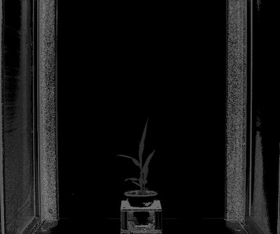
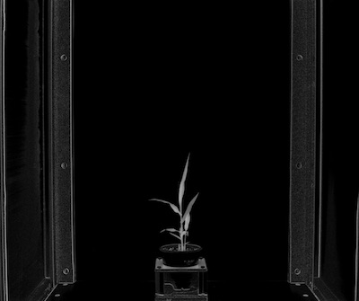
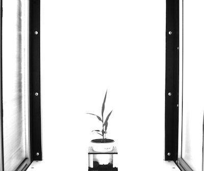

## RGB to HSV

Convert image from RGB color space to HSV color space and split the channels.

**plantcv.rgb2gray_hsv**(*rgb_img, channel*)

**returns** split image (h, s, or v channel)  

- **Parameters:**
    - rgb_img - RGB image data
    - channel - Split 'h' (hue), 's' (saturation), or 'v' (value) channel
   
- **Context:**
    - Used to help differentiate plant and background
- **Example use:**
    - [Use In VIS Tutorial](vis_tutorial.md)
    - [Use In PSII Tutorial](psII_tutorial.md)

**Original RGB image**


```python

from plantcv import plantcv as pcv

# Set global debug behavior to None (default), "print" (to file), or "plot" (Jupyter Notebooks or X11)
pcv.params.debug = "print"

# image converted from RGB to HSV, channels are then split. Hue ('h') channel is outputed.
h_channel = pcv.rgb2gray_hsv(rgb_img, 'h')
```

**Hue channel image**



```python

from plantcv import plantcv as pcv
    
# Set global debug behavior to None (default), "print" (to file), or "plot" (Jupyter Notebooks or X11)
pcv.params.debug = "print"
    
# image converted from RGB to HSV, channels are then split. Saturation ('s') channel is outputed.    
s_channel = pcv.rgb2gray_hsv(rgb_img, 's')
```  

**Saturation channel image**



```python

from plantcv import plantcv as pcv

# Set global debug behavior to None (default), "print" (to file), or "plot" (Jupyter Notebooks or X11)
pcv.params.debug = "print"

# image converted from RGB to HSV, channels are then split. Value ('v') channel is outputed.
v_channel = pcv.rgb2gray_hsv(rgb_img, 'v')
```  

**Value channel image**


