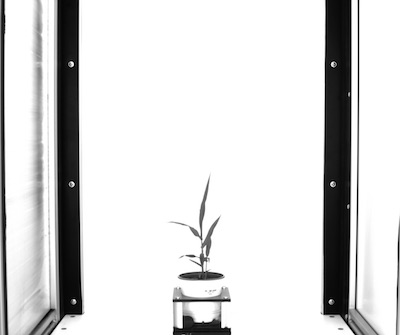
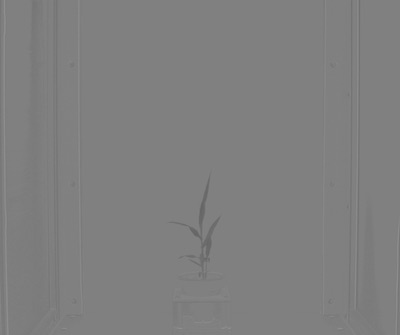
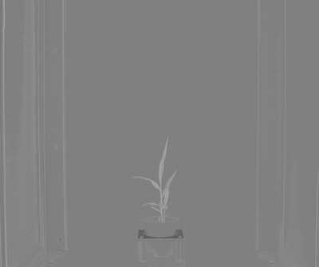

## RGB to LAB

Convert image from RGB color space to LAB color space and split the channels.

**plantcv.rgb2gray_lab**(*rgb_img, channel*)

**returns** split image (l, a, or b channel)

- **Parameters:**
    - rgb_img - RGB image data
    - channel - Split 'l' (lightness), 'a' (green-magenta), or 'b' (blue-yellow) channel
   
- **Context:**
    - Used to help differentiate plant and background
- **Example use:**
    - [Use In VIS Tutorial](vis_tutorial.md)

**Original RGB image**


```python

from plantcv import plantcv as pcv

# Set global debug behavior to None (default), "print" (to file), or "plot" (Jupyter Notebooks or X11)
pcv.params.debug = "print"

# image converted from RGB to LAB, channels are then split. Lightness ('l') channel is outputed.
l_channel = pcv.rgb2gray_lab(rgb_img, 'l')
```

**Lightness channel image**



```python

from plantcv import plantcv as pcv

# Set global debug behavior to None (default), "print" (to file), or "plot" (Jupyter Notebooks or X11)
pcv.params.debug = "print"

# image converted from RGB to LAB, channels are then split. Green-Magenta ('a') channel is outputed.
a_channel = pcv.rgb2gray_lab(rgb_img, 'a')
```

**Green-Magenta channel image**


   
```python

from plantcv import plantcv as pcv

# Set global debug behavior to None (default), "print" (to file), or "plot" (Jupyter Notebooks or X11)
pcv.params.debug = "print"

# image converted from RGB to Lab, channels are then split. Blue-Yellow ('b') channel is outputed.
b_channel = pcv.rgb2gray_lab(rgb_img, 'b')
```

**Blue-Yellow channel image**



