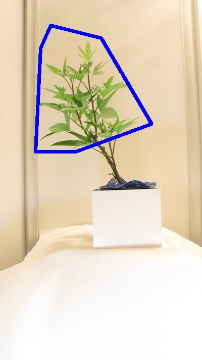

## Region of interest to mask

Convert a region of interest/object contour to a binary mask of the same shape 

**plantcv.roi.roi2mask**(*img, contour*)

**returns** mask

- **Parameters:**
    - img - RGB or grayscale image data
    - contour - ROI or other object contour
   
- **Context:**
    - `img` parameter is only used to determine the size of the mask getting created. 
- **Example use:**
    - below

```python

from plantcv import plantcv as pcv

# Set global debug behavior to None (default), "print" (to file), 
# or "plot" (Jupyter Notebooks or X11)
pcv.params.debug = "print"

# Read in the image 
img, filename, filepath = pcv.readimage(filename="plant_image.png")

roi_contour, roi_hierarchy = pcv.roi.custom(img=img, vertices=[[1190,490], [1470,830], [920,1430], [890,950]])
            
# Convert the ROI contour into a binary mask
mask = pcv.roi.roi2mask(img=img, contour=roi_contour)

```

**Custom ROI Image**




**Binary Mask**


**Source Code:** [Here](https://github.com/danforthcenter/plantcv/blob/main/plantcv/plantcv/roi/roi2mask.py)
