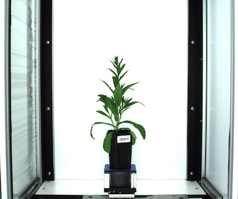
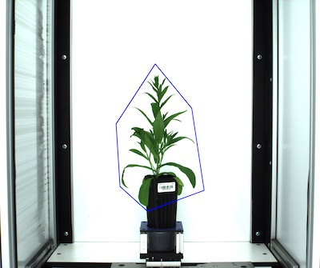

## Create Custom Polygon Regions of Interest (ROI) 

**plantcv.roi.custom**(*img, vertices*)

**returns** roi 

- **Parameters:**
    - img            = Input image data.
    - vertices       = List of vertices that define the custom polygon
- **Context:**
    - Used to define a custom polygon-shaped region of interest. Polygons 
    can be as simple as a triangle or complex and will work with downstream 
    steps such as [pcv.roi.filter](roi_filter.md). The `vertices` input 
    is a list of coordinates of the desired vertices where the desired vertices 
    are tuples inside square brackets. 

**Reference Image**



```python

from plantcv import plantcv as pcv

# Set global debug behavior to None (default), "print" (to file), 
# or "plot" (Jupyter Notebooks or X11)
pcv.params.debug = "plot"

# Make a custom polygon ROI
roi = pcv.roi.custom(img=img, vertices=[[1190,490], [1470,830], 
                                        [1565,1460], [1130,1620], 
                                        [920,1430], [890,950]])
                                      
```

**Custom ROI**



**Source Code:** [Here](https://github.com/danforthcenter/plantcv/blob/main/plantcv/plantcv/roi/roi_methods.py)
