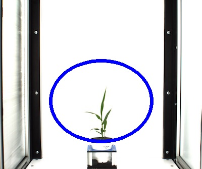

## Create an elliptical Region of Interest (ROI)

**plantcv.roi.ellipse**(*x, y, r1, r2, angle, img*)

**returns** roi_contour, roi_hierarchy

- **Parameters:**
    - x - The x-coordinate of the center of the ellipse.
    - y - The y-coordinate of the center of the ellipse.
    - r1 - The radius of the major axis.
    - r2 - The radius of the minor axis.
    - angle - The angle of rotation of the major axis.
    - img - An RGB or grayscale image to plot the ROI on in debug mode.
- **Context:**
    - Used to define a region of interest in the image.

**Reference Image**


```python

from plantcv import plantcv as pcv

# Set global debug behavior to None (default), "print" (to file), or "plot" (Jupyter Notebooks or X11)
pcv.params.debug = "print"

roi_contour, roi_hierarchy = pcv.roi.ellipse(x=200, y=200, r1=100, r2=80, angle=0, img=rgb_img)
```


