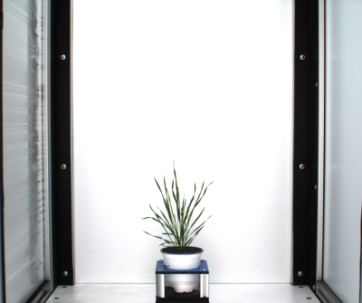
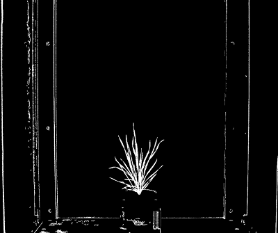
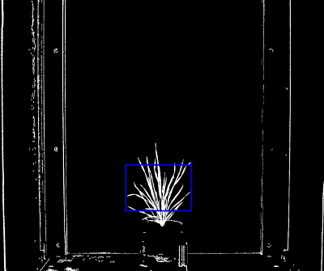
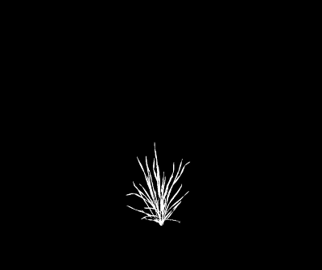

## Filter a Mask using a Region of Interest with Connected Components

Filter connected regions of non-zero pixels within a region of interest. These functions are similar to
[plantcv.roi.filter](roi_filter.md) and [plantcv.roi.quick_filter](roi_quick_filter.md), but use OpenCV connected
components for a stripped down, faster ROI filtering path.

**plantcv.roi.fast_filter**(*mask, roi, roi_type="partial"*)

**plantcv.roi.fast_rect_filter**(*mask, rois, roi_type="partial"*)

**returns** filtered_mask

- **Parameters:**
    - mask = binary image data to be filtered
    - roi = region of interest, an instance of the Objects class, output from one of the pcv.roi subpackage functions
    - rois = rectangular regions of interest as (x, y, width, height) tuples, used by `fast_rect_filter`
    - roi_type = 'partial' (for partially inside, default), 'cutto' (cut objects to the inside of the ROI),
    'within' (keep only objects fully inside ROI), or 'largest' (keep the largest clipped mask component in each ROI)

- **Context:**
    - Used to quickly keep objects inside one or more ROIs without the full contour filtering workflow.
    - `fast_filter` accepts PlantCV ROI Objects. `fast_rect_filter` accepts GUI-style rectangle tuples directly.

- **Example use:**
    - Below

**RGB image**



**Thresholded image (mask)**



**ROI visualization**




```python

from plantcv import plantcv as pcv

# Set global debug behavior to None (default), "print" (to file),
# or "plot" (Jupyter Notebooks or X11)
pcv.params.debug = "plot"

# ROI filter keeps objects that are partially inside ROI
filtered_mask = pcv.roi.fast_filter(mask=mask, roi=roi)

# Rectangular ROI tuples can be filtered without first building PlantCV ROI Objects
filtered_mask = pcv.roi.fast_rect_filter(mask=mask, rois=[(150, 150, 100, 25)], roi_type="partial")

```

**Filtered mask**




**Source Code:** [Here](https://github.com/danforthcenter/plantcv/blob/main/plantcv/plantcv/roi/fast_filter.py)
