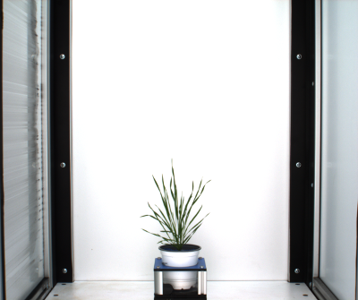
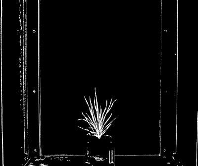
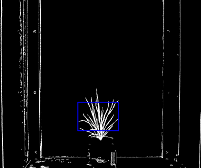
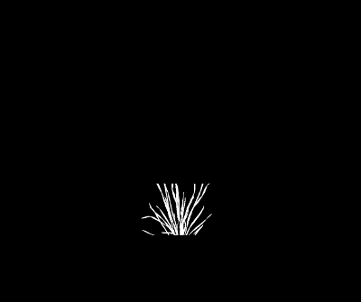

## Filter a Mask using a Region of Interest

Filter objects (connected regions of non-zero pixels) within a region of interest, either cut those objects to the region of interest
or include objects that overlap with the region of interest.

**plantcv.roi.filter**(*mask, roi, roi_type='partial'*)

**returns** filtered_mask

**Important Note:** If your ROI object detection does not perform first check that the ROI is
completely within the image.

- **Parameters:**
    - mask = binary image data to be filtered
    - roi = region of interest, an instance of the Objects class, output from one of the pcv.roi subpackage functions
    - roi_type = 'partial' (for partially inside, default), 'cutto', or 'largest' (keep only the largest contour)

- **Context:**
    - Used to filter objects within a region of interest and decide which ones to keep.

- **Warning:**
    - Using `roi_type='largest'` will only keep the largest outer connected region of non-zero pixels.

- **Example use:**
    - [Use In VIS Tutorial](tutorials/vis_tutorial.md)
    - [Use In PSII Tutorial](tutorials/psII_tutorial.md)

**RGB image**



**Thresholded image (mask)**



**ROI visualization**




```python

from plantcv import plantcv as pcv

# Set global debug behavior to None (default), "print" (to file),
# or "plot" (Jupyter Notebooks or X11)
pcv.params.debug = "plot"

# ROI filter allows the user to define if objects partially inside ROI are included or if objects are cut to ROI.
filtered_mask = pcv.roi.filter(mask=mask, roi=roi, roi_type='partial')

```


**Filtered mask with `roi_type='partial'`**


```python

from plantcv import plantcv as pcv

# Set global debug behavior to None (default), "print" (to file), or "plot" (Jupyter Notebooks or X11)
pcv.params.debug = "plot"

# ROI filter allows the user to define if objects partially inside ROI are included or if objects are cut to ROI.
filtered_mask = pcv.roi.filter(mask=mask, roi=roi, roi_type='cutto')
```

**Filtered mask with `roi_type='cutto'`**




**Source Code:** [Here](https://github.com/danforthcenter/plantcv/blob/main/plantcv/plantcv/roi/roi_methods.py)
