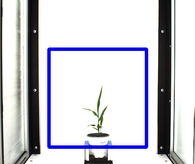

## Create a Region of Interest (ROI) from a binary image

**plantcv.roi.from_binary_image**(*img, bin_img*)

**returns** roi

- **Parameters:**
    - img - An RGB or grayscale image to plot the ROI on in debug mode.
    - bin_img - Binary image. The ROI contour will be identified from this image.
- **Context:**
    - Used to define a region of interest in the image.

**Binary Image**


```python
from plantcv import plantcv as pcv

# Set global debug behavior to None (default), "print" (to file), 
# or "plot" (Jupyter Notebooks or X11)
pcv.params.debug = "plot"

roi = pcv.roi.from_binary_image(img=rgb_img, bin_img=bin_img)

```



**Source Code:** [Here](https://github.com/danforthcenter/plantcv/blob/main/plantcv/plantcv/roi/roi_methods.py)
