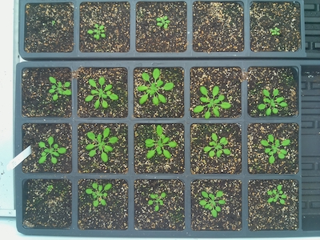
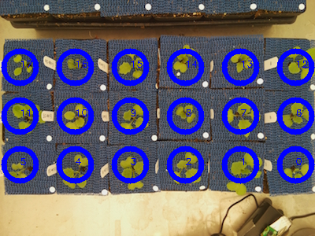
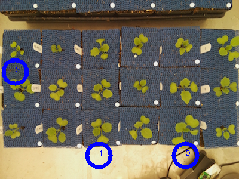
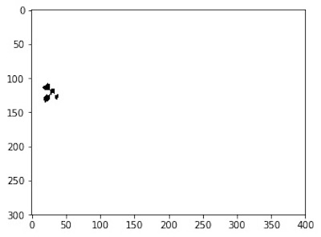
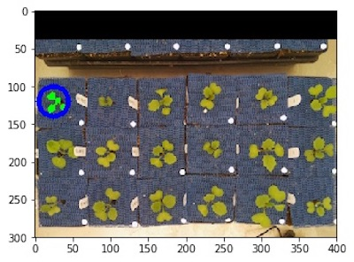
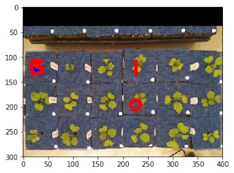
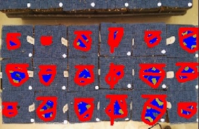

## Create Multiple Regions of Interest (ROI) 

**plantcv.roi.multi**(*img, coord, radius, spacing=None, nrows=None, ncols=None*)

**returns** roi_contours, roi_hierarchies

- **Parameters:**
    - img            = Input image data.
    - coord          = Two-element tuple of the center of the top left object.
    - radius         = Radius of ROIs.
    - spacing        = Two-element tuple of the horizontal and vertical spacing between ROIs.
    - nrows          = Number of rows in ROI layout.
    - ncols          = Number of columns in ROI layout.
- **Context:**
    - Used to define multiple regions of interest in the same image. Users can either specify a
      starting coordinate (`coord`), number of row and columns, and spacing to create a grid of ROIs,
      or a custom list of coordinates that specify the centers of the ROIs. Providing a custom list 
      of coordinates (list of tuples) is useful for missing plants or any arrangement that isn't 
      a perfect grid. Returns lists of contours and hierarchies that can be used in downstream steps. 

**Reference Image**



```python

from plantcv import plantcv as pcv

# Set global debug behavior to None (default), "print" (to file), 
# or "plot" (Jupyter Notebooks or X11)
pcv.params.debug = "print"

# Make a grid of ROIs 
rois1, roi_hierarchy1 = pcv.roi.multi(img=img1, coord=(25,120), radius=20, 
                                      spacing=(70, 70), nrows=3, ncols=6)

# Specify a list of coordinates of desired ROIs 
rois2, roi_hierarchy2 = pcv.roi.multi(img=img1, coord=[(25,120), (165,260), (310, 260)], 
                                      radius=20)
                                      
```

**Grid of ROIs**



**Custom list of ROIs** 



### Next steps:

Since this function returns lists of objects and hierarchies, the downstream steps require users to loop 
over each. The [pcv.roi_objects](roi_objects.md) and [pcv.object_composition](object_composition.md) functions usually 
follow an ROI step.

```python
import numpy as np 

img_copy = np.copy(img)

# The result file should exist if plantcv-workflow.py was run
if os.path.exists(args.result):
    # Open the result file
    results = open(args.result, "r")
    # The result file would have image metadata in it from plantcv-workflow.py, read it into memory
    metadata = results.read()
    # Close the file
    results.close()
    # Delete the file, we will create new ones
    os.remove(args.result)

for i in range(0, len(rois1)):
    roi = rois1[i]
    hierarchy = roi_hierarchy1[i]
    # Find objects
    filtered_contours, filtered_hierarchy, filtered_mask, filtered_area = pcv.roi_objects(
        img=img, roi_type="partial", roi_contour=roi, roi_hierarchy=hierarchy, object_contour=obj, 
        obj_hierarchy=obj_hierarchy)
    
    # Combine objects together in each plant     
    plant_contour, plant_mask = pcv.object_composition(img=img, contours=filtered_contours, hierarchy=filtered_hierarchy)        
    
    # Analyze the shape of each plant 
    analysis_images = pcv.analyze_object(img=img_copy, obj=plant_contour, mask=plant_mask)
    
    # Save the image with shape characteristics 
    img_copy = analysis_images
    
    # Print out a text file with shape data for each plant in the image 
    filename = args.result[:-4] + "_" + str(i) + ".txt" 
    with open(filename, "w") as r:
        r.write(metadata)
    pcv.outputs.save_results(filename=filename)
    # Clear the measurements stored globally into the Outputs class
    pcv.outputs.clear()
    
# Plot out the image with shape analysis on each plant in the image 
pcv.plot_image(img_copy)
```
**Custom list of ROIs** 



**Custom list of ROIs** 



**Custom list of ROIs** 



Many intermediate outputs later... 

**Image with shape analysis characteristics on each plant** 



**Source Code:** [Here](https://github.com/danforthcenter/plantcv/blob/master/plantcv/plantcv/roi/roi_methods.py)
