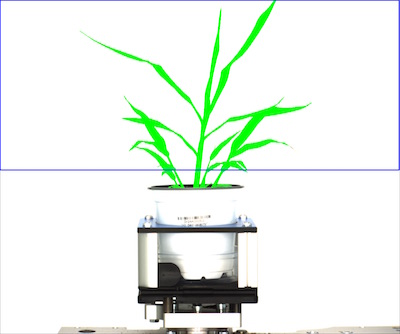
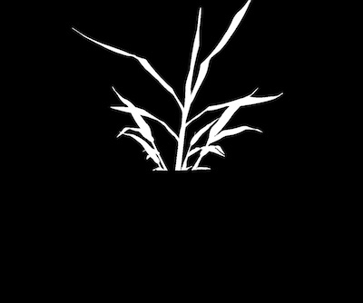
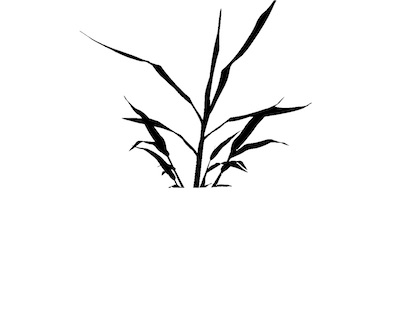
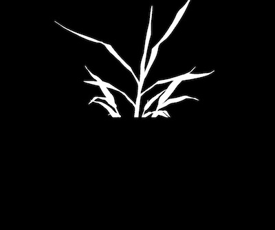
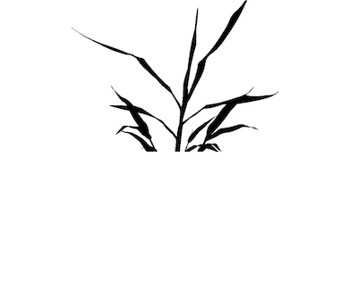

## Find Objects within a Region of Interest

Find objects within a region of interest, either cut those objects to the region of interest 
or include objects that overlap with the region of interest.

**plantcv.roi_objects**(*img, roi_type, roi_contour, roi_hierarchy, object_contour, obj_hierarchy*)

**returns** kept objects, object hierarchy, object mask, object area

**Important Note:** If your ROI object detection does not perform first check that the ROI is 
completely within the image.

- **Parameters:**
    - img = RGB or grayscale image data to display kept objects on
    - roi_type = 'cutto' or 'partial' (include objects that are partially inside or overlapping with ROI)
    - roi_contour = contour of roi, output from one of the pcv.roi subpackage functions
    - roi_hierarchy = contour of roi, output from one of the pcv.roi subpackage functions
    - object_contour = contours of objects, output from "find_objects" function 
    - obj_hierarchy = hierarchy of objects, output from "find_objects" function
    
- **Context:**
    - Used to find objects within a region of interest and decide which ones to keep.
- **Example use:**
    - [Use In VIS Tutorial](vis_tutorial.md)
    - [Use In NIR Tutorial](nir_tutorial.md)
    - [Use In PSII Tutorial](psII_tutorial.md)


```python

from plantcv import plantcv as pcv

# Set global debug behavior to None (default), "print" (to file), or "plot" (Jupyter Notebooks or X11)
pcv.params.debug = "print"

# ROI objects allows the user to define if objects partially inside ROI are included or if objects are cut to ROI.
roi_objects, hierarchy, kept_mask, obj_area = pcv.roi_objects(img, 'partial', roi, roi_hierarchy, objects, obj_hierarchy)
```

**Object (green) that is identified as partially inside ROI**



**Mask of identified object**



**Kept objects**



```python

from plantcv import plantcv as pcv

# Set global debug behavior to None (default), "print" (to file), or "plot" (Jupyter Notebooks or X11)
pcv.params.debug = "print"

# Define region of interest in an image, there is a futher function 'ROI Objects' that allows the user to define if you want to include objects partially inside ROI or if you want to do cut objects to ROI.
roi_objects, hierarchy, kept_mask, obj_area = pcv.roi_objects(img, 'cutto', roi, roi_hierarchy, objects, obj_hierarchy)
```

**Object (green) that is cut to the ROI**


**Mask of identified object**



**Kept objects**


