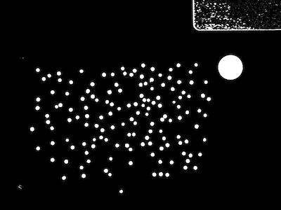
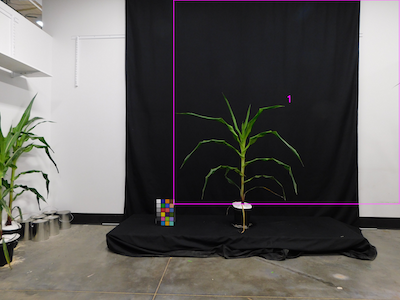
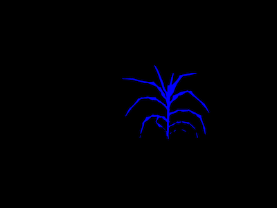

## Quickly Filter a Mask by cutting to one or more Regions of Interest

Filter objects (connected regions of non-zero pixels) within a region of interest. This function is similar to
[plantcv.roi.filter](roi_filter.md) and [plantcv.create_labels](create_labels.md) but is faster, though it only supports the cut to method
(`roi_type='cutto'` in `plantcv.roi.filter`).

**plantcv.roi._quick_cutto**(*mask, roi*)

**returns** filtered_mask, labeled mask, num_labels

- **Parameters:**
    - mask = binary image data to be filtered
    - roi = region of interest, an instance of the Objects class, output from one of the pcv.roi subpackage functions

- **Context:**
    - Used to filter objects within one or more regions of interest.

- **Example use:**
    - Below

**RGB image**


**Thresholded image (mask)**



**ROI visualization**




```python

from plantcv import plantcv as pcv

# Set global debug behavior to None (default), "print" (to file),
# or "plot" (Jupyter Notebooks or X11)
pcv.params.debug = "plot"

# ROI filter keeps objects that are partially inside ROI
filtered_mask, lbl_mask, num = pcv.roi._quick_cutto(mask=mask, roi=roi)

```

**Filtered mask**




**Source Code:** [Here](https://github.com/danforthcenter/plantcv/blob/main/plantcv/plantcv/roi/quick_filter.py)
