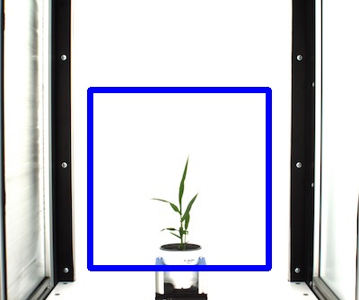

## Create a rectangular Region of Interest (ROI)

**plantcv.roi.rectangle**(*x, y, h, w, img*)

**returns** roi_contour, roi_hierarchy

- **Parameters:**
    - x - The x-coordinate of the upper left corner of the rectangle.
    - y - The y-coordinate of the upper left corner of the rectangle.
    - h - The height of the rectangle.
    - w - The width of the rectangle.
    - img - An RGB or grayscale image to plot the ROI on in debug mode.
- **Context:**
    - Used to define a region of interest in the image.

**Reference Image**


```python

from plantcv import plantcv as pcv

# Set global debug behavior to None (default), "print" (to file), or "plot" (Jupyter Notebooks or X11)
pcv.params.debug = "print"

roi_contour, roi_hierarchy = pcv.roi.rectangle(x=100, y=100, h=200, w=200, img=rgb_img)
```


