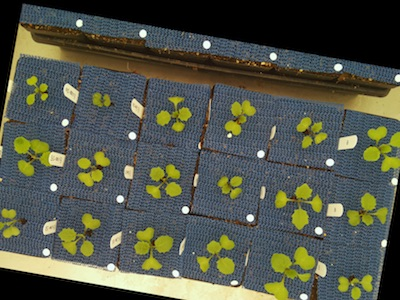

## Rotate

Rotates image without changing the dimensions of the image.

<span style="color:red">NOTE: The rotate_img function will be depricated in the near future, please
use the rotate function as an equivalent replacement. The rotate_img
function will continue to be functional and is now a wrapper for the rotate
function (with crop set to True) .</span>  

**rotate_img**(*img, rotation_deg, device,debug=None*)

**returns** device, image after rotation

- **Parameters:**
    - img - Input image
    - rotation_deg - rotation angle in degrees, should be an integer, can be a negative number, positive values move counter clockwise.
    - device - Counter for image processing steps
    - debug- None, "print", or "plot". Print = save to file, Plot = print to screen. Default = None
- **Context:**
    - Rotates image, sometimes it is necessary to rotate an image, especially when clustering objects.
- **Example use:**
    - [Use In Multi-Plant Tutorial](multi-plant_tutorial.md)
    
**Input image**


```python
from plantcv import plantcv as pcv

# Rotate image
device, rotate_img = pcv.rotate_img(img, 10, device, debug='print')
```

**Image after rotating 10 degrees**


```python
from plantcv import plantcv as pcv

# Rotate image
device, rotate_img = pcv.rotate_img(img, -10, device, debug='print')
```

**Image after rotating -10 degrees**

