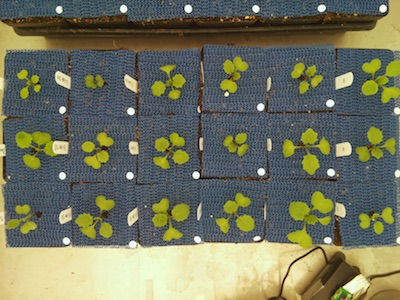
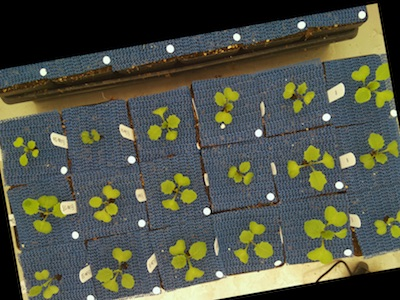
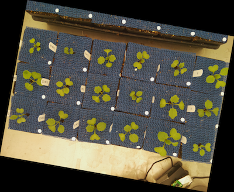

## New Rotate

Rotates image without changing the dimensions of the image.

**rotate**(*img, rotation_deg, crop*)

**returns** image after rotation

- **Parameters:**
    - img - RGB or grayscale image data
    - rotation_deg - rotation angle in degrees, should be an integer, can be a negative number, positive values move counter clockwise.
    - crop - if crop is set to True, image will be cropped to original image dimensions, if set to False, the image size will be adjusted to accommodate new image dimensions.
- **Context:**
    - Rotates image, sometimes it is necessary to rotate an image, especially when clustering objects.
- **Example use:**
    - [Use In Multi-Plant Tutorial](multi-plant_tutorial.md)
    
**Input image**



```python

from plantcv import plantcv as pcv

# Set global debug behavior to None (default), "print" (to file), or "plot" (Jupyter Notebooks or X11)
pcv.params.debug = "print"

# Rotate image
device, rotate_img = pcv.rotate(img, 10, True)
```

**Image after rotating 10 degrees**



```python

from plantcv import plantcv as pcv

# Set global debug behavior to None (default), "print" (to file), or "plot" (Jupyter Notebooks or X11)
pcv.params.debug = "print"

# Rotate image
rotate_img = pcv.rotate(img, -10, False)
```

**Image after rotating -10 degrees**

