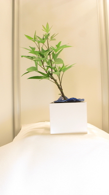
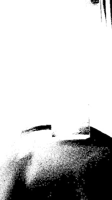

## Saturation Threshold

Creates a binary image from an RGB image by thresholding out saturated pixels. 


**plantcv.threshold.saturation**(*rgb_img, threshold=255, channel="any"*)

**returns** thresholded/binary image

- **Parameters:**
    - rgb_img - RGB image data
    - threshold - Threshold value, above which is considered saturated (0-255, default = 255)
    - channel - How many channels must be saturated for the pixel to be masked out ("any", "all"; default="any")
- **Context:**
    - Used to threshold based on saturation of pixels from any or all color channels. This can be a useful 
    pre-processing step before doing color analysis.  
- **Example use:**
    - Below

**Original image**



```python

from plantcv import plantcv as pcv

# Set global debug behavior to None (default), "print" (to file), 
# or "plot" (Jupyter Notebooks or X11)

pcv.params.debug = "plot"

# Create binary image from a gray image based on texture values.
sat_thresh = pcv.threshold.saturation(rgb_img=rgb_img, threshold=250, channel="any")
                                    
```

**Thresholded image**

We can see that part of the table was masked out due to being fully saturated. 



**Source Code:** [Here](https://github.com/danforthcenter/plantcv/blob/main/plantcv/plantcv/threshold/threshold_methods.py)
