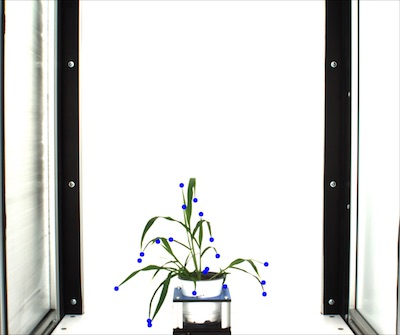
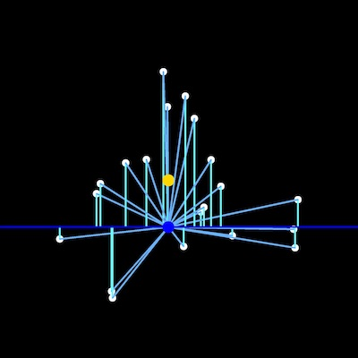

## Scale features

This is a function to to transform the coordiantes of landmark points onto a common scale (0-1.0)
Scaling is used to remove the influence of size on shape parameters. Returns a list of tuples.

**plantcv.scale_features**(*obj, mask, points, boundary_line*)

**returns** rescaled landmark points, a rescaled centroid point, a rescaled baseline point

- **Parameters:**
    - obj - A contour of the plant object (this should be output from the object_composition.py fxn)
    - mask - This is a binary image. The object should be white and the background should be black
    - points - A set of landmark points to be rescaled given the centroid of the object
    - boundary_line - A vertical coordinate (int) that denotes the height of the plant pot, the coordinates of this reference point is also rescaled
- **Context:**
    - Used to rescale the point coordinates of landmark points, including centroid and boundary line
    
**Input contour of plant object, an mask that denotes plant outline and landmark points**



```python

from plantcv import plantcv as pcv

# Set global debug behavior to None (default), "print" (to file), or "plot" (Jupyter Notebooks or X11)
pcv.params.debug = "print"

# Identify acute vertices (tip points) of an object
# Results in set of point values that may indicate tip points
points_rescaled, centroid_rescaled, bottomline_rescaled = pcv.scale_features(obj, mask, landmark_points, boundary_line)
```

**Image of rescaled points in white, centroid is in gold and centroid at pot base is in blue**


