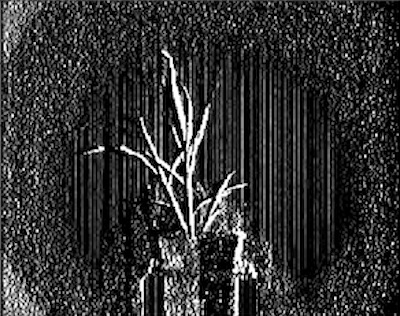
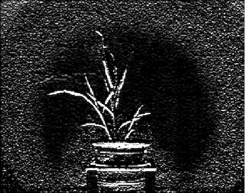

## Scharr Filter

This is a filtering method used to identify and highlight gradient edges/features using the 1st derivative.
       Typically used to identify gradients along the x-axis (dx = 1, dy = 0) and y-axis (dx = 0, dy = 1) independently.
       Performance is quite similar to [Sobel filter](sobel_filter.md). Used to detect edges / changes in pixel intensity. ddepth = -1
       specifies that the dimensions of output image will be the same as the input image.

**plantcv.scharr_filter**(*img, dx, dy, scale*)

**returns** filtered image

- **Parameters:**
    - img - RGB or grayscale image data
    - dx - derivative of x to analyze (0 or 1)
    - dy - derivative of y to analyze (0 or 1)
    - scale - scaling factor applied (multiplied) to computed Scharr values (scale = 1 is unscaled)
- **Context:**
    - This is a filtering method used to identify and highlight gradient edges/features using the 1st derivative.
       Typically used to identify gradients along the x-axis (dx = 1, dy = 0) and y-axis (dx = 0, dy = 1) independently.
       Performance is quite similar to Sobel filter.
    - Derivatives must sum to 1 (`dx+dy == 1`) in order to run

**Original image**


```python

from plantcv import plantcv as pcv

# Set global debug behavior to None (default), "print" (to file), or "plot" (Jupyter Notebooks or X11)
pcv.params.debug = "print"

# Apply to a grayscale image
sr_x_img = pcv.scharr_filter(gray_img, 1, 0, 1)
sr_y_img = pcv.scharr_filter(gray_img, 0, 1, 1)
```

**Scharr filtered (x-axis)**



**Scharr filtered (y-axis)**


