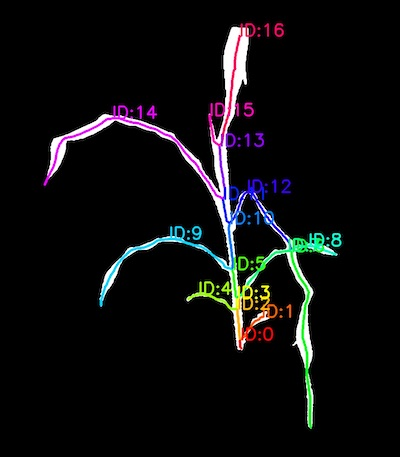
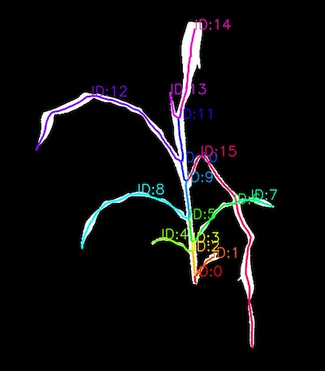
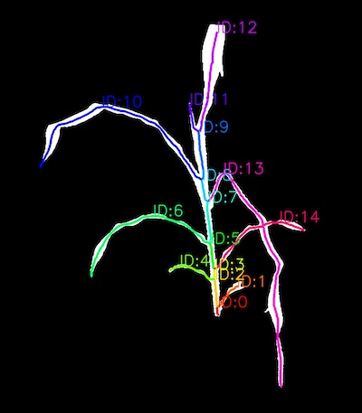

## Combine segments 

Manually combine segments from a segmented skeleton 

**plantcv.morphology.segment_combine**(*segment_list, objects, mask*)

**returns** Labeled image, new segment objects list 

- **Parameters:**
    - segment_list - List of segments to get combined
    - objects - Segment objects (output from either [plantcv.morphology.prune](prune.md),,
    [plantcv.morphology.segment_skeleton](segment_skeleton.md), or
    [plantcv.morphology.segment_sort](segment_sort.md)).
    - mask - Binary mask for debugging images.

- **Context:**
    - Objects with more complexity will often cause issues with the algorithms used in functions within the 
    `plantcv.morphology` sub-package. However, it is still possible to collect accurate data from such images
    with a manual step such as `plantcv.morphology.segment_combine`. An example workflow would use 
    [plantcv.morphology.check_cycles](check_cycles.md) to identify images that have parts of plant that occlude 
    others, and get corrected by combining segments that are recognized as belonging to the same leaf. 


```python

from plantcv import plantcv as pcv

# Set global debug behavior to None (default), "print" (to file), 
# or "plot" (Jupyter Notebooks or X11)
pcv.params.debug = "plot"

# Adjust text thickness (default = 5) and text size (default = .55) with the 
# global text parameters. Users can adjust text_size and text_thickness to 
# obtain labels that are easier to read. 
pcv.params.text_size=1.5
pcv.params.text_thickness = 3

# Plot an image with ID's labeled so the specific segment ID's can get used
# to combine segments 
segment_img, id_labeled_img = pcv.morphology.segment_id(skel_img=pruned_img, objects=segment_objects, mask=mask)

# Combine the segments of the really floppy leaf
labeled_img, new_objects = pcv.morphology.segment_combine(segment_list=[12,6], objects=segment_objects, mask=mask)

# Combine the segments of the leaf obscuring the floppy leaf 
labeled_img2, new_objects = pcv.morphology.segment_combine(segment_list=[7,6], objects=new_objects, mask=mask)

# Optionally, if all ID's were legible we could combine multiple segments in one step. 
# Users can provide a list of lists in which each list contains segments that should 
# get combined together.  

## labeled_img, objects = pcv.morphology.segment_combine(segment_list=[[12,6,3], [11,10]],
##                                                       objects = segment_objects,
##                                                       mask = plant_mask)    

```

*ID Labeled Image*



*Floppy Leaf Combined*



*Other Leaf Combined*



**Source Code:** [Here](https://github.com/danforthcenter/plantcv/blob/main/plantcv/plantcv/morphology/segment_combine.py)
