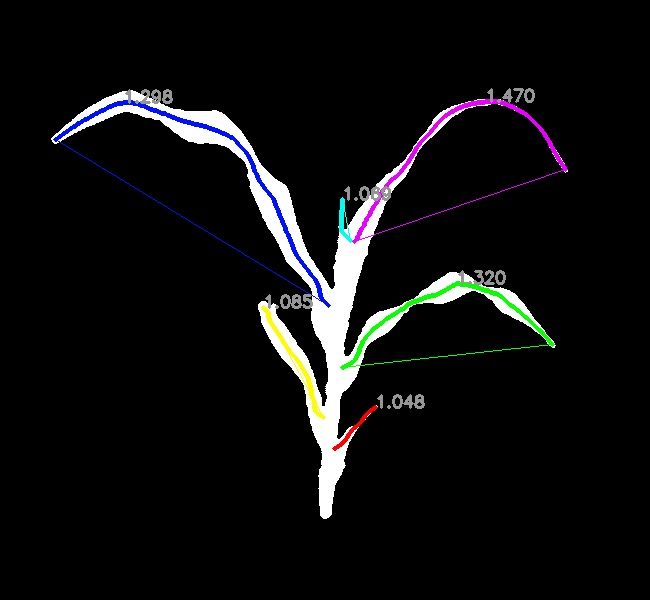

## Segment Curvature

Measure the curvature of segments.   

**plantcv.morphology.segment_curvature**(*segmented_img, objects, label=None*)

**returns** labeled image 

- **Parameters:**
    - segmented_img - Segmented image (output either from [plantcv.morphology.segment_skeleton](segment_skeleton.md)
    or [plantcv.morphology.segment_id](segment_id.md)), used for creating the labeled image. 
    - objects - Segment objects (output from either [plantcv.morphology.prune](prune.md),
    [plantcv.morphology.segment_skeleton](segment_skeleton.md), or
    [plantcv.morphology.segment_sort](segment_sort.md)).
    - label         - Optional label parameter, modifies the variable name of observations recorded. (default = `pcv.params.sample_label`)
- **Context:**
    - Calculates curvature of segments by taking the ratio of the geodesic distance ([plantcv.morphology.segment_path_length](segment_pathlength.md))
    over the euclidean distance [plantcv.morphology.segment_euclidean_length](segment_euclidean_length.md)). Measurement of two-dimensional tortuosity.
    Values closer to 1 indicate that a segment is a straight line while larger values indicate the segment has more curvature.
    Users can pass only leaf objects (returned from [plantcv.morphology.segment_sort](segment_sort.md)) to only collect curvature of leaves. 
- **Output data stored:** Data ('segment_curvature') automatically gets stored to the [`Outputs` class](outputs.md) when this function is ran. 
    These data can always get accessed during a workflow (example below). For more detail about data output see [Summary of Output Observations](output_measurements.md#summary-of-output-observations)

```python

from plantcv import plantcv as pcv

# Set global debug behavior to None (default), "print" (to file), 
# or "plot" (Jupyter Notebooks or X11)
pcv.params.debug = "plot"

labeled_img = pcv.morphology.segment_curvature(segmented_img=segmented_img, 
                                               objects=obj, label="all")
# Pass just leaf objects and hierarchies (output from pcv.morphology.segment_sort) 
labeled_img2 = pcv.morphology.segment_curvature(segmented_img=leaf_segmented,
                                                objects=leaf_obj, label="leaf")

# Access data stored out from segment_curvature
all_curvatures = pcv.outputs.observations['all']['segment_curvature']['value']
leaf_curvatures = pcv.outputs.observations['leaf']['segment_curvature']['value']

```

*Labeled Image*


*Labeled Image (only leaves)*



**Source Code:** [Here](https://github.com/danforthcenter/plantcv/blob/main/plantcv/plantcv/morphology/segment_curvature.py)
