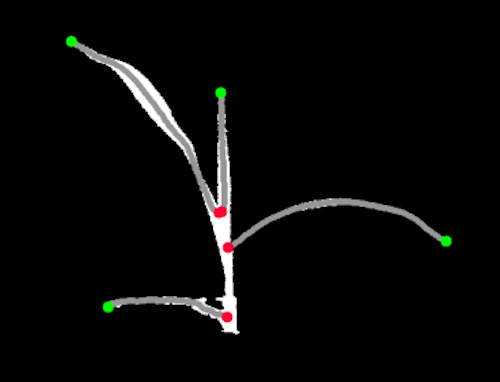

## Identify Segment Ends

Find segment tip and inner branch-point coordinates, and sort segments by the y-coordinates of the branch points

**plantcv.morphology.segment_ends**(*skel_img, leaf_objects, mask=None, label=None*)

**returns** Re-ordered leaf segments, list of branch point coordinates, list of leaf tip coordinates

- **Parameters:**
    - skel_img - Skeleton image (output from [plantcv.morphology.skeletonize](skeletonize.md))
    - leaf_objects - Secondary segment objects (output from [plantcv.morphology.segment_sort](segment_sort.md)).
    - mask - Binary mask for plotting. If provided, the debugging image will be overlaid on the mask (optional).
    - label - Optional label parameter, modifies the variable name of observations recorded. (default = `pcv.params.sample_label`)
- **Context:**
    - Aims to sort leaf objects by biological age. This tends to work somewhat consistently for grass species that have the youngest leaves emerge at the top of the plant.

**Reference Images**


```python

from plantcv import plantcv as pcv

# Set global debug behavior to None (default), "print" (to file), 
# or "plot" (Jupyter Notebooks or X11)
pcv.params.debug = "plot"

# Adjust point thickness with the global line_thickness parameter (default = 5)
pcv.params.line_thickness = 3 

sorted_obs, bp, tips = pcv.morphology.segment_ends(skel_img=skeleton,
                                         leaf_objects=leaf_objs,
                                         mask=plant_mask,
                                         label="leaves")

segmented_img, leaves_labeled = pcv.morphology.segment_id(skel_img=skeleton, 
                                                          objects=leaf_objs,
                                                          mask=plant_mask)
# With ID re-assignment
segmented_img, leaves_labeled = pcv.morphology.segment_id(skel_img=skeleton, 
                                                          objects=sorted_obs,
                                                          mask=plant_mask)

```

**Segment End points Debug**

Leaf tips are green, branch points are red. 



**Source Code:** [Here](https://github.com/danforthcenter/plantcv/blob/main/plantcv/plantcv/morphology/segment_ends.py)
