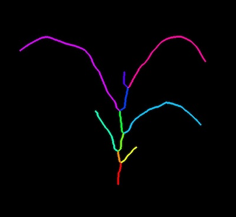
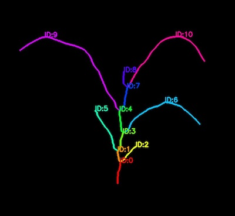
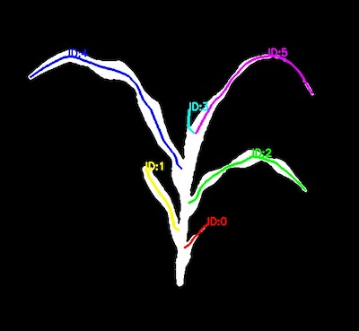

## Identify Segments

Label segments with their ID numbers. 

**plantcv.morphology.segment_id**(*skel_img, objects, mask=None*)

**returns** Segmented image, labeled image with segment ID's 

- **Parameters:**
    - skel_img - Skeleton image (output from [plantcv.morphology.skeletonize](skeletonize.md))
    - objects - Segment objects (output from either [plantcv.morphology.prune](prune.md),
    [plantcv.morphology.segment_skeleton](segment_skeleton.md), or
    [plantcv.morphology.segment_sort](segment_sort.md)).
    - mask - Binary mask for plotting. If provided, segmented and labeled image will be overlaid on the mask (optional).
- **Context:**
    - Plots segmented image with segment ID's. The segmented image output can be used in downstream functions, such as [plantcv.morphology.segment_angle](segment_angle.md), [plantcv.morphology.segment_curvature](segment_curvature.md),
    [plantcv.morphology.segment_euclidean_length](segment_euclidean_length.md), [plantcv.morphology.segment_path_length](segment_pathlength.md), [plantcv.morphology.segment_tangent_angle](segment_tangent_angle.md). 
    The labeled image can inform the order in which segments are analyzed for all downstream functions. 

**Reference Images**


```python

from plantcv import plantcv as pcv

# Set global debug behavior to None (default), "print" (to file), 
# or "plot" (Jupyter Notebooks or X11)
pcv.params.debug = "plot"

# Adjust line thickness with the global line thickness parameter (default = 5)
pcv.params.line_thickness = 3 

segmented_img, labeled_img = pcv.morphology.segment_id(skel_img=skeleton, 
                                                       hierarchies=hier)

segmented_img, leaves_labeled = pcv.morphology.segment_id(skel_img=skeleton, 
                                                          objects=leaf_obj,
                                                          mask=plant_mask)

```

*Input Segmented Image without Mask*



*Labeled Image without Mask*



*Input Segmented Image, Leaves Only with Mask*


*Labeled Image, Leaves Only with Mask*



**Source Code:** [Here](https://github.com/danforthcenter/plantcv/blob/main/plantcv/plantcv/morphology/segment_id.py)
