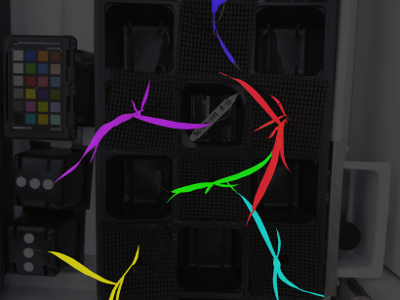

## Segment Image Series

This function uses watershed segmentation to label individual objects in a series of images.

**plantcv.segment_image_series**(*imgs_paths, masks_paths, rois, save_labels=True, ksize=3*)

**returns** out_labels

- **Parameters:**
    - imgs_paths  = List of paths to the images in the time series. Ordered by time
    - masks_paths = List of paths to the masks in the time series. Each mask should correspond to the image in imgs_paths for the same index
    - rois        = List of roi contours
    - save_labels = Optional, saves the labels of each image independently (default: True)
    - ksize       = Size of the block in the time dimension to propagate the labels (default: 3)

- **Context:**
    - Used to obtain individual masks for objects, like full plants or leaves, that grow in a
      time series of images from being separated to touching

**Early time point and corresponding mask**


**Later time point and corresponding mask**


```python

from plantcv import plantcv as pcv

# Set global debug behavior to None (default), "print" (to file), or "plot" (Jupyter Notebooks or X11)
pcv.params.debug = "print"

# Using segment image series
analysis_image = pcv.segment_image_series(imgs_paths=paths_to_imgs_list, masks_paths=paths_to_masks_list, rois=valid_rois, save_labels=True, ksize=3)

```

**Image Series Segmentation**





**Source Code:** [Here](https://github.com/danforthcenter/plantcv/blob/master/plantcv/plantcv/segment_image_series.py)
