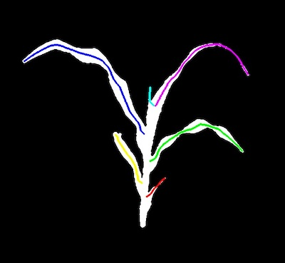
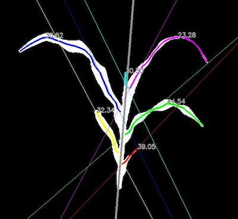

## Segment Insertion Angles  

Measure leaf insertion angles. 

**plantcv.morphology.segment_insertion_angle**(*skel_img, segmented_img, leaf_objects, stem_objects, size, label=None*)

**returns** labeled image 

- **Parameters:**
    - skel_img - Skeletonize image (output from [plantcv.morphology.skeletonize](skeletonize.md)). 
    - segmented_img - Segmented image (output from either [plantcv.morphology.prune](prune.md),
    [plantcv.morphology.segment_skeleton](segment_skeleton.md), or
    [plantcv.morphology.segment_sort](segment_sort.md))., used for creating the labeled debugging image. 
    - leaf_objects - Leaf segment objects (output from [plantcv.morphology.segment_sort](segment_sort.md)).
    - stem_objects - Stem segment objects (output from [plantcv.morphology.segment_sort](segment_sort.md)).
    - size - Size of ends (number of pixels) used to calculate insertion point "tangent" lines
    - label         - Optional label parameter, modifies the variable name of observations recorded. (default = `pcv.params.sample_label`)
- **Context:**
    - Find "tangent" angles to leaf insertion points in degrees of skeleton segments compared to the stem angle. 
      Use `size` pixels of the inner portion of each leaf to find a linear regression line, and calculate angle between insertion
      angle and the stem.        
- **Output data stored:** Data ('segment_insertion_angle') automatically gets stored to the [`Outputs` class](outputs.md) when this function is ran. 
    These data can always get accessed during a workflow (example below). For more detail about data output see [Summary of Output Observations](output_measurements.md#summary-of-output-observations)

**Reference Image:** segmented_img 




```python

from plantcv import plantcv as pcv

# Set global debug behavior to None (default), "print" (to file), 
# or "plot" (Jupyter Notebooks or X11)
pcv.params.debug = "plot"
# Optionally, set a sample label name
pcv.params.sample_label = "plant"

# Adjust line thickness with the global line thickness parameter (default = 5)
pcv.params.line_thickness = 3 

labeled_img = pcv.morphology.segment_insertion_angle(skel_img=skeleton,
                                                     segmented_img=leaves_segment, 
                                                     leaf_objects=leaf_obj,
                                                     stem_objects=stem_objs,
                                                     size=20)

# Access data stored out from segment_insertion_angle
segment_insertion_angles = pcv.outputs.observations['plant']['segment_insertion_angle']['value']

```

*Labeled Image*



**Source Code:** [Here](https://github.com/danforthcenter/plantcv/blob/main/plantcv/plantcv/morphology/segment_insertion_angle.py)
