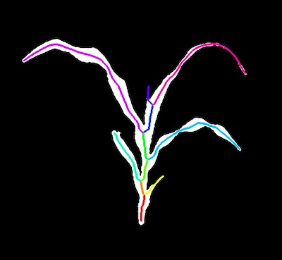
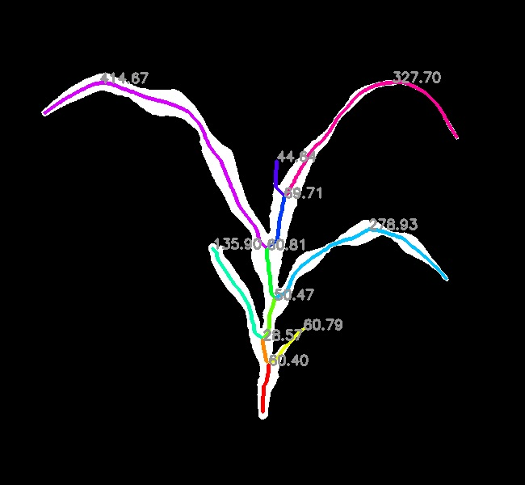

## Measure Path Length of Segments 

Measure the geodesic distance of segments. 

**plantcv.morphology.segment_path_length**(*segmented_img, objects, label=None*)

**returns** labeled_image  

- **Parameters:**
    - segmented_img - Segmented image (output either from [plantcv.morphology.segment_skeleton](segment_skeleton.md)
    or [plantcv.morphology.segment_id](segment_id.md)), used for creating the labeled image. 
    - objects - Segment objects (output from either [plantcv.morphology.prune](prune.md),
    [plantcv.morphology.segment_skeleton](segment_skeleton.md), or
    [plantcv.morphology.segment_sort](segment_sort.md)).
    - label         - Optional label parameter, modifies the variable name of observations recorded. (default = `pcv.params.sample_label`)
- **Context:**
    - Calculates the geodesic distance of each segment. Users can pass only 
    leaf objects (returned from [plantcv.morphology.segment_sort](segment_sort.md)) to only collect lengths of leaves only.
- **Output data stored:** Data ('segment_path_length') automatically gets stored to the [`Outputs` class](outputs.md) when this function is ran. 
    These data can always get accessed during a workflow (example below). For more detail about data output see [Summary of Output Observations](output_measurements.md#summary-of-output-observations)

**Reference Image:** segmented_img 




```python

from plantcv import plantcv as pcv

# Set global debug behavior to None (default), "print" (to file), 
# or "plot" (Jupyter Notebooks or X11)
pcv.params.debug = "plot"
# Optionally, set a sample label name
pcv.params.sample_label = "plant"

labeled_img = pcv.morphology.segment_path_length(segmented_img=segmented_img, objects=obj)

# Access data stored out from segment_path_length
path_lengths = pcv.outputs.observations['plant']['segment_path_length']['value']

```

*Labeled Image*



**Source Code:** [Here](https://github.com/danforthcenter/plantcv/blob/main/plantcv/plantcv/morphology/segment_path_length.py)
