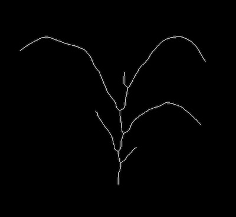
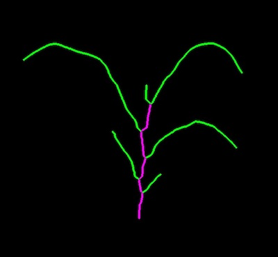
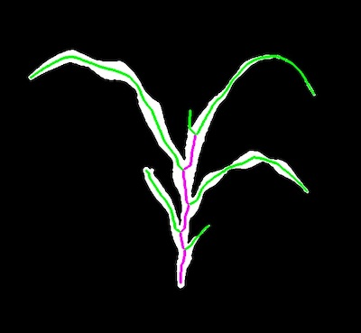

## Sort Segments

Sort segments from a skeletonized image into two categories: leaf objects and other objects. 

**plantcv.morphology.segment_sort**(*skel_img, objects, mask=None, first_stem=True*)

**returns** Secondary objects, primary objects

- **Parameters:**
    - skel_img - Skeleton image (output from [plantcv.morphology.skeletonize](skeletonize.md))
    - objects - Segment objects (output from [plantcv.morphology.prune](prune.md), or [plantcv.morphology.segment_skeleton](segment_skeleton.md))
    - mask - Binary mask for debugging. If provided, debug image will be overlaid on the mask.
    - first_stem - When True, the first segment (the bottom segment) gets classified as stem. If False, then the algorithm classification is applied to each segment. 
- **Context:**
    - Sorts skeleton segments into two categories: primary and secondary segments. Segments get classified as primary 
    if both end points of the segment coincide with branch points. Segments get classified as secondary if at least one of their
    endpoints coincide with a tip. By this classification method in the example below primary segments are stem and secondary 
    segments are leaves. Secondary segments get colored green and primary segments get colored fuschia. 

**Reference Images**




```python

from plantcv import plantcv as pcv

# Set global debug behavior to None (default), "print" (to file), 
# or "plot" (Jupyter Notebooks or X11)
pcv.params.debug = "plot"

# Adjust line thickness with the global line thickness parameter (default = 5)
pcv.params.line_thickness = 3 

leaf_obj, other_obj = pcv.morphology.segment_sort(skel_img=skeleton,
                                                  objects=obj)

leaf_obj, other_obj = pcv.morphology.segment_sort(skel_img=skeleton,
                                                  objects=obj,
                                                  mask=plant_mask)

```

*Segmented Image without Mask*



*Segmented Image with Mask*



**Source Code:** [Here](https://github.com/danforthcenter/plantcv/blob/main/plantcv/plantcv/morphology/segment_sort.py)
