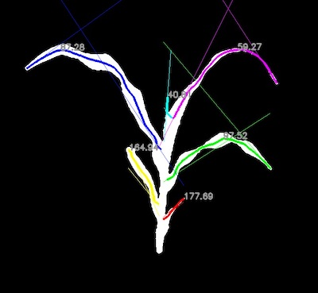

## Measure Tangent Angles of Segments  

Measure tangent angles of segments as a way to quantify leaf behavior. 

**plantcv.morphology.segment_tangent_angle**(*segmented_img, objects, size, label=None*)

**returns** labeled image 

- **Parameters:**
    - segmented_img - Segmented image (output either from [plantcv.morphology.segment_skeleton](segment_skeleton.md)
    or [plantcv.morphology.segment_id](segment_id.md)), used for creating the labeled image. 
    - objects - Segment objects (output from either [plantcv.morphology.prune](prune.md),
    [plantcv.morphology.segment_skeleton](segment_skeleton.md), or
    [plantcv.morphology.segment_sort](segment_sort.md)).
    - size - Size of ends (number of pixels) used to calculate "tangent" lines
    - label         - Optional label parameter, modifies the variable name of observations recorded. (default = `pcv.params.sample_label`)
- **Context:**
    - Find 'tangent' angles in degrees of skeleton segments. Use `size` pixels on either end of
      each segment to find a linear regression line, and calculate angle between the two lines
      drawn per segment. Users can pass only leaf objects (returned from [plantcv.morphology.segment_sort](segment_sort.md)) 
      to only collect angles of leaves. 
- **Output data stored:** Data ('segment_tangent_angle') automatically gets stored to the [`Outputs` class](outputs.md) when this function is ran. 
    These data can always get accessed during a workflow (example below). For more detail about data output see [Summary of Output Observations](output_measurements.md#summary-of-output-observations)

**Reference Image:** segmented image 


```python

from plantcv import plantcv as pcv

# Set global debug behavior to None (default), "print" (to file), 
# or "plot" (Jupyter Notebooks or X11)
pcv.params.debug = "plot"
# Optionally, set a sample label name
pcv.params.sample_label = "plant"

# Adjust line thickness with the global line thickness parameter (default = 5)
pcv.params.line_thickness = 3 

labeled_img = pcv.morphology.segment_tangent_angle(segmented_img=leaves_segment, 
                                                   objects=leaf_obj,
                                                   size=15)

# Access data stored out from segment_tangent_angle
leaf_tangent_angles = pcv.outputs.observations['plant']['segment_tangent_angle']['value']

```

*Labeled Image*



**Source Code:** [Here](https://github.com/danforthcenter/plantcv/blob/main/plantcv/plantcv/morphology/segment_tangent_angle.py)
