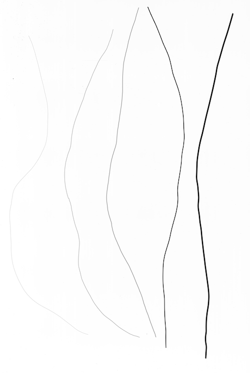
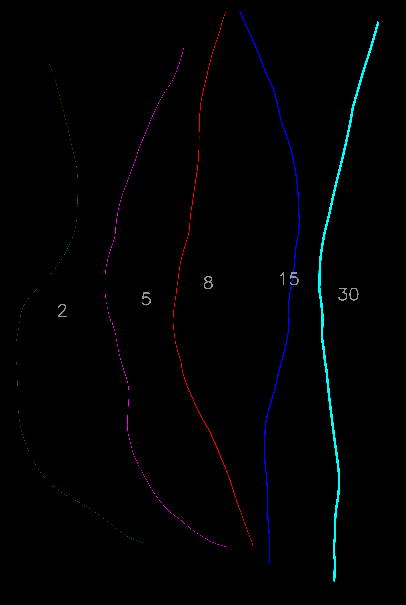

## Measure Width of Segments 

Measure the average width of segments. 

**plantcv.morphology.segment_width**(*segmented_img, skel_img, labeled_mask, n_labels=1, label=None*)

**returns** labeled_image  

- **Parameters:**
    - segmented_img - Segmented image (output either from [`plantcv.morphology.segment_skeleton`](segment_skeleton.md)
    or [`plantcv.morphology.segment_id`](segment_id.md)), used for creating the labeled image. 
    - Skeleton image (output from [`plantcv.morphology.skeletonize`](skeletonize.md) or output from [`plantcv.morphology.prune`](prune.md))
    - labeled_mask - Labeled mask of segments/objects to get analyzes (output from [`plantcv.morphology.fill_segments`](fill_segments.md),  [`pcv.create_labels`](create_labels.md), or [`pcv.roi.filter`](roi_filter.md))
    - label         - Optional label parameter, modifies the variable name of observations recorded. (default = `pcv.params.sample_label`)
- **Context:**
    - Calculates the average width of each segment with a distance transformation.
- **Output data stored:** Data ('segment_width') automatically gets stored to the [`Outputs` class](outputs.md) when this function is ran. Width measurements can be scaled to real world units (e.g. mm) using the `unit`, `px_height`, and `px_width` [parameters](params.md).
    These data can always get accessed during a workflow (example below). For more detail about data output see [Summary of Output Observations](output_measurements.md#summary-of-output-observations)

**Reference Image:** [Images of copper wires with various diameters for validating root image analysis](https://doi.org/10.5281/zenodo.4677546)




```python

from plantcv import plantcv as pcv

# Set global debug behavior to None (default), "print" (to file), 
# or "plot" (Jupyter Notebooks or X11)
pcv.params.debug = "plot"
# Optionally, set a sample label name
pcv.params.sample_label = "wire"

labeled_img = pcv.morphology.segment_path_length(segmented_img=segmented_img, skel_img=skel, labeled_mask=labeled_mask, n_labels=5)

# Access data stored out from segment_path_length
seg_widths = pcv.outputs.observations['wire']['mean_segment_width']['value']

```

*Labeled Image*



**Source Code:** [Here](https://github.com/danforthcenter/plantcv/blob/main/plantcv/plantcv/morphology/segment_width.py)
