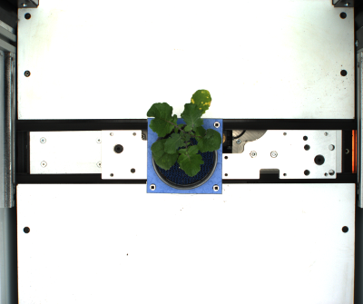
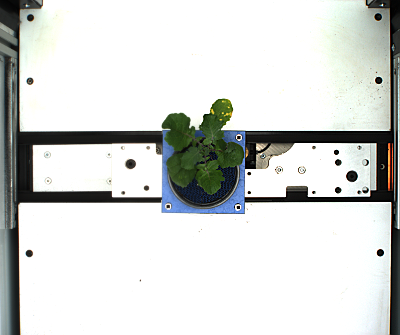
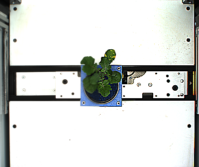

## Sharpen

Sharpens an image through the unsharp masking method. Applies a gaussian blur which is subtracted from an exaggerated version of the starting image.

**plantcv.sharpen**(*img, ksize, amount=1, threshold=0, sigma_x=0, sigma_y=None, roi=None*)

**returns** sharpened image

- **Parameters:**
    - img - RGB or grayscale image data
    - ksize - Tuple of kernel dimensions, e.g. (5, 5). Must be odd integers.
    - amount - Integer describing amount of sharpening, higher numbers will sharpen more.
    - threshold - Integer cutoff on low contrast, contrasts lower than this will be removed.
    - sigma_x - standard deviation in X direction; if 0 (default), calculated from kernel size
    - sigma_y - standard deviation in Y direction; if sigma_Y is None (default), sigma_Y is taken to equal sigma_X
    - roi - Optional rectangular ROI as returned by [`pcv.roi.rectangle`](roi_rectangle.md) within which to apply this function. (default = None, which uses the entire image)
- **Context:**
    - Used to reduce blur in an image

**Original image**



**Sharpening Image**

```python

# Apply sharpening within an ROI to show differences
roi = pcv.roi.rectangle(img, 200, 0, 335, 200)
sharp1 = pcv.sharpen(img, (5, 5), amount=1, roi=roi)

# Higher amount of sharpening will look more dramatic
sharp5 = pcv.sharpen(img, (5, 5), amount = 5, roi=roi)
```

**Sharpen (ksize = (5,5), amount=1, roi=roi)**



**Sharpen (ksize = (5,5), amount=5, roi=roi)**



**Source Code:** [Here](https://github.com/danforthcenter/plantcv/blob/main/plantcv/plantcv/sharpen.py)
