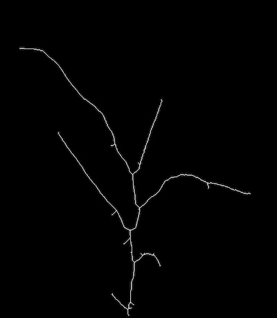

## Create a Skeleton 

**plantcv.morphology.**(**)

**returns** Binary skeleton (1 pixel wide representation)

- **Parameters:**
    - mask - Binary mask
- **Context:**
    - Reduces binary objects to 1 pixel wide representations (skeleton)

**Reference Image**


```python

from plantcv import plantcv as pcv

# Set global debug behavior to None (default), "print" (to file), 
# or "plot" (Jupyter Notebooks or X11)
pcv.params.debug = "print"

skeleton = pcv.morphology.skeletonize(mask=plant_mask)

```


