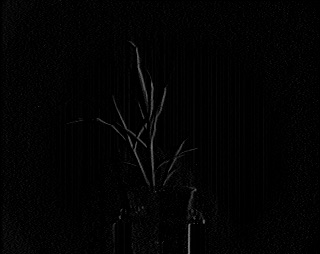

## Sobel Filter

This is a filtering method used to identify and highlight coarse changes in pixel intensity based on the 1st derivative.
Similar results to the [Scharr filter](scharr_filter.md) function.

**plantcv.sobel_filter**(*gray_img, dx, dy, k*)

**returns** filtered image

- **Parameters:**
    - gray_img - Grayscale image data
    - dx - derivative of x to analyze
    - dy - derivative of y to analyze
    - k - apertures size used to calculate 2nd derivative filter, specifies the size of the kernel (must be an odd integer)
- **Context:**
    - Used to define edges within and around objects
    - Aperture size must be greater than the largest derivative (`k >= dx & k >= dy`) in order to run
- **Example use:**
    - [Use In NIR Tutorial](nir_tutorial.md)

**Original grayscale image**


```python
from plantcv import plantcv as pcv

# Set global debug behavior to None (default), "print" (to file), or "plot" (Jupyter Notebooks or X11)
pcv.params.debug = "print"

# Apply to a grayscale image
# Filtered image will highlight areas of coarse pixel intensity change based on 1st derivative
sb_x_img = pcv.sobel_filter(gray_img, 1, 0, 1)
sb_y_img = pcv.sobel_filter(gray_img, 0, 1, 1)
```

**Sobel filtered (x-axis)**



**Sobel filtered (y-axis)**


