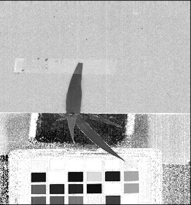

## Spectral Index

This function extracts indices, typically from a hyperspectral datacube, which is a [`Spectral_data` class](Spectral_data.md) instance created while reading in with [readimage](read_image.md)
with `mode='envi'`. For some indices, RGB images are also eligable of calculating them. There is also a parameter to allow some flexibility 
on using wavelengths that are at least close to the wavelength bands require to calculate a specific index. 

**plantcv.spectral_index.ndvi**(*hsi, distance=20*)

**returns** calculated index array (instance of the `Spectral_data` class)

- **Parameters:**
    - hsi         - A hyperspectral image, an instance of the `Spectral_data` class in plantcv, (read in with [pcv.readimage](read_image.md) with `mode='envi'`)
    - distance    - Amount of flexibility (in nanometers) regarding using wavelengths that are 
    at least close to the wavelength bands require to calculate a specific index

- **Note:**
    - We are adding potential indices as needed by PlantCV contributors, however the functions added to PlantCV are shaped in large part 
    by the end users so please post feature requests (including a specific index), questions, and comments on the 
    [GitHub issues page](https://github.com/danforthcenter/plantcv/issues). 
- **Example use:**
    - Below
```python

from plantcv import plantcv as pcv

# Set global debug behavior to None (default), "print" (to file), 
# or "plot" (Jupyter Notebooks or X11)
pcv.params.debug = "print"

# Extract NDVI index from the datacube 
ndvi_array  = pcv.spectral_index.ndvi(hsi=spectral_data, distance=20)

# Extract GDVI index from the datacube
gdvi_array  = pcv.spectral_index.gdvi(hsi=spectral_data, distance=20)

# Extract SAVI index from the datacube
savi_array  = pcv.spectral_index.savi(hsi=spectral_data, distance=20)

# Extract ARI index from the datacube
ari_array  = pcv.spectral_index.ari(hsi=spectral_data, distance=20)

# Extract ACI index from the datacube 
aci_array  = pcv.spectral_index.aci(hsi=spectral_data, distance=20)

# Extract ARI index from the datacube 
ari_array  = pcv.spectral_index.ari(hsi=spectral_data, distance=20)

# Extract CARI index from the datacube 
cari_array  = pcv.spectral_index.cari(hsi=spectral_data, index="CARI", distance=20)

# Extract CI_REDEDGE index from the datacube 
ci_rededge_array  = pcv.spectral_index.ci_rededge(array=spectral_data, index="CI_REDEDGE", distance=20)

# Extract CRI1 index from the datacube 
cri1_array  = pcv.hyperspectral.extract_index.cri1(hsi=spectral_data, distance=20)

# Extract CRI2 index from the datacube 
cri2_array  = pcv.spectral_index.cri2(hsi=spectral_data, distance=20)

# Extract EVI index from the datacube 
evi_array  = pcv.spectral_index.evi(hsi=spectral_data, distance=20)

# Extract MARI index from the datacube 
mari_array  = pcv.spectral_index.mari(hsi=spectral_data, distance=20)

# Extract MCARI index from the datacube 
mcari_array  = pcv.spectral_index.mcari(hsi=spectral_data, distance=20)

# Extract MTCI index from the datacube 
mtci_array  = pcv.spectral_index.mtci(hsi=spectral_data, distance=20)

# Extract NDRE index from the datacube 
ndre_array  = pcv.spectral_index.ndre(hsi=spectral_data, distance=20)

# Extract PSND_CHLA index from the datacube 
psnd_chla_array  = pcv.spectral_index.psnd_chla(hsi=spectral_data, distance=20)

# Extract PSND_CHLB index from the datacube 
psnd_chlb_array  = pcv.spectral_index.psnd_chlb (hsi=spectral_data, distance=20)

# Extract PSND_CAR index from the datacube 
psnd_car_array  = pcv.spectral_index(hsi=spectral_data, distance=20)

# Extract PSRI index from the datacube 
psri_array  = pcv.spectral_index.psri(hsi=spectral_data, distance=20)

# Extract PSSR1 index from the datacube 
pssr1_array  = pcv.spectral_index.pssr1(hsi=spectral_data, distance=20)

# Extract PSSR2 index from the datacube 
pssr2_array  = pcv.spectral_index.pssr2(hsi=spectral_data, distance=20)

# Extract PSSR3 index from the datacube 
pssr3_array  = pcv.spectral_index.pssr3(hsi=spectral_data, distance=20)

# Extract RGRI index from the datacube 
rgri_array  = pcv.spectral_index.rgri(hsi=spectral_data, distance=20)

# Extract RVSI index from the datacube 
rvsi_array  = pcv.spectral_index.rvsi(hsi=spectral_data, distance=20)

# Extract SIPI index from the datacube 
sipi_array  = pcv.spectral_index.sipi(hsi=spectral_data, distance=20)

# Extract SR index from the datacube 
sr_array  = pcv.spectral_index.sr(hsi=spectral_data, distance=20)

# Extract VARI index from the datacube 
vari_array  = pcv.spectral_index.vari(hsi=spectral_data, distance=20)

# Extract VI_GREEN index from the datacube 
vi_green_array  = pcv.spectral_index.vi_green(hsi=spectral_data, distance=20)

# Extract WBI index from the datacube 
wbi_array  = pcv.spectral_index.wbi(hsi=spectral_data, distance=20)


```

**NDVI array image**


**GDVI array image**


**SAVI array image**


**ARI array image**


**ACI array image**



**NDRE array image**


**PSND_CHLA array image**


**PSND_CHLB array image**


**WBI array image**


**Source Code:** [Here](https://github.com/danforthcenter/plantcv/blob/master/plantcv/plantcv/hyperspectral/extract_index.py)
