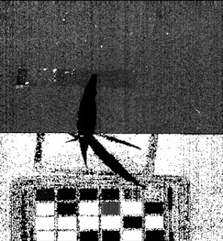
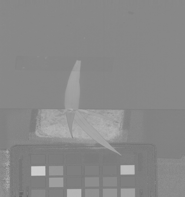
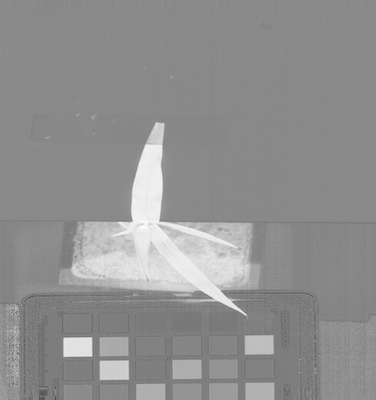
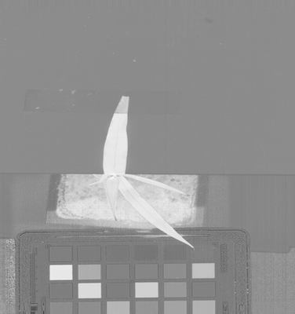
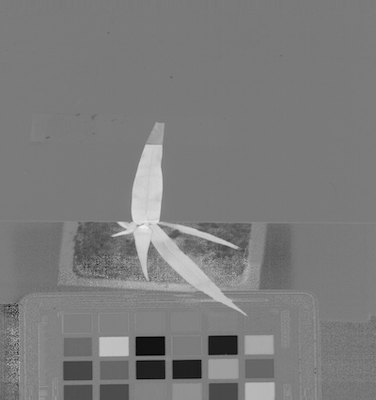

## Spectral Index

The `plantcv.spectral_index` subpackage contains functions that calculate indices from multi-channel image data, 
typically from a hyperspectral datacube, which is a [`Spectral_data` class](Spectral_data.md) instance created while 
reading in with the [pcv.readimage](read_image.md) function with `mode='envi'` or `mode='arcgis'`. RGB images are valid input for certain 
indices. There is also a parameter to allow some flexibility if the required wavelengths are not available for a specific index.

!!! note
    We are adding potential indices as needed by PlantCV community members, however the functions added to PlantCV are 
    shaped in large part by the end users so please post feature requests (including a specific index), questions, 
    and comments on the [GitHub issues page](https://github.com/danforthcenter/plantcv/issues).

### ARI

Calculates the Anthocyanin Reflectance Index using reflectance values ([Gitelson et al., 2001](#references)):

```
ARI = (1 / R550) - (1 / R700) 

```

Index range: -∞, ∞

**plantcv.spectral_index.ari**(*hsi, distance=20*)

**returns** calculated index array (instance of the `Spectral_data` class)

- **Parameters:**
    - hsi         - Hyperspectral image object, an instance of the `Spectral_data` class in plantcv (read in using [pcv.readimage](read_image.md) with `mode='envi'`)
    - distance    - Amount of flexibility (in nanometers) regarding the bands used to calculate an index.

### CI_REDEDGE

Calculates the Chlorophyll Index Rededge using reflectance values ([Gitelson et al., 2003](#references)):

```
CI_REDEDGE = (R800 / R700) - 1
```

Index range: -1.0, ∞

**plantcv.spectral_index.ci_rededge**(*hsi, distance=20*)

**returns** calculated index array (instance of the `Spectral_data` class)

- **Parameters:**
    - hsi         - Hyperspectral image object, an instance of the `Spectral_data` class in plantcv (read in using [pcv.readimage](read_image.md) with `mode='envi'`)
    - distance    - Amount of flexibility (in nanometers) regarding the bands used to calculate an index.

### CRI550

Calculates the Carotenoid Reflectance Index 550 using reflectance values ([Gitelson et al., 2002a](#references)):

```
CRI550 = (1 / R510) - (1 / R550)
```

Index range: -∞, ∞

**plantcv.spectral_index.cri550**(*hsi, distance=20*)

**returns** calculated index array (instance of the `Spectral_data` class)

- **Parameters:**
    - hsi         - Hyperspectral image object, an instance of the `Spectral_data` class in plantcv (read in using [pcv.readimage](read_image.md) with `mode='envi'`)
    - distance    - Amount of flexibility (in nanometers) regarding the bands used to calculate an index.

### CRI700

Calculates the Carotenoid Reflectance Index 700 using reflectance values ([Gitelson et al., 2002a](#references)):

```
CRI700 = (1 / R510) - (1 / R700)
```

Index range: -∞, ∞

**plantcv.spectral_index.cri700**(*hsi, distance=20*)

**returns** calculated index array (instance of the `Spectral_data` class)

- **Parameters:**
    - hsi         - Hyperspectral image object, an instance of the `Spectral_data` class in plantcv (read in using [pcv.readimage](read_image.md) with `mode='envi'`)
    - distance    - Amount of flexibility (in nanometers) regarding the bands used to calculate an index.

### EGI

Calculates the Excess Green Index using RGB values ([Woebbecke et al., 1995](#references)):

```
r = R / (R + G + B)
g = G / (R + G + B)
b = B / (R + G + B)
EGI = 2g - r - b
```

Index range: -1, 2

**plantcv.spectral_index.egi**(*rgb_img*)

**returns** calculated index array (instance of the `Spectral_data` class)

- **Parameters:**
    - rgb_img     - Color image.

### EVI

Calculates the Enhanced Vegetation index using reflectance values ([Huete et al., 1997](#references)):

```
EVI = (2.5 * (NIR - RED)) / (1 + NIR + (6 * RED) - (7.5 * BLUE))
```

Here, we use ~R800 for NIR, ~R670 for RED, and ~R480 for BLUE:

```
EVI = (2.5 * (R800 - R670)) / (1 + R800 + (6 * R670) - (7.5 * R480))
```

Index range: -∞, ∞

**plantcv.spectral_index.evi**(*hsi, distance=20*)

**returns** calculated index array (instance of the `Spectral_data` class)

- **Parameters:**
    - hsi         - Hyperspectral image object, an instance of the `Spectral_data` class in plantcv (read in using [pcv.readimage](read_image.md) with `mode='envi'`)
    - distance    - Amount of flexibility (in nanometers) regarding the bands used to calculate an index.

### GDVI

Calculates the Green Difference Vegetation Index using reflectance values ([Sripada et al., 2006](#references)):

```
GDVI = (NIR - GREEN) / (NIR + GREEN)
```

Here, we use ~R800 for NIR and ~R550 for GREEN:

```
GDVI = (R800 - R550) / (R800 + R550)
```

Index range: -2.0, 2.0

**plantcv.spectral_index.gdvi**(*hsi, distance=20*)

**returns** calculated index array (instance of the `Spectral_data` class)

- **Parameters:**
    - hsi         - Hyperspectral image object, an instance of the `Spectral_data` class in plantcv (read in using [pcv.readimage](read_image.md) with `mode='envi'`)
    - distance    - Amount of flexibility (in nanometers) regarding the bands used to calculate an index.

### MARI

Calculates the Modified Anthocyanin Reflectance Index using reflectance values ([Gitelson et al., 2006](#references)):

```
MARI = ((1 / R550) - (1 / R700)) * R800
```

Index range: -∞, ∞

**plantcv.spectral_index.mari**(*hsi, distance=20*)

**returns** calculated index array (instance of the `Spectral_data` class)

- **Parameters:**
    - hsi         - Hyperspectral image object, an instance of the `Spectral_data` class in plantcv (read in using [pcv.readimage](read_image.md) with `mode='envi'`)
    - distance    - Amount of flexibility (in nanometers) regarding the bands used to calculate an index.

### MCARI

Calculates the Modified Chlorophyll Absorption Reflectance Index using reflectance values ([Daughtry et al., 2000](#references)):

```
MCARI = ((R700 - R670) - 0.2 * (R700 - R550)) * (R700 / R670)
```

Index range: -∞, ∞

**plantcv.spectral_index.mcari**(*hsi, distance=20*)

**returns** calculated index array (instance of the `Spectral_data` class)

- **Parameters:**
    - hsi         - Hyperspectral image object, an instance of the `Spectral_data` class in plantcv (read in using [pcv.readimage](read_image.md) with `mode='envi'`)
    - distance    - Amount of flexibility (in nanometers) regarding the bands used to calculate an index.

### MTCI

Calculates the MERIS Terrestrial Chlorophyll Index using reflectance values ([Dash and Curran 2004](#references)):

```
MTCI = (R753.75 - R708.75) / (R708.75 - R681.25)
```

Index range: -∞, ∞

**plantcv.spectral_index.mtci**(*hsi, distance=20*)

**returns** calculated index array (instance of the `Spectral_data` class)

- **Parameters:**
    - hsi         - Hyperspectral image object, an instance of the `Spectral_data` class in plantcv (read in using [pcv.readimage](read_image.md) with `mode='envi'`)
    - distance    - Amount of flexibility (in nanometers) regarding the bands used to calculate an index.

### NDRE

Calculates the Normalized Difference Red Edge index using reflectance values ([Barnes et al., 2000](#references)):

```
NDRE = (R790 - R720) / (R790 + R720)
```

Index range: -1.0, 1.0

**plantcv.spectral_index.ndre**(*hsi, distance=20*)

**returns** calculated index array (instance of the `Spectral_data` class)

- **Parameters:**
    - hsi         - Hyperspectral image object, an instance of the `Spectral_data` class in plantcv (read in using [pcv.readimage](read_image.md) with `mode='envi'`)
    - distance    - Amount of flexibility (in nanometers) regarding the bands used to calculate an index.

### NDVI

Calculates the Normalized Difference Vegetation Index using reflectance values ([Rouse et al., 1974](#references)):

```
NDVI = (NIR - RED) / (NIR + RED)
```

Here, we use ~R800 for NIR and ~R670 for RED:

```
NDVI = (R800 - R670) / (R800 + R670)
```

Index range: -1.0, 1.0

**plantcv.spectral_index.ndvi**(*hsi, distance=20*)

**returns** calculated index array (instance of the `Spectral_data` class)

- **Parameters:**
    - hsi         - Hyperspectral image object, an instance of the `Spectral_data` class in plantcv (read in using [pcv.readimage](read_image.md) with `mode='envi'`)
    - distance    - Amount of flexibility (in nanometers) regarding the bands used to calculate an index.

### PRI

Calculates the Photochemical Reflectance Index using reflectance values ([Penuelas et al., 1995a](#references)):

```
PRI = (R531 - R570) / (R531 + R570)
```

Index range: -1.0, 1.0

**plantcv.spectral_index.pri**(*hsi, distance=20*)

**returns** calculated index array (instance of the `Spectral_data` class)

- **Parameters:**
    - hsi         - Hyperspectral image object, an instance of the `Spectral_data` class in plantcv (read in using [pcv.readimage](read_image.md) with `mode='envi'`)
    - distance    - Amount of flexibility (in nanometers) regarding the bands used to calculate an index.

### PSND-Chlorophyll a

Calculates the Pigment Specific Normalized Difference for Chlorophyll a using reflectance values 
([Blackburn 1998](#references)):

```
PSND_CHLA = (R800 - R680) / (R800 + R680)
```

Index range: -1.0, 1.0

**plantcv.spectral_index.psnd_chla**(*hsi, distance=20*)

**returns** calculated index array (instance of the `Spectral_data` class)

- **Parameters:**
    - hsi         - Hyperspectral image object, an instance of the `Spectral_data` class in plantcv (read in using [pcv.readimage](read_image.md) with `mode='envi'`)
    - distance    - Amount of flexibility (in nanometers) regarding the bands used to calculate an index.

### PSND-Chlorophyll b

Calculates the Pigment Specific Normalized Difference for Chlorophyll b using reflectance values 
([Blackburn 1998](#references)):

```
PSND_CHLB = (R800 - R635) / (R800 + R635)
```

Index range: -1.0, 1.0

**plantcv.spectral_index.psnd_chlb**(*hsi, distance=20*)

**returns** calculated index array (instance of the `Spectral_data` class)

- **Parameters:**
    - hsi         - Hyperspectral image object, an instance of the `Spectral_data` class in plantcv (read in using [pcv.readimage](read_image.md) with `mode='envi'`)
    - distance    - Amount of flexibility (in nanometers) regarding the bands used to calculate an index.

### PSND-Caroteniods

Calculates the Pigment Specific Normalized Difference for Caroteniods using reflectance values 
([Blackburn 1998](#references)):

```
PSND_CAR = (R800 - R470) / (R800 + R470)
```

Index range: -1.0, 1.0

**plantcv.spectral_index.psnd_car**(*hsi, distance=20*)

**returns** calculated index array (instance of the `Spectral_data` class)

- **Parameters:**
    - hsi         - Hyperspectral image object, an instance of the `Spectral_data` class in plantcv (read in using [pcv.readimage](read_image.md) with `mode='envi'`)
    - distance    - Amount of flexibility (in nanometers) regarding the bands used to calculate an index.

### PSRI

Calculates the Plant Senescence Reflectance Index using reflectance values ([Merzlyak et al., 1999](#references)):

```
PSRI = (R678 - R500) / R750
```

Index range: -∞, ∞

**plantcv.spectral_index.psri**(*hsi, distance=20*)

**returns** calculated index array (instance of the `Spectral_data` class)

- **Parameters:**
    - hsi         - Hyperspectral image object, an instance of the `Spectral_data` class in plantcv (read in using [pcv.readimage](read_image.md) with `mode='envi'`)
    - distance    - Amount of flexibility (in nanometers) regarding the bands used to calculate an index.

### PSSR-Chlorophyll a

Calculates the Pigment Specific Simple Ratio for Chlorophyll a using reflectance values 
([Blackburn 1998](#references)):

```
PSSR_CHLA = R800 / R680
```

Index range: -1.0, 1.0

**plantcv.spectral_index.pssr_chla**(*hsi, distance=20*)

**returns** calculated index array (instance of the `Spectral_data` class)

- **Parameters:**
    - hsi         - Hyperspectral image object, an instance of the `Spectral_data` class in plantcv (read in using [pcv.readimage](read_image.md) with `mode='envi'`)
    - distance    - Amount of flexibility (in nanometers) regarding the bands used to calculate an index.

### PSSR-Chlorophyll b

Calculates the Pigment Specific Simple Ratio for Chlorophyll b using reflectance values 
([Blackburn 1998](#references)):

```
PSSR_CHLB = R800 / R635
```

Index range: -1.0, 1.0

**plantcv.spectral_index.pssr_chlb**(*hsi, distance=20*)

**returns** calculated index array (instance of the `Spectral_data` class)

- **Parameters:**
    - hsi         - Hyperspectral image object, an instance of the `Spectral_data` class in plantcv (read in using [pcv.readimage](read_image.md) with `mode='envi'`)
    - distance    - Amount of flexibility (in nanometers) regarding the bands used to calculate an index.

### PSSR-Caroteniods

Calculates the Pigment Specific Simple Ratio for Caroteniods using reflectance values 
([Blackburn 1998](#references)):

```
PSSR_CAR = R800 / R470
```

Index range: -1.0, 1.0

**plantcv.spectral_index.pssr_car**(*hsi, distance=20*)

**returns** calculated index array (instance of the `Spectral_data` class)

- **Parameters:**
    - hsi         - Hyperspectral image object, an instance of the `Spectral_data` class in plantcv (read in using [pcv.readimage](read_image.md) with `mode='envi'`)
    - distance    - Amount of flexibility (in nanometers) regarding the bands used to calculate an index.

### RGRI

Calculates the Red:Green Ratio Index for anthocyanin using reflectance values ([Gamon and Surfus 1999](#references)):

```
RGRI = RED / GREEN
```

Here, we use ~R670 for RED and ~R560 for GREEN:

```
RGRI = R670 / R560
```

Index range: 0.0, ∞

**plantcv.spectral_index.rgri**(*hsi, distance=20*)

**returns** calculated index array (instance of the `Spectral_data` class)

- **Parameters:**
    - hsi         - Hyperspectral image object, an instance of the `Spectral_data` class in plantcv (read in using [pcv.readimage](read_image.md) with `mode='envi'`)
    - distance    - Amount of flexibility (in nanometers) regarding the bands used to calculate an index.

### RVSI

Calculates the Red-Edge Vegetation Stress Index using reflectance values ([Merton and Huntington 1999](#references)):

```
RVSI = ((R714 + R752) / 2) - R733
```

Index range: -1.0, 1.0

**plantcv.spectral_index.rvsi**(*hsi, distance=20*)

**returns** calculated index array (instance of the `Spectral_data` class)

- **Parameters:**
    - hsi         - Hyperspectral image object, an instance of the `Spectral_data` class in plantcv (read in using [pcv.readimage](read_image.md) with `mode='envi'`)
    - distance    - Amount of flexibility (in nanometers) regarding the bands used to calculate an index.

### SAVI

Calculates the Soil Adjusted Vegetation Index using reflectance values ([Huete 1988](#references)):

```
SAVI = (1.5 * (NIR - RED)) / (NIR + RED + 0.5)
```

Here, we use ~R800 for NIR and ~R680 for RED:

```
SAVI = (1.5 * (R800 - R680)) / (R800 + R680 + 0.5)
```

Index range: -1.2, 1.2

**plantcv.spectral_index.savi**(*hsi, distance=20*)

**returns** calculated index array (instance of the `Spectral_data` class)

- **Parameters:**
    - hsi         - Hyperspectral image object, an instance of the `Spectral_data` class in plantcv (read in using [pcv.readimage](read_image.md) with `mode='envi'`)
    - distance    - Amount of flexibility (in nanometers) regarding the bands used to calculate an index.

### SIPI

Calculates the Structure-Independent Pigment Index using reflectance values ([Penuelas et al., 1995b](#references)):

```
SIPI = (NIR - RED) / (NIR - BLUE)
```

Here, we use ~R800 for NIR, ~670 for RED and ~R480 for BLUE:

```
SIPI = (R800 - R680) / (R800 - R480)
```

Index range: -∞, ∞

**plantcv.spectral_index.sipi**(*hsi, distance=20*)

**returns** calculated index array (instance of the `Spectral_data` class)

- **Parameters:**
    - hsi         - Hyperspectral image object, an instance of the `Spectral_data` class in plantcv (read in using [pcv.readimage](read_image.md) with `mode='envi'`)
    - distance    - Amount of flexibility (in nanometers) regarding the bands used to calculate an index.

### SR

Calculates the Simple Ratio using reflectance values ([Jordan 1969](#references)):

```
SR = NIR / RED
```

Here, we use ~R800 for NIR and ~R670 for RED:

```
SR = R800 / R670
```

Index range: 0.0, ∞

**plantcv.spectral_index.sr**(*hsi, distance=20*)

**returns** calculated index array (instance of the `Spectral_data` class)

- **Parameters:**
    - hsi         - Hyperspectral image object, an instance of the `Spectral_data` class in plantcv (read in using [pcv.readimage](read_image.md) with `mode='envi'`)
    - distance    - Amount of flexibility (in nanometers) regarding the bands used to calculate an index.

### VARI

Calculates the Visible Atmospherically Resistant Index using reflectance values ([Gitelson et al., 2002b](#references)):

```
VARI = (GREEN - RED) / (GREEN + RED - BLUE)
```

Here, we use ~R480 for BLUE, ~R550 for GREEN, and ~R670 for RED:

```
VARI = (R550 - R670) / (R550 + R670 - R480)
```

Index range: -∞, ∞

**plantcv.spectral_index.vari**(*hsi, distance=20*)

**returns** calculated index array (instance of the `Spectral_data` class)

- **Parameters:**
    - hsi         - Hyperspectral image object, an instance of the `Spectral_data` class in plantcv (read in using [pcv.readimage](read_image.md) with `mode='envi'`)
    - distance    - Amount of flexibility (in nanometers) regarding the bands used to calculate an index.

### VI_GREEN

Calculates the Vegetation Index using green bands using reflectance values ([Gitelson et al., 2002b](#references)):

```
VIgreen = (GREEN - RED) / (GREEN + RED)
```

Here, we use ~R550 for GREEN and ~R670 for RED:

```
VIgreen = (R550 - R670) / (R550 + R670)
```

Index range: -1.0, 1.0

**plantcv.spectral_index.vi_green**(*hsi, distance=20*)

**returns** calculated index array (instance of the `Spectral_data` class)

- **Parameters:**
    - hsi         - Hyperspectral image object, an instance of the `Spectral_data` class in plantcv (read in using [pcv.readimage](read_image.md) with `mode='envi'`)
    - distance    - Amount of flexibility (in nanometers) regarding the bands used to calculate an index.

### WI

Calculates the Water Index using reflectance values ([Penuelas et al., 1997](#references)):

```
WI = R900 / R970
```

Index range: 0.0, ∞

**plantcv.spectral_index.wi**(*hsi, distance=20*)

**returns** calculated index array (instance of the `Spectral_data` class)

- **Parameters:**
    - hsi         - Hyperspectral image object, an instance of the `Spectral_data` class in plantcv (read in using [pcv.readimage](read_image.md) with `mode='envi'`)
    - distance    - Amount of flexibility (in nanometers) regarding the bands used to calculate an index.

### Examples

```python

from plantcv import plantcv as pcv

# Set global debug behavior to None (default), "print" (to file), 
# or "plot" (Jupyter Notebooks or X11)
pcv.params.debug = "plot"

# Extract NDVI index from the datacube 
ndvi_array  = pcv.spectral_index.ndvi(hsi=spectral_data, distance=20)

# Extract GDVI index from the datacube
gdvi_array  = pcv.spectral_index.gdvi(hsi=spectral_data, distance=20)

# Extract SAVI index from the datacube
savi_array  = pcv.spectral_index.savi(hsi=spectral_data, distance=20)

# Extract ARI index from the datacube
ari_array  = pcv.spectral_index.ari(hsi=spectral_data, distance=20)

# Extract CI_REDEDGE index from the datacube 
ci_rededge_array  = pcv.spectral_index.ci_rededge(hsi=spectral_data, distance=20)

# Extract CRI550 index from the datacube 
cri550_array  = pcv.hyperspectral.extract_index.cri550(hsi=spectral_data, distance=20)

# Extract CRI700 index from the datacube 
cri700_array  = pcv.spectral_index.cri700(hsi=spectral_data, distance=20)

# Extract EVI index from the datacube 
evi_array  = pcv.spectral_index.evi(hsi=spectral_data, distance=20)

# Extract MARI index from the datacube 
mari_array  = pcv.spectral_index.mari(hsi=spectral_data, distance=20)

# Extract MCARI index from the datacube 
mcari_array  = pcv.spectral_index.mcari(hsi=spectral_data, distance=20)

# Extract MTCI index from the datacube 
mtci_array  = pcv.spectral_index.mtci(hsi=spectral_data, distance=20)

# Extract NDRE index from the datacube 
ndre_array  = pcv.spectral_index.ndre(hsi=spectral_data, distance=20)

# Extract PSND_CHLA index from the datacube 
psnd_chla_array  = pcv.spectral_index.psnd_chla(hsi=spectral_data, distance=20)

# Extract PSND_CHLB index from the datacube 
psnd_chlb_array  = pcv.spectral_index.psnd_chlb(hsi=spectral_data, distance=20)

# Extract PSND_CAR index from the datacube 
psnd_car_array  = pcv.spectral_index.psnd_car(hsi=spectral_data, distance=20)

# Extract PSRI index from the datacube 
psri_array  = pcv.spectral_index.psri(hsi=spectral_data, distance=20)

# Extract PSSR_CHLA index from the datacube 
pssr_chla_array  = pcv.spectral_index.pssr_chla(hsi=spectral_data, distance=20)

# Extract PSSR_CHLB index from the datacube 
pssr_chlb_array  = pcv.spectral_index.pssr_chlb(hsi=spectral_data, distance=20)

# Extract PSSR_CAR index from the datacube 
pssr_car_array  = pcv.spectral_index.pssr_car(hsi=spectral_data, distance=20)

# Extract RGRI index from the datacube 
rgri_array  = pcv.spectral_index.rgri(hsi=spectral_data, distance=20)

# Extract RVSI index from the datacube 
rvsi_array  = pcv.spectral_index.rvsi(hsi=spectral_data, distance=20)

# Extract SIPI index from the datacube 
sipi_array  = pcv.spectral_index.sipi(hsi=spectral_data, distance=20)

# Extract SR index from the datacube 
sr_array  = pcv.spectral_index.sr(hsi=spectral_data, distance=20)

# Extract VARI index from the datacube 
vari_array  = pcv.spectral_index.vari(hsi=spectral_data, distance=20)

# Extract VI_GREEN index from the datacube 
vi_green_array  = pcv.spectral_index.vi_green(hsi=spectral_data, distance=20)

# Extract WI index from the datacube 
wi_array  = pcv.spectral_index.wi(hsi=spectral_data, distance=20)

egi_array = pcv.spectral_index.egi(rgb_img=img)

```

**NDVI array image**


**GDVI array image**


**SAVI array image**


**ARI array image**



**NDRE array image**



**PSND_CHLA array image**



**PSND_CHLB array image**



**WI array image**



**Source Code:** [Here](https://github.com/danforthcenter/plantcv/blob/main/plantcv/plantcv/spectral_index/spectral_index.py)

### References

Barnes EM, Clarke TR, Richards SE, Colaizzi PD, Haberland J, Kostrzewski M, Waller P, Choi C, Riley E, Thompson T, 
Others. 2000. Coincident detection of crop water stress, nitrogen status and canopy density using ground based 
multispectral data. In: Proceedings of the Fifth International Conference on Precision Agriculture, Bloomington, MN, 
USA. [LINK](https://naldc.nal.usda.gov/download/4190/PDF)

Blackburn GA. 1998. Quantifying chlorophylls and caroteniods at leaf and canopy scales: An evaluation of some 
hyperspectral approaches. Remote Sensing of Environment 66:273–285. DOI: 
[10.1016/S0034-4257(98)00059-5](https://doi.org/10.1016/S0034-4257(98)00059-5).

Daughtry CST, Walthall CL, Kim MS, de Colstoun EB, McMurtrey JE. 2000. Estimating corn leaf chlorophyll concentration 
from leaf and canopy reflectance. Remote Sensing of Environment 74:229–239. DOI: 
[10.1016/S0034-4257(00)00113-9](https://doi.org/10.1016/S0034-4257(00)00113-9).

Dash J, Curran PJ. 2004. The MERIS terrestrial chlorophyll index. International Journal of Remote Sensing 25:5403–5413. 
DOI: [10.1080/0143116042000274015](https://doi.org/10.1080/0143116042000274015).

Gamon JA, Surfus JS. 1999. Assessing leaf pigment content and activity with a reflectometer. The New Phytologist 
143:105–117. DOI: [10.1046/j.1469-8137.1999.00424.x](https://doi.org/10.1046/j.1469-8137.1999.00424.x).

Gitelson AA, Zur Y, Chivkunova OB, Merzlyak MN. 2002. Assessing carotenoid content in plant leaves with reflectance 
spectroscopy. Photochemistry and Photobiology 75:272–281. DOI: 
[10.1562/0031-8655(2002)0750272ACCIPL2.0.CO2](https://doi.org/10.1562/0031-8655(2002)0750272ACCIPL2.0.CO2).

Gitelson AA, Kaufman YJ, Stark R, Rundquist D. 2002. Novel algorithms for remote estimation of vegetation fraction. 
Remote Sensing of Environment 80:76–87. DOI: [10.1016/S0034-4257(01)00289-9](https://doi.org/10.1016/S0034-4257(01)00289-9).

Gitelson AA, Viña A, Arkebauer TJ, Rundquist DC, Keydan G, Leavitt B. 2003. Remote estimation of leaf area index and 
green leaf biomass in maize canopies. Geophysical Research Letters 30. DOI: 
[10.1029/2002GL016450](https://doi.org/10.1029/2002GL016450).

Gitelson AA, Keydan GP, Merzlyak MN. 2006. Three-band model for noninvasive estimation of chlorophyll, carotenoids, and 
anthocyanin contents in higher plant leaves. Geophysical Research Letters 33:239. DOI: 
[10.1029/2006GL026457](https://doi.org/10.1029/2006GL026457).

Gitelson AA, Merzlyak MN, Chivkunova OB. 2007. Optical properties and nondestructive estimation of anthocyanin content 
in plant Leaves. Photochemistry and Photobiology 74:38–45. DOI: 
[10.1562/0031-8655(2001)0740038OPANEO2.0.CO2](https://doi.org/10.1562/0031-8655(2001)0740038OPANEO2.0.CO2).

Huete AR. 1988. A soil-adjusted vegetation index (SAVI). Remote Sensing of Environment 25:295–309. 
DOI: [10.1016/0034-4257(88)90106-X](https://doi.org/10.1016/0034-4257(88)90106-X).

Huete AR, HuiQing Liu, van Leeuwen WJD. 1997. The use of vegetation indices in forested regions: issues of linearity 
and saturation. In: IGARSS’97. 1997 IEEE International Geoscience and Remote Sensing Symposium Proceedings. Remote 
Sensing - A Scientific Vision for Sustainable Development. 1966–1968 vol.4. DOI: 
[10.1109/IGARSS.1997.609169](https://doi.org/10.1109/IGARSS.1997.609169).

Jordan CF. 1969. Derivation of leaf-area index from quality of light on the forest floor. Ecology 50:663–666. DOI: 
[10.2307/1936256](https://doi.org/10.2307/1936256).

Merton R, Huntington J. 1999. Early simulation results of the ARIES-1 satellite sensor for multi-temporal vegetation 
research derived from AVIRIS. [LINK](https://aviris.jpl.nasa.gov/proceedings/workshops/99_docs/41.pdf).

Merzlyak MN, Gitelson AA, Chivkunova OB, Rakitin VYU. 1999. Non-destructive optical detection of pigment changes during 
leaf senescence and fruit ripening. Physiologia Plantarum 106:135–141. DOI: 
[10.1034/j.1399-3054.1999.106119.x](https://doi.org/10.1034/j.1399-3054.1999.106119.x).

Penuelas J, Filella I, Gamon JA. 1995. Assessment of photosynthetic radiation-use efficiency with spectral reflectance. 
The New Phytologist 131:291–296. DOI: 
[10.1111/j.1469-8137.1995.tb03064.x](https://doi.org/10.1111/j.1469-8137.1995.tb03064.x).

Penuelas J, Baret F, Filella I. 1995. Semi-empirical indices to assess carotenoids/chlorophyll-a ratio from leaf 
spectral reflectance. Photosynthetica 31:221–230. [LINK](https://www.researchgate.net/publication/229084513_Semi-Empirical_Indices_to_Assess_CarotenoidsChlorophyll-a_Ratio_from_Leaf_Spectral_Reflectance).

Penuelas J, Pinol J, Ogaya R, Filella I. 1997. Estimation of plant water concentration by the reflectance Water Index 
WI (R900/R970). International Journal of Remote Sensing 18:2869–2875. DOI: [10.1080/014311697217396](https://doi.org/10.1080/014311697217396).

Rouse JW, Haas RH, Scheel JA, Deering DW. 1974. Monitoring Vegetation Systems in the Great Plains with ERTS. In: 
Freden SC, Mercanti EP, Becker MA eds. Third Earth Resources Technology Satellite-1 Symposium: The Proceedings of a 
Symposium Held by Goddard Space Flight Center at Washington, D.C. on December 10-14, 1973 : Prepared at Goddard Space 
Flight Center. Scientific and Technical Information Office, National Aeronautics and Space Administration, 48–62. 
[LINK](https://ntrs.nasa.gov/archive/nasa/casi.ntrs.nasa.gov/19740022592.pdf).

Sripada RP, Heiniger RW, White JG, Meijer AD. 2006. Aerial Color Infrared Photography for Determining Early In-Season 
Nitrogen Requirements in Corn. Agronomy Journal 98:968–977. DOI: 
[10.2134/agronj2005.0200](https://doi.org/10.2134/agronj2005.0200).

Woebbecke DM, Meyer GE, Von Bargen K, Mortensen DA. 1995. Color indices for weed identification under various 
soil, residue, and lighting conditions. Transactions of the ASAE. American Society of Agricultural Engineers 38:259–269.
DOI: [10.13031/2013.27838](https://doi.org/10.13031/2013.27838).
