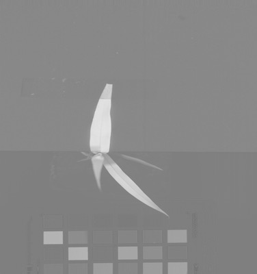

## Spectral Index

The `plantcv.spectral_index` subpackage contains functions that calculate indices from multi-channel image data, 
typically from a hyperspectral datacube, which is a [`Spectral_data` class](Spectral_data.md) instance created while 
reading in with the [pcv.readimage](read_image.md) function with `mode='envi'`. For certain indices RGB images are 
valid input. There is also a parameter to allow some flexibility if the required wavelengths for a specific index 
are not available.

!!! note
    We are adding potential indices as needed by PlantCV contributors, however the functions added to PlantCV are 
    shaped in large part by the end users so please post feature requests (including a specific index), questions, 
    and comments on the [GitHub issues page](https://github.com/danforthcenter/plantcv/issues).

### ARI

Calculates the Anthocyanin Reflectance Index using reflectance values ([Gitelson et al. 2001](#references)):

```
ARI = (1 / R550) - (1 / R700)
```

Index range: -Inf, Inf

**plantcv.spectral_index.ari**(*hsi, distance=20*)

**returns** calculated index array (instance of the `Spectral_data` class)

- **Parameters:**
    - hsi         - Hyperspectral image object, an instance of the `Spectral_data` class in plantcv (read in using [pcv.readimage](read_image.md) with `mode='envi'`)
    - distance    - Amount of flexibility (in nanometers) regarding the bands used to calculate an index.

### CI_REDEDGE

Calculates the Chlorophyll Index Rededge using reflectance values ([Gitelson et al. 2003](#references)):

```
CI_REDEDGE = (R800 / R700) - 1
```

Index range: -1.0, Inf

**plantcv.spectral_index.ci_rededge**(*hsi, distance=20*)

**returns** calculated index array (instance of the `Spectral_data` class)

- **Parameters:**
    - hsi         - Hyperspectral image object, an instance of the `Spectral_data` class in plantcv (read in using [pcv.readimage](read_image.md) with `mode='envi'`)
    - distance    - Amount of flexibility (in nanometers) regarding the bands used to calculate an index.

### CRI550

Calculates the Carotenoid Reflectance Index 550 using reflectance values ([Gitelson et al. 2002](#references)):

```
CRI550 = (1 / R510) - (1 / R550)
```

Index range: -Inf, Inf

**plantcv.spectral_index.cri550**(*hsi, distance=20*)

**returns** calculated index array (instance of the `Spectral_data` class)

- **Parameters:**
    - hsi         - Hyperspectral image object, an instance of the `Spectral_data` class in plantcv (read in using [pcv.readimage](read_image.md) with `mode='envi'`)
    - distance    - Amount of flexibility (in nanometers) regarding the bands used to calculate an index.

### CRI700

Calculates the Carotenoid Reflectance Index 700 using reflectance values ([Gitelson et al. 2002](#references)):

```
CRI700 = (1 / R510) - (1 / R700)
```

Index range: -Inf, Inf

**plantcv.spectral_index.cri700**(*hsi, distance=20*)

**returns** calculated index array (instance of the `Spectral_data` class)

- **Parameters:**
    - hsi         - Hyperspectral image object, an instance of the `Spectral_data` class in plantcv (read in using [pcv.readimage](read_image.md) with `mode='envi'`)
    - distance    - Amount of flexibility (in nanometers) regarding the bands used to calculate an index.

### EGI

Calculates the Excess Green Index using RGB values ([Woebbecke et al. 1995](#references)):

```
r = R / (R + G + B)
g = G / (R + G + B)
b = B / (R + G + B)
EGI = 2g - r - b
```

Index range: -1, 2

**plantcv.spectral_index.egi**(*rgb_img*)

**returns** calculated index array (instance of the `Spectral_data` class)

- **Parameters:**
    - rgb_img     - Color image.

### GDVI

Calculates the Green Difference Vegetation Index using reflectance values ([Sripada et al. 2006](#references)):

```
GDVI = (NIR - GREEN) / (NIR + GREEN)
```

Here, we use ~R800 for NIR and ~R550 for GREEN:

```
GDVI = (R800 - R550) / (R800 + R550)
```

Index range: -2.0, 2.0

**plantcv.spectral_index.gdvi**(*hsi, distance=20*)

**returns** calculated index array (instance of the `Spectral_data` class)

- **Parameters:**
    - hsi         - Hyperspectral image object, an instance of the `Spectral_data` class in plantcv (read in using [pcv.readimage](read_image.md) with `mode='envi'`)
    - distance    - Amount of flexibility (in nanometers) regarding the bands used to calculate an index.

### MCARI

Calculates the Modified Chlorophyll Absorption Reflectance Index using reflectance values ([Daughtry et al. 2000](#references)):

```
MCARI = ((R700 - R670) - 0.2 * (R700 - R550)) * (R700 / R670)
```

Index range: -Inf, Inf

**plantcv.spectral_index.mcari**(*hsi, distance=20*)

**returns** calculated index array (instance of the `Spectral_data` class)

- **Parameters:**
    - hsi         - Hyperspectral image object, an instance of the `Spectral_data` class in plantcv (read in using [pcv.readimage](read_image.md) with `mode='envi'`)
    - distance    - Amount of flexibility (in nanometers) regarding the bands used to calculate an index.

### NDVI

Calculates the Normalized Difference Vegetation Index using reflectance values ([Rouse et al. 1974](#references)):

```
NDVI = (NIR - RED) / (NIR + RED)
```

Here, we use ~R800 for NIR and ~R670 for RED:

```
NDVI = (R800 - R670) / (R800 + R670)
```

Index range: -1.0, 1.0

**plantcv.spectral_index.ndvi**(*hsi, distance=20*)

**returns** calculated index array (instance of the `Spectral_data` class)

- **Parameters:**
    - hsi         - Hyperspectral image object, an instance of the `Spectral_data` class in plantcv (read in using [pcv.readimage](read_image.md) with `mode='envi'`)
    - distance    - Amount of flexibility (in nanometers) regarding the bands used to calculate an index.

### PRI

Calculates the Photochemical Reflectance Index using reflectance values ([Penuelas et al. 1995](#references)):

```
PRI = (R531 - R570) / (R531 + R570)
```

Index range: -1.0, 1.0

**plantcv.spectral_index.pri**(*hsi, distance=20*)

**returns** calculated index array (instance of the `Spectral_data` class)

- **Parameters:**
    - hsi         - Hyperspectral image object, an instance of the `Spectral_data` class in plantcv (read in using [pcv.readimage](read_image.md) with `mode='envi'`)
    - distance    - Amount of flexibility (in nanometers) regarding the bands used to calculate an index.

### SAVI

Calculates the Soil Adjusted Vegetation Index using reflectance values ([Huete 1988](#references)):

```
SAVI = (1.5 * (NIR - RED)) / (NIR + RED + 0.5)
```

Here, we use ~R800 for NIR and ~R680 for RED:

```
SAVI = (1.5 * (R800 - R680)) / (R800 + R680 + 0.5)
```

Index range: -1.2, 1.2

**plantcv.spectral_index.savi**(*hsi, distance=20*)

**returns** calculated index array (instance of the `Spectral_data` class)

- **Parameters:**
    - hsi         - Hyperspectral image object, an instance of the `Spectral_data` class in plantcv (read in using [pcv.readimage](read_image.md) with `mode='envi'`)
    - distance    - Amount of flexibility (in nanometers) regarding the bands used to calculate an index.


### Examples

```python

from plantcv import plantcv as pcv

# Set global debug behavior to None (default), "print" (to file), 
# or "plot" (Jupyter Notebooks or X11)
pcv.params.debug = "print"

# Extract NDVI index from the datacube 
ndvi_array  = pcv.spectral_index.ndvi(hsi=spectral_data, distance=20)

# Extract GDVI index from the datacube
gdvi_array  = pcv.spectral_index.gdvi(hsi=spectral_data, distance=20)

# Extract SAVI index from the datacube
savi_array  = pcv.spectral_index.savi(hsi=spectral_data, distance=20)

# Extract ARI index from the datacube
ari_array  = pcv.spectral_index.ari(hsi=spectral_data, distance=20)

# Extract CI_REDEDGE index from the datacube 
ci_rededge_array  = pcv.spectral_index.ci_rededge(hsi=spectral_data, distance=20)

# Extract CRI1 index from the datacube 
cri1_array  = pcv.hyperspectral.extract_index.cri550(hsi=spectral_data, distance=20)

# Extract CRI2 index from the datacube 
cri2_array  = pcv.spectral_index.cri700(hsi=spectral_data, distance=20)

# Extract EVI index from the datacube 
evi_array  = pcv.spectral_index.evi(hsi=spectral_data, distance=20)

# Extract MARI index from the datacube 
mari_array  = pcv.spectral_index.mari(hsi=spectral_data, distance=20)

# Extract MCARI index from the datacube 
mcari_array  = pcv.spectral_index.mcari(hsi=spectral_data, distance=20)

# Extract MTCI index from the datacube 
mtci_array  = pcv.spectral_index.mtci(hsi=spectral_data, distance=20)

# Extract NDRE index from the datacube 
ndre_array  = pcv.spectral_index.ndre(hsi=spectral_data, distance=20)

# Extract PSND_CHLA index from the datacube 
psnd_chla_array  = pcv.spectral_index.psnd_chla(hsi=spectral_data, distance=20)

# Extract PSND_CHLB index from the datacube 
psnd_chlb_array  = pcv.spectral_index.psnd_chlb(hsi=spectral_data, distance=20)

# Extract PSND_CAR index from the datacube 
psnd_car_array  = pcv.spectral_index.psnd_car(hsi=spectral_data, distance=20)

# Extract PSRI index from the datacube 
psri_array  = pcv.spectral_index.psri(hsi=spectral_data, distance=20)

# Extract PSSR1 index from the datacube 
pssr1_array  = pcv.spectral_index.pssr1(hsi=spectral_data, distance=20)

# Extract PSSR2 index from the datacube 
pssr2_array  = pcv.spectral_index.pssr2(hsi=spectral_data, distance=20)

# Extract PSSR3 index from the datacube 
pssr3_array  = pcv.spectral_index.pssr3(hsi=spectral_data, distance=20)

# Extract RGRI index from the datacube 
rgri_array  = pcv.spectral_index.rgri(hsi=spectral_data, distance=20)

# Extract RVSI index from the datacube 
rvsi_array  = pcv.spectral_index.rvsi(hsi=spectral_data, distance=20)

# Extract SIPI index from the datacube 
sipi_array  = pcv.spectral_index.sipi(hsi=spectral_data, distance=20)

# Extract SR index from the datacube 
sr_array  = pcv.spectral_index.sr(hsi=spectral_data, distance=20)

# Extract VARI index from the datacube 
vari_array  = pcv.spectral_index.vari(hsi=spectral_data, distance=20)

# Extract VI_GREEN index from the datacube 
vi_green_array  = pcv.spectral_index.vi_green(hsi=spectral_data, distance=20)

# Extract WBI index from the datacube 
wbi_array  = pcv.spectral_index.wbi(hsi=spectral_data, distance=20)

egi_array = pcv.spectral_index.egi(rgb_img=img)

```

**NDVI array image**


**GDVI array image**


**SAVI array image**



**ARI array image**


**NDRE array image**


**PSND_CHLA array image**


**PSND_CHLB array image**


**WBI array image**


**Source Code:** [Here](https://github.com/danforthcenter/plantcv/blob/master/plantcv/plantcv/spectral_index/spectral_index.py)

### References

Daughtry CST, Walthall CL, Kim MS, de Colstoun EB, McMurtrey JE. 2000. Estimating corn leaf chlorophyll concentration 
from leaf and canopy reflectance. Remote Sensing of Environment 74:229–239. DOI: 
[10.1016/S0034-4257(00)00113-9](https://doi.org/10.1016/S0034-4257(00)00113-9).

Gitelson AA, Zur Y, Chivkunova OB, Merzlyak MN. 2002. Assessing carotenoid content in plant leaves with reflectance 
spectroscopy. Photochemistry and Photobiology 75:272–281. DOI: 
[10.1562/0031-8655(2002)0750272ACCIPL2.0.CO2](https://doi.org/10.1562/0031-8655(2002)0750272ACCIPL2.0.CO2).

Gitelson AA, Viña A, Arkebauer TJ, Rundquist DC, Keydan G, Leavitt B. 2003. Remote estimation of leaf area index and 
green leaf biomass in maize canopies. Geophysical Research Letters 30. DOI: 
[10.1029/2002GL016450](https://doi.org/10.1029/2002GL016450).

Gitelson AA, Merzlyak MN, Chivkunova OB. 2007. Optical properties and nondestructive estimation of anthocyanin content 
in plant Leaves. Photochemistry and Photobiology 74:38–45. DOI: 
[10.1562/0031-8655(2001)0740038OPANEO2.0.CO2](https://doi.org/10.1562/0031-8655(2001)0740038OPANEO2.0.CO2).

Huete AR. 1988. A soil-adjusted vegetation index (SAVI). Remote Sensing of Environment 25:295–309. 
DOI: [10.1016/0034-4257(88)90106-X](https://doi.org/10.1016/0034-4257(88)90106-X).

Penuelas J, Filella I, Gamon JA. 1995. Assessment of photosynthetic radiation-use efficiency with spectral reflectance. 
The New Phytologist 131:291–296. DOI: 
[10.1111/j.1469-8137.1995.tb03064.x](https://doi.org/10.1111/j.1469-8137.1995.tb03064.x).

Rouse JW, Haas RH, Scheel JA, Deering DW. 1974. Monitoring Vegetation Systems in the Great Plains with ERTS. In: 
Freden SC, Mercanti EP, Becker MA eds. Third Earth Resources Technology Satellite-1 Symposium: The Proceedings of a 
Symposium Held by Goddard Space Flight Center at Washington, D.C. on December 10-14, 1973 : Prepared at Goddard Space 
Flight Center. Scientific and Technical Information Office, National Aeronautics and Space Administration, 48–62. 
[LINK](https://ntrs.nasa.gov/archive/nasa/casi.ntrs.nasa.gov/19740022592.pdf).

Sripada RP, Heiniger RW, White JG, Meijer AD. 2006. Aerial Color Infrared Photography for Determining Early In-Season 
Nitrogen Requirements in Corn. Agronomy Journal 98:968–977. DOI: 
[10.2134/agronj2005.0200](https://doi.org/10.2134/agronj2005.0200).

Woebbecke DM, Meyer GE, Von Bargen K, Mortensen DA. 1995. Color indices for weed identification under various 
soil, residue, and lighting conditions. Transactions of the ASAE. American Society of Agricultural Engineers 38:259–269.
DOI: [10.13031/2013.27838](https://doi.org/10.13031/2013.27838).
