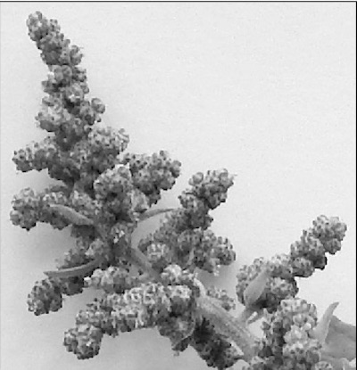
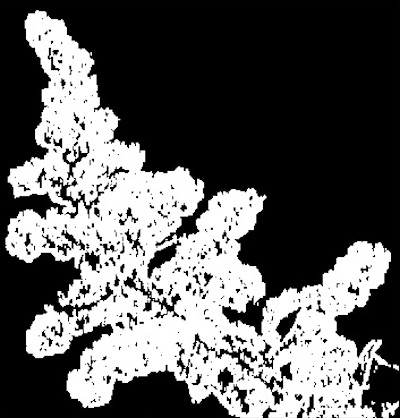

## Texture Threshold

Creates a binary image from a grayscale image using [skimage](http://scikit-image.org/docs/dev/index.html)
texture calculation for thresholding.


**plantcv.threshold.texture(*gray_img, kernel, threshold, offset=3, texture_method='dissimilarity', borders='nearest', max_value=255*)**

**returns** thresholded/binary image

- **Parameters:**
    - gray_img - Grayscale image data
    - kernel - Kernel size for texture measure calculation
    - threshold - Threshold value (0-255)
    - offset - Distance offsets (default offset=3)
    - texture_method - Feature of a grey level co-occurrence matrix, either
                      ‘contrast’, ‘dissimilarity’ (default), ‘homogeneity’, ‘ASM’, ‘energy’,
                      or ‘correlation’. For equations of different features see
                      http://scikit-image.org/docs/dev/api/skimage.feature.html#greycoprops
    - borders - How the array borders are handled, either ‘reflect’, ‘constant’, ‘nearest’ (default), ‘mirror’, or ‘wrap’
    - max_value - Value to apply above threshold (usually 255 = white)
- **Context:**
    - Used to threshold based on texture
- **Note:**
    - This function is computationally expensive and will likely take several minutes to run (even longer if images are large).
- **Example use:**
    - [Interactive Documentation](https://mybinder.org/v2/gh/danforthcenter/plantcv-binder.git/master?filepath=notebooks%2Fthreshold.ipynb)

**Original image (lightness channel)**



```python

from plantcv import plantcv as pcv
from skimage.feature import greycomatrix, greycoprops
from scipy.ndimage import generic_filter
import numpy as np
import cv2

# Set global debug behavior to None (default), "print" (to file), or "plot" (Jupyter Notebooks or X11)

pcv.params.debug = "print"

# Create binary image from a gray image based on texture values.
texture_img = pcv.threshold.texture(gray_img, kernel=6, threshold=7, offset=3, texture_method='dissimilarity', borders='nearest', max_value=255)
```

**Thresholded image**


