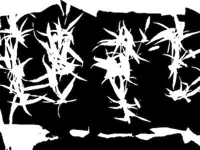
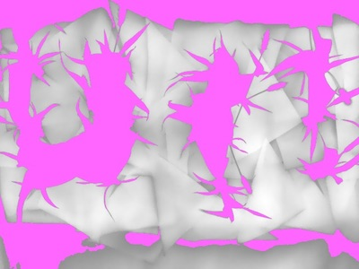
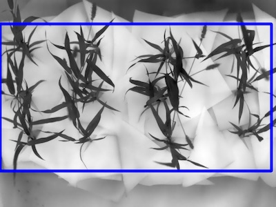
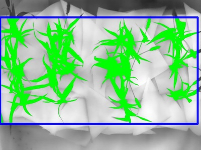
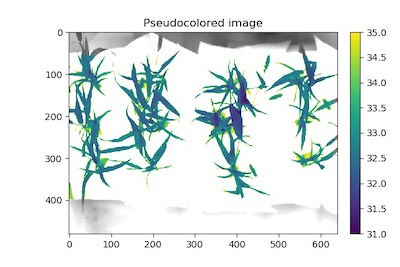

## Tutorial: Thermal Data Workflow

PlantCV is composed of modular functions that can be arranged (or rearranged) and adjusted quickly and easily.
Workflows do not need to be linear (and often are not). Please see workflow example below for more details.
A global variable "debug" allows the user to print out the resulting image. The debug has three modes: either None, 'plot', or 'print'.
If set to 'print' then the function prints the image out, or if using a [Jupyter](jupyter.md) notebook you could set debug to 'plot' to have
the images plot to the screen. Debug mode allows users to visualize and optimize each step on individual test images and small test sets before workflows are deployed over whole datasets.

[](https://mybinder.org/v2/gh/danforthcenter/plantcv-binder.git/master?filepath=notebooks/thermal.ipynb) Check out our interactive thermal tutorial! 

Also see [here](#thermal-script) for the complete script. 

**Workflow**

1.  Optimize workflow on individual image with debug set to 'print' (or 'plot' if using a Jupyter notebook).
2.  Run workflow on small test set (that ideally spans time and/or treatments).
3.  Re-optimize workflows on 'problem images' after manual inspection of test set.
4.  Deploy optimized workflow over test set using parallelization script.

**Running A Workflow**

To run a VIS workflow over a single VIS image there are two required inputs:

1.  **Image:** Thermal data in this tutorial is output from the camera as a .csv file.    
2.  **Output directory:** If debug mode is set to 'print' output images from each step are produced.

**Optional inputs:**

*  **Result File:** File to print results to
*  **Write Image Flag:** Flag to write out images, otherwise no result images are printed (to save time).
*  **Debug Flag:** Prints an image at each step
*  **Region of Interest:** The user can input their own binary region of interest or image mask (make sure it is the same size as your image or you will have problems).

Sample command to run a workflow on a single image:  

*  Always test workflows (preferably with -D flag set to 'print') before running over a full image set

```
./workflowname.py -i thermal_data.csv -o ./output-images -r results.txt -w -D 'print'

```

### Walk Through A Sample Workflow

#### Workflows start by importing necessary packages, and by defining user inputs.

```python
#!/usr/bin/env python

import sys, traceback
import cv2
import numpy as np
import argparse
import string
from plantcv import plantcv as pcv

### Parse command-line arguments
def options():
    parser = argparse.ArgumentParser(description="Imaging processing with opencv")
    parser.add_argument("-i", "--image", help="Input image file.", required=True)
    parser.add_argument("-o", "--outdir", help="Output directory for image files.", required=False)
    parser.add_argument("-r","--result", help="result file.", required= False )
    parser.add_argument("-w","--writeimg", help="write out images.", default=False, action="store_true")
    parser.add_argument("-D", "--debug", help="can be set to 'print' or None (or 'plot' if in jupyter) prints intermediate images.", default=None)
    args = parser.parse_args()
    return args
    
```

#### Start of the Main/Customizable portion of the workflow.

The image input by the user is [read in](read_image.md).


```python

### Main workflow
def main():
    # Get options
    args = options()
    
    pcv.params.debug=args.debug #set debug mode
    pcv.params.debug_outdir=args.outdir #set output directory
    
    # Read raw thermal data
    
    # Inputs:
    #   filename - Image file to be read (possibly including a path)
    #   mode - Return mode of image; either 'native' (default), 'rgb', 'gray', 'envi', or 'csv'
    thermal_data,path,filename = pcv.readimage(filename='FLIR2600.csv', mode="csv")
    
```

**Figure 1.** Original data as image.
This particular image was captured by a [FLIR camera](https://www.flir.com/) which saves a .csv 
file of thermal data.


  
Grayscale images usually have pixel values that range from 0-255 but since the raw data is measured in 
degrees Celsius the image representation can look very dark. In this example thermal image the maximum value is 
about 38 degrees Celsius which is still quite a dark shade of grey. This image also has a different data type
compared to typical images (usually `uint8` or 8-Bit Unsigned Integer) since it is `float64` or Double-precision 
floating-point format. While developing a workflow in a [Jupyter Notebook](http://jupyter.org/) with debugging mode
set to `'plot'`, the backend plotting will automatically scale the image such that it can be seen more easily. 
Rescaling the raw data will provide an image whose pixel values range from the specified minimum to specified 
maximum values and will change the data type to one that is compatible with other PlantCV functions that take 
grayscale images. 

```python
    # Rescale the thermal data to a colorspace with range 0-255
    
    # Inputs:
    #   gray_img - Grayscale image data 
    #   min_value - New minimum value for range of interest. default = 0
    #   max_value - New maximum value for range of interest. default = 255
    scaled_thermal_img = pcv.transform.rescale(gray_img=thermal_data)
    
```

**Figure 2.** Rescaled data image. 


The example image was taken with paper around the base of the plants for easier segmentation. 
The [threshold](binary_threshold.md) can be on either light or dark objects in the image.


```python
    # Threshold the thermal data to make a binary mask
    
    # Inputs:
    #   gray_img - Grayscale image data 
    #   threshold- Threshold value (between 0-255)
    #   max_value - Value to apply above threshold (255 = white) 
    #   object_type - 'light' (default) or 'dark'. If the object is lighter than the background then standard 
    #                 threshold is done. If the object is darker than the background then inverse thresholding is done. 
    bin_mask = pcv.threshold.binary(gray_img=thermal_data, threshold=35, max_value=255, object_type='dark')

```

**Figure 3.** Binary mask from thresholding. 



Now we need to [identify the objects](find_objects.md) (called contours in OpenCV) within the image.

```python 

    # Identify objects
    
    # Inputs: 
    #   img - RGB or grayscale image data for plotting 
    #   mask - Binary mask used for detecting contours 
    id_objects, obj_hierarchy = pcv.find_objects(img=scaled_thermal_img, mask=bin_mask)

```

**Figure 4.** Objects identified using the binary mask. 



Next a [rectangular region of interest](roi_rectangle.md) is defined.

```python 

    # Define the region of interest (ROI) 
    
    # Inputs: 
    #   img - RGB or grayscale image to plot the ROI on 
    #   x - The x-coordinate of the upper left corner of the rectangle 
    #   y - The y-coordinate of the upper left corner of the rectangle 
    #   h - The height of the rectangle 
    #   w - The width of the rectangle 
    roi, roi_hierarchy= pcv.roi.rectangle(img=scaled_thermal_img, x=0, y=55, h=342, w=630)

```

**Figure 5.** Region of interest drawn onto image. 



Once the region of interest is defined you can decide to keep everything overlapping with the [region of interest](roi_objects.md))
or cut the objects to the shape of the region of interest. Since the plant overlaps with the background we need to use a hard 
cut off in order to avoid it. 

```python 

    # Decide which objects to keep
    
    # Inputs:
    #   img - RGB or grayscale image data to display kept objects on 
    #   roi_contour - contour of ROI, output from pcv.roi.rectangle in this case
    #   object_contour - Contour of objects, output from pcv.roi.rectangle in this case 
    #   obj_hierarchy - Hierarchy of objects, output from pcv.find_objects function
    #   roi_type - 'partial' (for partially inside, default), 'cutto', or 'largest' (keep only the largest contour)
    roi_objects, hierarchy, kept_mask, obj_area = pcv.roi_objects(img=scaled_thermal_img,roi_contour=roi,
                                                                  roi_hierarchy=roi_hierarchy,
                                                                  object_contour=id_objects,
                                                                  obj_hierarchy=obj_hierarchy, 
                                                                  roi_type='cutto')
                                                                  
```

**Figure 6.** Kept objects (green) drawn onto image.



Now that the plant has been separated from the background we can analyze the temperature composition and shape of the plant.

```python 
    ##### Analysis #####

    # Analyze thermal data 
    
    # Inputs:
    #   img - Array of thermal values
    #   mask - Binary mask made from selected contours
    #   histplot - If True plots histogram of intensity values (default histplot = False)
    #   label - Optional label parameter, modifies the variable name of observations recorded 
    analysis_img = pcv.analyze_thermal_values(thermal_array=thermal_data, mask=kept_mask, histplot=True, label="default")
                                                                      
```

**Figure 7.** Histogram of the thermal values.


To [pseudocolor](visualize_pseudocolor.md) a plant by temperature can take very few parameters but offers a lot 
of customization since it is intended to just make figures. 

```python 
    # Pseudocolor the thermal data 
    
    # Inputs:
    #     gray_img - Grayscale image data
    #     obj - Single or grouped contour object (optional), if provided the pseudocolored image gets 
    #           cropped down to the region of interest.
    #     mask - Binary mask (optional) 
    #     background - Background color/type. Options are "image" (gray_img, default), "white", or "black". A mask 
    #                  must be supplied.
    #     cmap - Colormap
    #     min_value - Minimum value for range of interest
    #     max_value - Maximum value for range of interest
    #     dpi - Dots per inch for image if printed out (optional, if dpi=None then the default is set to 100 dpi).
    #     axes - If False then the title, x-axis, and y-axis won't be displayed (default axes=True).
    #     colorbar - If False then the colorbar won't be displayed (default colorbar=True)
    pseudo_img = pcv.visualize.pseudocolor(gray_img = thermal_data, mask=kept_mask, cmap='viridis', 
                                           min_value=31, max_value=35)
                                           
    # Write shape and thermal data to results file
    pcv.outputs.save_results(filename=args.result)
  
if __name__ == '__main__':
    main()
                                                                      
```

**Figure 8.** Pseudocolored thermal image.



To deploy a Workflow over a full image set please see tutorial on [Workflow parallelization](pipeline_parallel.md).

## Thermal Script 

In the terminal:

```python
./Workflowname.py -i /home/user/images/testimg.png -o /home/user/output-images -D 'print'

```

*  Always test Workflows (preferably with -D flag set to 'print') before running over a full image set

```python

#!/usr/bin/env python
import sys, traceback
import cv2
import numpy as np
import argparse
import string
from plantcv import plantcv as pcv

### Parse command-line arguments
def options():
    parser = argparse.ArgumentParser(description="Imaging processing with opencv")
    parser.add_argument("-i", "--image", help="Input image file.", required=True)
    parser.add_argument("-o", "--outdir", help="Output directory for image files.", required=False)
    parser.add_argument("-r","--result", help="result file.", required= False )
    parser.add_argument("-w","--writeimg", help="write out images.", default=False, action="store_true")
    parser.add_argument("-D", "--debug", help="can be set to 'print' or None (or 'plot' if in jupyter) prints intermediate images.", default=None)
    args = parser.parse_args()
    return args
    

### Main workflow
def main():
    # Get options
    args = options()
    
    pcv.params.debug=args.debug #set debug mode
    pcv.params.debug_outdir=args.outdir #set output directory
    
    # Read raw thermal data
    
    # Inputs:
    #   filename - Image file to be read (possibly including a path)
    #   mode - Return mode of image ("native," "rgb,", "rgba", "gray", or "flir"), defaults to "native"
    thermal_data,path,filename = pcv.readimage(filename='FLIR2600.csv', mode="flir")
    

    # Rescale the thermal data to a colorspace with range 0-255
    
    # Inputs:
    #   gray_img - Grayscale image data 
    #   min_value - New minimum value for range of interest. default = 0
    #   max_value - New maximum value for range of interest. default = 255
    scaled_thermal_img = pcv.transform.rescale(gray_img=thermal_data)
    

    # Threshold the thermal data to make a binary mask
    
    # Inputs:
    #   gray_img - Grayscale image data 
    #   threshold- Threshold value (between 0-255)
    #   max_value - Value to apply above threshold (255 = white) 
    #   object_type - 'light' (default) or 'dark'. If the object is lighter than the background then standard 
    #                 threshold is done. If the object is darker than the background then inverse thresholding is done. 
    bin_mask = pcv.binary(gray_img=thermal_data, threshold=35, max_value=255, object_type='dark')


    # Identify objects
    
    # Inputs: 
    #   img - RGB or grayscale image data for plotting 
    #   mask - Binary mask used for detecting contours 
    id_objects, obj_hierarchy = pcv.find_objects(img=scaled_thermal_img, mask=bin_mask)


    # Define the region of interest (ROI) 
    
    # Inputs: 
    #   img - RGB or grayscale image to plot the ROI on 
    #   x - The x-coordinate of the upper left corner of the rectangle 
    #   y - The y-coordinate of the upper left corner of the rectangle 
    #   h - The height of the rectangle 
    #   w - The width of the rectangle 
    roi, roi_hierarchy= pcv.roi.rectangle(img=scaled_thermal_img, x=0, y=55, h=342, w=630)


    # Decide which objects to keep
    
    # Inputs:
    #   img - RGB or grayscale image data to display kept objects on 
    #   roi_contour - contour of ROI, output from pcv.roi.rectangle in this case
    #   object_contour - Contour of objects, output from pcv.roi.rectangle in this case 
    #   obj_hierarchy - Hierarchy of objects, output from pcv.find_objects function
    #   roi_type - 'partial' (for partially inside, default), 'cutto', or 'largest' (keep only the largest contour)
    roi_objects, hierarchy, kept_mask, obj_area = pcv.roi_objects(img=scaled_thermal_img,roi_contour=roi,
                                                                  roi_hierarchy=roi_hierarchy,
                                                                  object_contour=id_objects,
                                                                  obj_hierarchy=obj_hierarchy, 
                                                                  roi_type='cutto')


    ##### Analysis #####

    # Analyze thermal data 
    
    # Inputs:
    #   img - Array of thermal values
    #   mask - Binary mask made from selected contours
    #   histplot - If True plots histogram of intensity values (default histplot = False)
    #   label - Optional label parameter, modifies the variable name of observations recorded 
    analysis_img = pcv.analyze_thermal_values(thermal_array=thermal_data, mask=kept_mask, histplot=True, label="default")


    # Pseudocolor the thermal data 
    
    # Inputs:
    #     gray_img - Grayscale image data
    #     obj - Single or grouped contour object (optional), if provided the pseudocolored image gets 
    #           cropped down to the region of interest.
    #     mask - Binary mask (optional) 
    #     background - Background color/type. Options are "image" (gray_img, default), "white", or "black". A mask 
    #                  must be supplied.
    #     cmap - Colormap
    #     min_value - Minimum value for range of interest
    #     max_value - Maximum value for range of interest
    #     dpi - Dots per inch for image if printed out (optional, if dpi=None then the default is set to 100 dpi).
    #     axes - If False then the title, x-axis, and y-axis won't be displayed (default axes=True).
    #     colorbar - If False then the colorbar won't be displayed (default colorbar=True)
    pseudo_img = pcv.visualize.pseudocolor(gray_img = thermal_data, mask=kept_mask, cmap='viridis', 
                                           min_value=31, max_value=35)
                                           
    # Write shape and thermal data to results file
    pcv.outputs.save_results(filename=args.result)
  
if __name__ == '__main__':
    main()
                                                                      
```