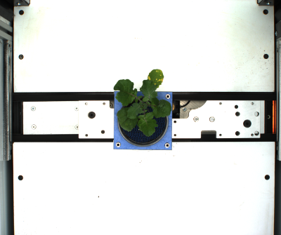
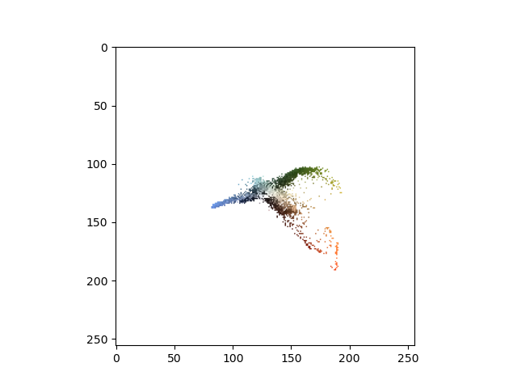
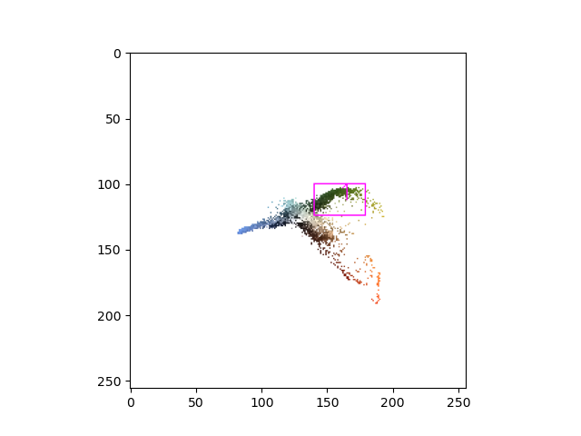
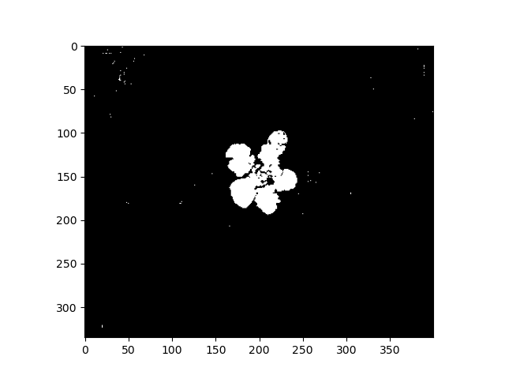
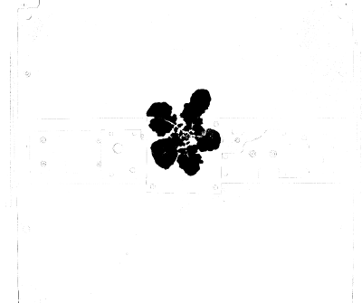
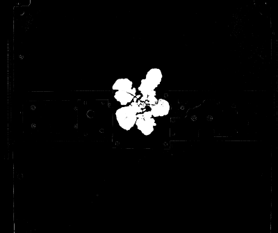

## Threshold Two Channels

Creates a binary image from an RGB image based on the pixels values in two channels.
The x and y channels define a 2D plane. Regions of that plane can be selected either
with an ROI or using two input points that define a straight line. Pixels included and
excluded using that cut method are assigned different values to return a binary mask.

**plantcv.threshold.dual_channels**(*rgb_img, x_channel, y_channel, cut=None, above=True*)

**returns** thresholded/binary image if `cut` is specified. If `cut` is not specified then an array is returned which you can use with ROI tools to decide on your `cut` ROI.

- **Parameters:**
    - rgb_img - RGB image
    - x_channel - Channel to use for the horizontal coordinate.
      Options:  'R', 'G', 'B', 'l', 'a', 'b', 'h', 's', 'v', 'c', 'm', 'y', 'k', 'gray', and 'index'
    - y_channel - Channel to use for the vertical coordinate.
      Options:  'R', 'G', 'B', 'l', 'a', 'b', 'h', 's', 'v', 'c', 'm', 'y', 'k', 'gray', and 'index'
    - cut - Either an ROI or a list containing two points as tuples defining the segmenting straight line. Defaults to `None` which will return an array of pixel colors across the specified channels.
    - above - Whether the pixels above the line are given the value of 0 or 255. This is only used if `cut` is a list of points (tuples).

- **Context:**
    - Used to help differentiate plant and background
    - Helpful in maize images, shown in the [single plant tutorial](https://plantcv.org/tutorials/single-plant-rgb-workflow), or in other plants with purple hues.
- **Example use below:**

**Original image**



**ROI method**

```python
from plantcv import plantcv as pcv

# Set global debug behavior to None (default), "print" (to file),
# or "plot" (Jupyter Notebooks or X11)

pcv.params.debug = "plot"

color_mat = pcv.threshold.dual_channels(img, "b", "a")

```

Because we did not specify a `cut` argument we get back the matrix of la**B** and l**A**b channels,
colored by the original RGB values.



Now we can make an ROI.

```python
thresholding_roi = pcv.roi.rectangle(color_mat, 140, 100, 25, 40)

```



Now we apply the ROI to `threshold.dual_channels`.

```python
binary_mask = pcv.threshold.dual_channels(img, "b", "a", cut=thresholding_roi)

```



**Points method**

```python
# Points previously defined  
pts = [(159, 128), (132, 110)]
# Create binary image from a RGB image based on two color channels and a straight
# line defined by two points
mask = pcv.threshold.dual_channels(rgb_img=img, x_channel='b', y_channel='a', cut=pts, above=True)

```

**Thresholded image**



```python

# Create binary image from a RGB image based on two color channels and a straight
# line defined by two points
mask = pcv.threshold.dual_channels(rgb_img=img, x_channel='b', y_channel='a', cut=pts, above=False)
```

**Thresholded image (inverse)**



**Source Code:** [Here](https://github.com/danforthcenter/plantcv/blob/master/plantcv/plantcv/threshold/threshold_methods.py)
