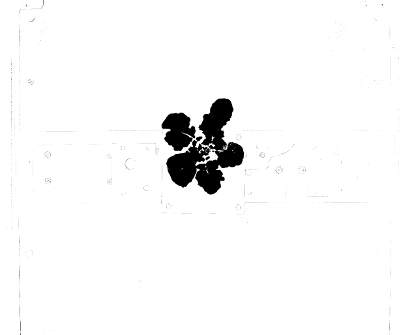
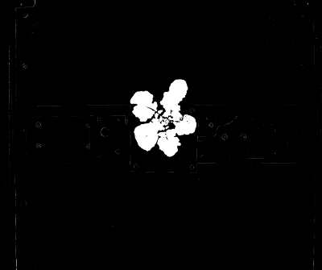

## Binary Threshold

Creates a binary image from an RGB image based on the pixels values in two channels.
The x and y channels define a 2D plane and the two input points define a straight line.
Pixels in the plane above and below the straight line are assigned two different values.

**plantcv.threshold.threshold_2_channels**(*rgb_img, x_channel, y_channel, points, above=True, max_value=255*)

**returns** thresholded/binary image

- **Parameters:**
    - rgb_img - RGB image
    - x_channel - Channel to use for the horizontal coordinate.
      Options:  'R', 'G', 'B', 'l', 'a', 'b', 'h', 's', 'v', 'gray', and 'index'
    - y_channel - Channel to use for the vertical coordinate.
      Options:  'R', 'G', 'B', 'l', 'a', 'b', 'h', 's', 'v', 'gray', and 'index'
    - points - List containing two points as tuples defining the segmenting straight line
    - above - Whether the pixels above the line are given the value of 0 or max_value
    - max_value - Value to apply above threshold (255 = white)

- **Context:**
    - Used to help differentiate plant and background
- **Example use:**
    <!-- - [Use In VIS Tutorial](tutorials/vis_tutorial.md) -->

**Original image**


```python

from plantcv import plantcv as pcv

# Set global debug behavior to None (default), "print" (to file),
# or "plot" (Jupyter Notebooks or X11)

pcv.params.debug = "plot"

# Points previously defined  
pts = [(159, 128), (132, 110)]
# Create binary image from a RGB image based on two color channels and a straight
# line defined by two points
mask = pcv.threshold.threshold_2_channels(rgb_img=img, x_channel='b', y_channel='a', points=pts, above=True, max_value=255)

```

**Thresholded image**



```python

# Create binary image from a RGB image based on two color channels and a straight
# line defined by two points
mask = pcv.threshold.threshold_2_channels(rgb_img=img, x_channel='b', y_channel='a', points=pts, above=False, max_value=255)
```

**Thresholded image (inverse)**



**Source Code:** [Here](https://github.com/danforthcenter/plantcv/blob/master/plantcv/plantcv/threshold/threshold_methods.py)
