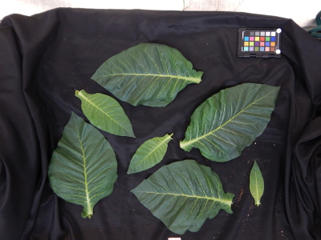
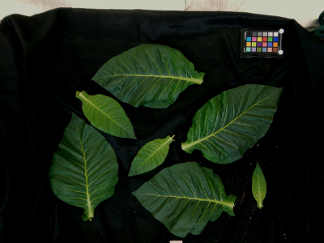

## Correct Color using an affine transformation

Corrects the color of the input image based on the target color matrix using an affine transformation
in the RGB space. The vector containing the regression coefficients is calculated as the one that minimizes the
Euclidean distance between the transformed source color values and the target color values. The functionality was recently implemented into the simplified [`pcv.transform.auto_correct_color`](transform_auto_correct_color.md). 

**plantcv.transform.affine_color_correction**(*rgb_img, source_matrix, target_matrix*)

**returns** corrected_img

**Important Note:** Each image must contain a reference from which color values are sampled.
 The following example uses a 24-color Colorchecker passport.

 - **Parameters:**
    - rgb_img       - an RGB image with color chips visualized
    - source_matrix - array of RGB color values (intensity in the range [0-1]) from the image to be corrected where each row is one color reference and the columns are organized as index,R,G,B; likely created with [plantcv.transform.get_color_matrix](get_color_matrix.md).
    - target_matrix - array of target RGB color values (intensity in the range [0-1]) where each row is one color reference and the columns are organized as index,R,G,B; likely created with [plantcv.transform.std_color_matrix](std_color_matrix.md). 
- **Example use:**
    - [Color Correction Tutorial](https://plantcv.org/tutorials/color-correction)

**Reference Images**

 RGB image




```python

from plantcv import plantcv as pcv

# Set global debug behavior to None (default), "print" (to file),
# or "plot" (Jupyter Notebooks or X11)
pcv.params.debug = 'plot'

# the source matrix needs to be computed form the RGB image, see the functions
# plantcv.transform.detect_color_card to make a mask and
# plantcv.transform.get_color_matrix to make a matrix from that mask

# using standard color values for the target
tgt_matrix = pcv.transform.std_color_matrix(pos=2)

corrected_img = pcv.transform.affine_color_correction(rgb_img=img,
                                                      source_matrix=src_matrix,
                                                      target_matrix=tgt_matrix)

```

Corrected image



**Source Code:** [Here](https://github.com/danforthcenter/plantcv/blob/main/plantcv/plantcv/transform/color_correction.py)
