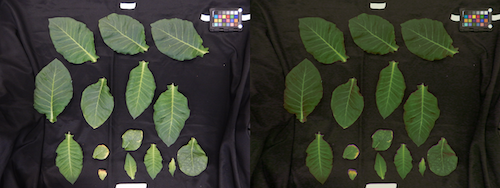

# Automatically detect a color card and color correct in one step

Corrects the color of the input image based on the target color matrix using a non-linear transformation.

**plantcv.transform.auto_correct_color_nonlinear**(*rgb_img, color_chip_size=None, roi=None, \*\*kwargs*)

**returns** corrected_img

- **Parameters**
    - rgb_img          - Input RGB image data containing a color card.
    - color_chip_size  - Type of color card to be detected, (case insensitive, either "classic", "passport", "nano", or "cameratrax", by default `None`). Or provide `(width, height)` of your specific color card in millimeters. If set then size scalings parameters `pcv.params.unit`, `pcv.params.px_width`, and `pcv.params.px_height` are automatically set, and utilized throughout linear and area type measurements stored to `Outputs`.
    - roi              - Optional rectangular ROI as returned by [`pcv.roi.rectangle`](roi_rectangle.md) within which to look for the color card. (default = None)
	- **kwargs         - Other keyword arguments passed to `cv2.adaptiveThreshold` and `cv2.circle`.
        - adaptive_method  - Adaptive threhold method. 0 (mean) or 1 (Gaussian) (default = 1).
        - block_size       - Size of a pixel neighborhood that is used to calculate a threshold value (default = 51). We suggest using 127 if using `adaptive_method=0`.
        - radius           - Radius of circle to make the color card labeled mask (default = 20).
        - min_size         - Minimum chip size for filtering objects after edge detection (default = 1000)
        - aspect_ratio   - Optional aspect ratio (width / height) below which objects will get removed. Orientation agnogstic since automatically set to the reciprocal if <1 (default = 1.27)
        - solidity - Optional solidity (object area / convex hull area) filter (default = 0.8)
- **Returns**
    - corrected_img    - Color corrected image

- **Example Use**
    - Below

```python

from plantcv import plantcv as pcv

rgb_img, imgpath, imgname = pcv.readimage(filename="top_view_plant.png")

corrected_rgb = pcv.transform.auto_correct_color_nonlinear(rgb_img=rgb_img, color_chip_size="Passport")

# Or set `color_chip_size` can be defined explicitly
# E.G. Given a square color card chips, (12mm x 12mm) in size
corrected_rgb = pcv.transform.auto_correct_color_nonlinear(rgb_img=rgb_img, color_chip_size=(12, 12))
```

**Debug Image: Color Corrected Image**



**Source Code:** [Here](https://github.com/danforthcenter/plantcv/blob/main/plantcv/plantcv/transform/auto_correct_color.py)
