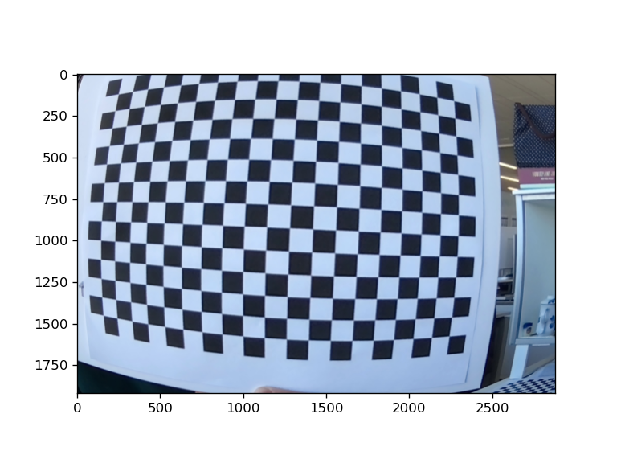
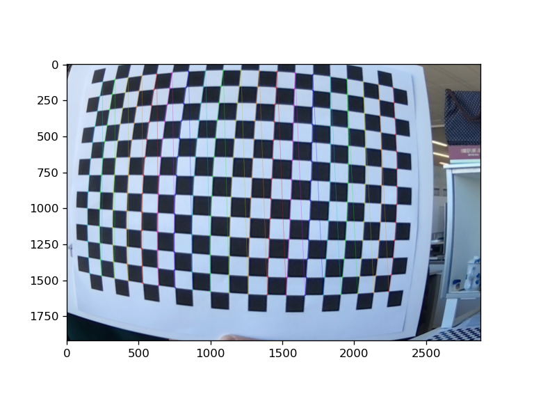
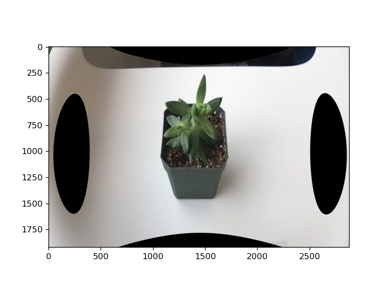

## Camera calibration

This function uses the outputs of [**plantcv.transform.checkerboard_calib**](transform_checkerboard_calibration.md) to correct distortions introduced by the camera.

**plantcv.transform.calibrate_camera**(*rgb_img, mtx, dist)

**returns** corrected image

- **Parameters:**
    - rgb_img - an RGB image to be corrected
    - mtx - path to a .npz file output from **plantcv.checkerboard_calib**
    - dist - path to a .npz file output from **plantcv.checkerboard_calib**

- **Context:**
    - Used to correct image distortions based on checkerboard calibrations

- **Example use:**

**Checkerboard image example**



**Input image example**


```python

from plantcv import plantcv as pcv

# Set global debug behavior to None (default), "print" (to file), or "plot" (Jupyter Notebooks or X11)
pcv.params.debug = "plot"

# Create calibration matrices with checkerboard images
mtx, dist = pcv.transform.checkerboard_calib(img_path = "./img_files/", col_corners = 13, row_corners = 19, out_dir = "./output/")

# Correct distortions using the outputs from checkerboard calibration
corrected_img = pcv.transform.calibrate_camera(rgb_img = img, mtx = "./output/mtx.npz", dist = "./output/dist.npz")

```

**Checkerboard calibration**



**Corrected image**



**Source Code:** [Here](https://github.com/danforthcenter/plantcv/blob/main/plantcv/plantcv/transform/checkerboard_calib.py)
