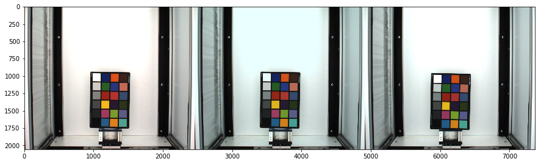
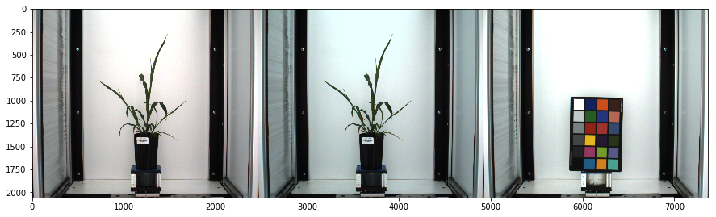
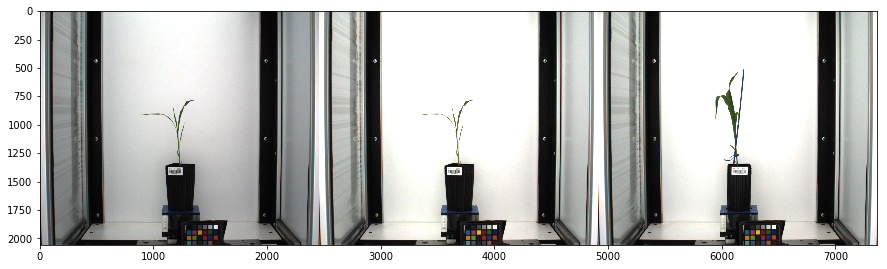
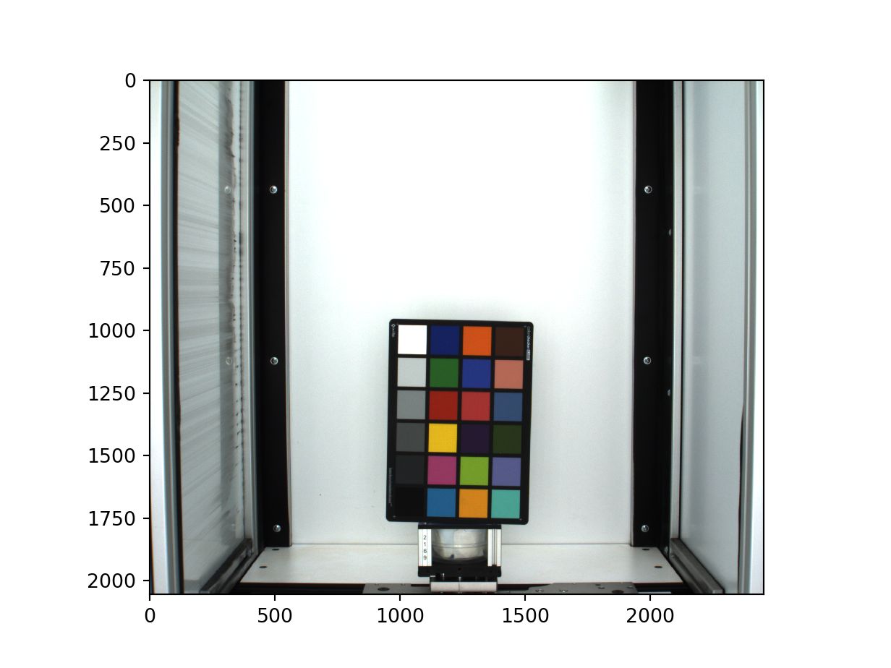
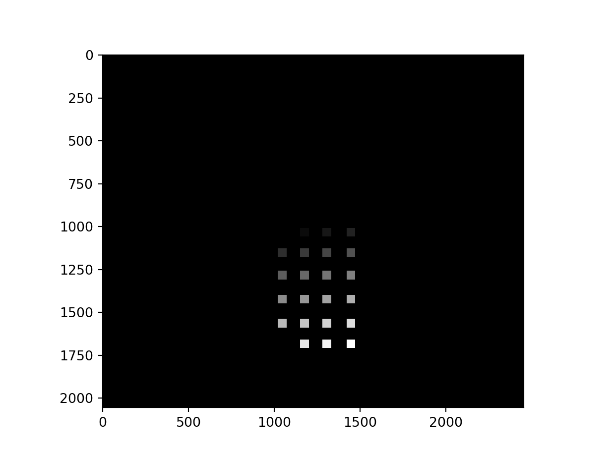
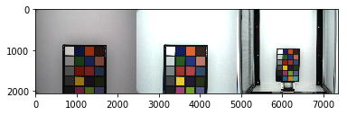
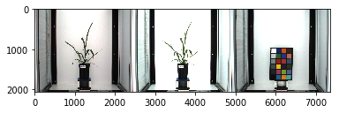
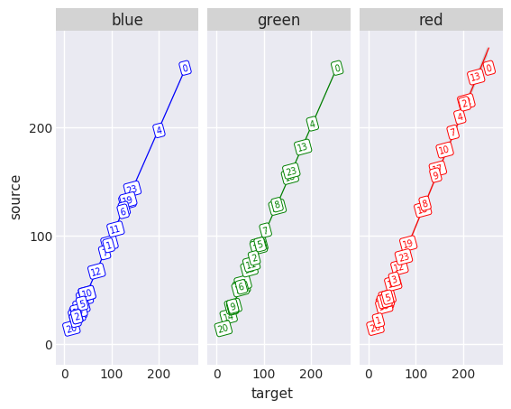
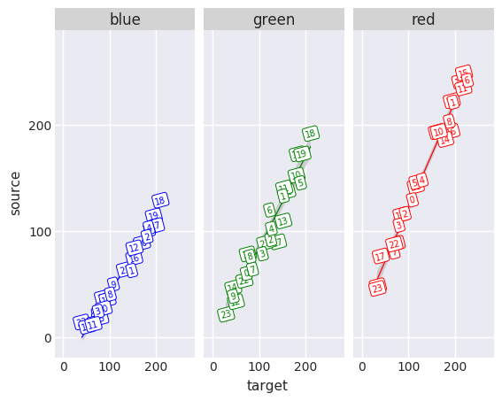
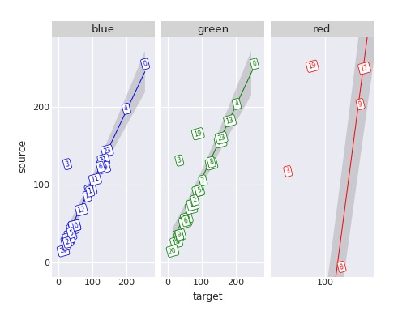

## Tutorial: Color Correction Pipeline

The color correction module has been developed as a method of normalizing image-based data sets for more accurate image analysis.

PlantCV is composed of modular functions that can be arranged (or rearranged) and adjusted quickly and easily.
Pipelines do not need to be linear (and often are not). Please see the pipeline examples below for more details.
A global variable "debug" allows the user to print out the resulting image. The debug has three modes: either None, 'plot', or 'print', If the global object, plantcv.params.debug is set to
'print' then the function prints the image to a file. If using a [Jupyter](jupyter.md) notebook, you would set debug to 'plot' to have
the images plot to the screen. Debug mode allows users to visualize and optimize steps on individual test images and small test sets before pipelines are deployed over whole datasets.

For simple input and output, a helper function [plantcv.transform.correct_color](transform_correct_color.md) was developed.

**Important Note:** This function has been developed with only 8 bit images in mind. Images of other bit depth are not compatible with this function.

**Conditions**

To run color correction on an image, the following are needed:

* Target and source images must contain a reference from which color values are sampled. The following example uses a 24-color Colorchecker passport.

* A target image (RGB) must be chosen. This image will be of the color profile to which other images will be corrected.

* A source image (RGB), that will be corrected to the target image's color profile.

* A mask (gray-scale) of the target image in which background has value 0, and color chips from the colorchecker are labeled with unique values greater than zero, but less than 255.

* A mask (gray-scale) of the source image labeled consistently with the target image's mask.

We have an example of how to [create a gray-scale mask of color chips](#creating-masks).


## Developing a pipeline

The modularity of PlantCV allows for flexible development of pipelines to fit the context and needs of users. The development of a pipeline for color correction is no different.
Below are two potential scenarios with possible color correction pipelines. 

### Scenario A: One Target profile, One Source profile

For situations where only one source profile is identified per target profile, or one source profile will serve as a representation for many images,
a simple pipeline can be developed to produce a transformation matrix that can be applied to the set of images congruent to the source profile.

**1) [Read](read_image.md) in target, source, and mask images.**

```python

from plantcv import plantcv as pcv
import cv2
import numpy as np

pcv.params.debug = "print" #set debug mode

target_img = cv2.imread("target_img.png")
source_img = cv2.imread("source1_img.png")
mask = cv2.imread("test_mask.png", -1) # mask must be read in "as-is" include -1
#Since target_img and source_img have the same zoom and colorchecker position, the same mask can be used for both.
```

**2) Declare an output directory to which your target, source, and transformation matrices will be saved.**

```python

#.npz files containing target_matrix, source_matrix, and transformation_matrix will be saved to the output_directory file path

output_directory = "./test1"
```

**3) Run the images through the [plantcv.transform.correct_color](transform_correct_color.md) function.**

```python

target_matrix, source_matrix, transformation_matrix, corrected_img = pcv.transform.correct_color(target_img, mask, source_img, mask, output_directory)
```

If you are in debug mode "plot", a horizontally stacked comparison of the source, corrected, and target images will be displayed.



**4) Using either the returned transformation_matrix or [loading](transform_correct_color.md#load-matrix) the transformation_matrix from its directory,
you may now [apply the matrix](transform_correct_color.md#apply-transformation-matrix) to congruent images.**

```python

transformation_matrix = pcv.transform.load_matrix("./test1/transformation_matrix.npz") #load in transformation_matrix

new_source = cv2.imread("VIS_SV_0_z1_h1_g0_e65_v500_376217_0.png") #read in new image for transformation

#apply transformation
corrected_img = pcv.transform.apply_transformation_matrix(source_img= new_source, target_img= target_img, transformation_matrix= transformation_matrix)
```




**Important Note:** The color correction submodule has been made with the capability to handle [incomplete colorchecker data](#creating-a-pipeline-with-incomplete-color-data)
in the source image. This way if color chips have been cut off, the module will still work. Color chips do need to be consistently labeled
from target to source.

### Scenario B: One Target profile, Many Source profiles

For situations where each source image contains a colorchecker, a pipeline may be optimized by using functions from the transform
submodule. The target_matrix may be saved separately and referred to as needed for each source.  

**1) [Read](read_image.md) in target, source, and mask images.**

```python

target_img = cv2.imread("target_img.png")
source_img = cv2.imread("source_img.png")
mask = cv2.imread("mask.png", -1) # mask must be read in "as-is" include -1
#Since target_img and source_img have the same zoom and colorchecker position, the same mask can be used for both. 
```

**2) [Save](transform_correct_color.md#save-matrix) the target color matrix.**

```python

# get color matrix of target and save
target_headers, target_matrix = pcv.transform.get_color_matrix(target_img, mask)
pcv.transform.save_matrix(target_matrix, "target.npz")
```

**3) [Compute](transform_correct_color.md#color-matrix) the source color matrix.**

```python

#get color_matrix of source
source_headers, source_matrix = pcv.transform.get_color_matrix(source_img, mask)
```

**4) Get the [Moore-Penrose Inverse Matrix](transform_correct_color.md#moore-penrose-inverse).**

```python

# matrix_a is a matrix of average rgb values for each color ship in source_img, matrix_m is a moore-penrose inverse matrix,
# matrix_b is a matrix of average rgb values for each color ship in source_img

matrix_a, matrix_m, matrix_b = pcv.transform.get_matrix_m(target_matrix= target_matrix, source_matrix= source_matrix)
```

**5) Calculate the [transformation matrix](transform_correct_color.md#transformation-matrix).**

```python

# deviance is the measure of how greatly the source image deviates from the target image's color space. 
# Two images of the same color space should have a deviance of ~0.
# transformation_matrix is a 9x9 matrix of transformation coefficients 

deviance, transformation_matrix = pcv.transform.calc_transformation_matrix(matrix_m, matrix_b)
```

**6) [Apply](transform_correct_color.md#apply-transformation-matrix) the transformation matrix.**

```python

corrected_img = pcv.transform.apply_transformation_matrix(source_img= source_img, target_img= target_img, transformation_matrix= transformation_matrix)
```

If you are in debug mode "plot", a horizontally stacked comparison of the source, corrected, and target images will be displayed.




To deploy a pipeline over a full image set please see tutorial on [pipeline parallelization](pipeline_parallel.md).


## Creating Masks

We have added functions to semi-automate the tasks of [detecting](transform_correct_color.md#automatically-find-a-color-card) and [creating a color card mask](transform_correct_color.md#create-a-labeled-color-card-mask).

Or manually create a labeled mask as described below:

```python

"""

This program illustrates how to create a gray-scale mask for use with plantcv.transform.correct_color.

"""
from plantcv import plantcv as pcv
import cv2
import numpy as np

pcv.params.debug = "plot"
```


```python

img = cv2.imread("target_img.png") #read in img
pcv.plot_image(img)
```




```python

#Using the pixel coordinate on the plotted image, designate a region of interest for an n x n pixel region in each color chip.

dimensions = [50,50]  #pixel ROI dimensions

chips = []
#Declare first row:
chips.append(pcv.roi.rectangle(img=img, x=1020, y = 1010, w = dimensions[0], h = dimensions[1])) #white
chips.append(pcv.roi.rectangle(img=img, x= 1150 , y= 1010 , w = dimensions[0], h = dimensions[1]))#blue
chips.append(pcv.roi.rectangle(img=img, x= 1280 , y= 1010 , w = dimensions[0], h = dimensions[1]))#orange
chips.append(pcv.roi.rectangle(img=img, x= 1420 , y= 1010 , w = dimensions[0], h = dimensions[1]))#brown
    


#declare y_shift
y_shift = 135

#declare number of total rows
row_total = 6

#declare all other rows
for i in range(1, row_total):
    chips.append(pcv.roi.rectangle(img=img, x=1020, y = 1010 + i*(y_shift), w = dimensions[0], h = dimensions[1]))
    chips.append(pcv.roi.rectangle(img=img, x= 1150 , y= 1010 + i*(y_shift), w = dimensions[0], h = dimensions[1]))
    chips.append(pcv.roi.rectangle(img=img, x= 1280 , y= 1010 + i*(y_shift), w = dimensions[0], h = dimensions[1]))
    chips.append(pcv.roi.rectangle(img=img, x= 1420 , y= 1010 + i*(y_shift), w = dimensions[0], h = dimensions[1]))

```


```python

#remove black and white
del chips[0]
del chips[19]

mask = np.zeros(shape=np.shape(img)[:2], dtype = np.uint8()) # create empty mask img.

print mask
```

    [[0 0 0 ..., 0 0 0]
     [0 0 0 ..., 0 0 0]
     [0 0 0 ..., 0 0 0]
     ...,
     [0 0 0 ..., 0 0 0]
     [0 0 0 ..., 0 0 0]
     [0 0 0 ..., 0 0 0]]


```python

# draw contours for each region of interest and give them unique color values.

i=1
for chip in chips:
    print(chip)
    mask = cv2.drawContours(mask, chip[0], -1, (i*10), -1)
    i+=1


pcv.plot_image(mask, cmap="gray")

mask = mask*10  #multiply values in the mask for greater contrast. Exclude if designating have more than 25 color chips.
```


```python

np.unique(mask)
```


    array([  0,  10,  20,  30,  40,  50,  60,  70,  80,  90, 100, 110, 120,
           130, 140, 150, 160, 170, 180, 190, 200, 210, 220], dtype=uint8)


```python

cv2.imwrite("test_mask.png", mask) #write to file.
```

    True


## Creating a pipeline with incomplete color data

```python

from plantcv import plantcv as pcv
import cv2
import numpy as np
import matplotlib
```


```python

target_img = cv2.imread("target_img.png")
source_img = cv2.imread("source2_img.png")
target_mask = cv2.imread("test_mask.png", -1) # mask must be read in "as-is" include -1
source_mask = cv2.imread("mask2_img.png", -1) 

#.npz files containing target_matrix, source_matrix, and transformation_matrix will be saved to the output_directory file path
output_directory = "./test1"
```


```python

target_matrix, source_matrix, transformation_matrix, corrected_img = pcv.transform.correct_color(target_img, target_mask, source_img, source_mask, output_directory)
```




```python

transformation_matrix = pcv.transform.load_matrix("./test1/transformation_matrix.npz") #load in transformation_matrix

new_source = cv2.imread("VIS_SV_0_z1_h1_g0_e65_v500_376217_0.png") #read in new image for transformation

corrected_img = pcv.transform.apply_transformation_matrix(source_img= new_source, target_img= target_img, transformation_matrix= transformation_matrix) #apply transformation
```



## [Checking](transform_correct_color.md#checking-a-color-card) the Color Card Chips

```python

from plantcv import plantcv as pcv
from plotnine import *
import numpy as np
import pandas as pd

quick_color_check(source_matrix = s_matrix, target_matrix = t_matrix, num_chips = 24)
```

The relationship between RGB values in the source image and the target image should be extremely linearly related.
Plots are labeled with the chip numbers in order to help determine problematic. Black and white chips can often be fully saturated which can
affect color transformation outcomes.

**Example 1**



Plots that don't exhibit a strong linear relationship indicate problems with one or more chips in the color card. Over/under saturation of color channels can
effect color correction. Sometimes problematic chips can be excluded when creating a mask.

**Example 2**



Using `%matplotlib notebook` in a Jupyter notebook can be used to examine which color card chips might be problematic. The zoom to rectangle tool will allow for closer examination.

```python

%matplotlib notebook
from plantcv import plantcv as pcv
from plotnine import *
import numpy as np
import pandas as pd

pcv.transform.quick_color_check(source_matrix = s_matrix, target_matrix = t_matrix, num_chips = 24)
```

**Example 3**



In the example above there are only two chips that seem to deviate from the linear pattern expected. In this case we can go back and try to exclude chips 19 and 3
in the mask before running the pipeline again. However, in the second example there is differences in the range of values among color channels
indicating that camera settings and/or lighting technique likely needs revision in order to successfully use color correction.
