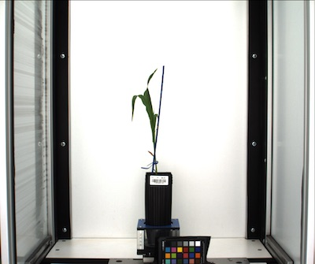
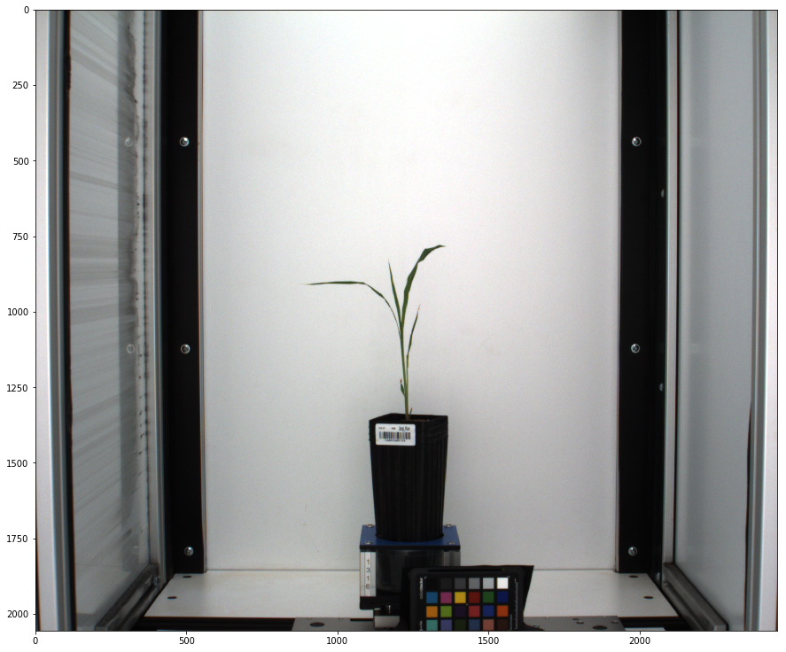
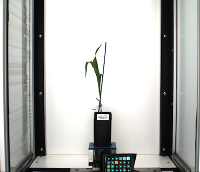
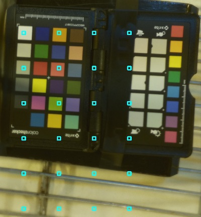
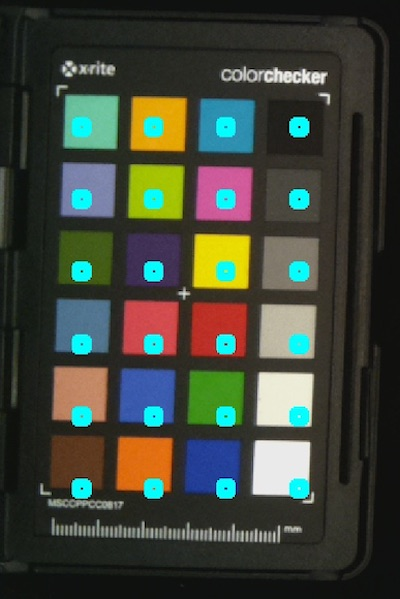
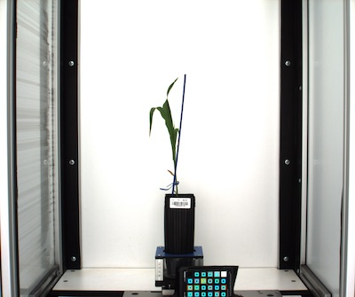
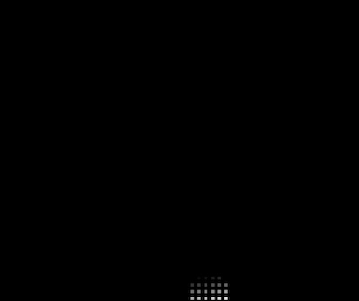

## Correct Color

Corrects the color profile of a source RGB image to the color profile of a target RGB image. This function outputs target_matrix, source_matrix, and transformation_matrix and saves them to the output directory as .npz files.
It also outputs, corrected_img, but storage (print or plot) is determined by debug mode. 

**plantcv.transform.correct_color**(*target_img, target_mask, source_img, source_mask, output_directory*)

**returns** target_matrix, source_matrix, transformation_matrix, corrected_img

**Important Note:** Each image must contain a reference from which color values are sampled.
 The following example uses a 24-color Colorchecker passport.

 - **Parameters:**
    - target_img       = an RGB image with color chips visualized
    - target_mask      = a grayscale image with color chips and background each represented with unique values
    - source_img       = an RGB image with color chips visualized
    - source_mask      = a grayscale image with color chips and background each represented as unique values
    - output_directory = a file path to which the target_matrix, source_matrix, and transformation_matrix will be save as .npz files


To see an example of how to create a grayscale mask of color chips see [here](transform_color_correction_tutorial.md#creating-masks).


**Reference Images**

 Target Image



 Source Image
 



```python

from plantcv import plantcv as pcv
import cv2

target_img = cv2.imread("target_img.png")
source_img = cv2.imread("source1_img.png")

target_mask = cv2.imread("mask_img.png", -1) # mask must be read in "as-is" include -1
source_mask = cv2.imread("mask_img.png", -1) # in this case, as our images share a zoom level and colorchecker placement, the same mask is used for both the target and the source.

output_directory = "."

# Set global debug behavior to None (default), "print" (to file), or "plot" (Jupyter Notebooks or X11)
pcv.params.debug = 'plot'

target_matrix, source_matrix, transformation_matrix, corrected_img = pcv.transform.correct_color(target_img, target_mask, source_img, source_mask, output_directory)
```


## Automatically Find a Color Card

Automatically detects a color card's location and size. Useful in pipelines where color card positioning isn't constant in all images.

**plantcv.transform.find_color_card**(*rgb_img, threshold='adaptgauss', threshvalue=125, blurry=False, background='dark'*)

**returns** df, start_coord, spacing

- **Parameters**
    - rgb_img       = Input RGB image data containing a color card.
    - threshold     = Optional threshold method, either 'normal', 'otsu', or 'adaptgauss' (default theshold='adaptgauss')
    - threshvalue   = Optional thresholding value (default threshvalue=125)
    - blurry        = Optional boolean, if True then image sharpening is applied (default blurry=False)
    - background    = Optional type of image background, either 'dark' or 'light' (default background='dark')
- **Returns**
    - df            = Dataframe of all color card chips found.
    - start_coord   = Two-element tuple of the first chip mask starting x and y coordinate. Useful in [create a color card mask](#create-a-labeled-color-card-mask) function.
    - spacing       = Two-element tuple of the horizontal and vertical spacing between chip masks. Useful in [create a color card mask](#create-a-labeled-color-card-mask) function.

**Important Note:** This function isn't entirely robust. There are a few important assumptions that must be met in order to automatically detect color cards:
- There is only one color card in the image.
- Color card should be 4x6 (like an X-Rite ColorChecker Passport Photo). Spacing calculations are based on 4x6 color cards. Although starting coordinates will be
    robust for most color cards, unless an entire row or entire column of chips is missing. Missing chips may also skew spacing and can also skew starting coordinates.
- Color card isn't tilted. The card can be vertical OR horizontal but if it is tilted there will errors in calculating spacing.

```python

from plantcv import plantcv as pcv
rgb_img, path, filename = pcv.readimage("target_img.png")
df, start, space = pcv.transform.find_color_card(rgb_img=rgb_img)

# Use these outputs to create a labeled color card mask
mask = pcv.transform.create_color_card_mask(rgb_img=img, radius=10, start_coord=(400,600), spacing=(30,30), ncols=6, nrows=4)
```

**Image automatically detected and masked**



**Image with multiple color cards**



**Tilted color card**



## Create a Labeled Color Card Mask

Creates a uniquely labeled mask for each color chip based on user-defined positioning.

**plantcv.transform.create_color_card_mask**(*(rgb_img, radius, start_coord, spacing, nrows, ncols, exclude=[]*)

**returns** mask

- **Parameters**
    - rgb_img        = Input RGB image data containing a color card.
    - radius         = Radius of color masks.
    - start_coord    = Two-element tuple of the first chip mask starting x and y coordinate.
    - spacing        = Two-element tuple of the horizontal and vertical spacing between chip masks.
    - nrows          = Number of chip rows.
    - ncols          = Number of chip columns.
    - exclude        = Optional list of chips to exclude. List in largest to smallest index (e.g. [20, 0])
- **Returns**
    - mask           = Labeled mask of chips. The first chip is labeled with the value 0, then 10, 20, and so on.
    
```python
from plantcv import plantcv as pcv

rgb_img, path, filename = pcv.readimage("target_img.png")

mask = pcv.transform.create_color_card_mask(rgb_img=img, radius=10, start_coord=(400,600), spacing=(30,30), ncols=6, nrows=4)

```

**Image with color card**


**Image with color chip ROIs**



**Color card mask**



## Color Matrix

Computes the average *R*, *G*, *B* values for each region in the RGB image denoted by the gray-scale mask and saves them in a matrix of n x 4, where n = the number of color chips represented in the mask.

**plantcv.transform.get_color_matrix**(*rgb_img, mask*)

**returns** headers, color_matrix

- **Parameters**
    - rgb_img = RGB image with color chips visualized
    - mask    = a gray-scale img with unique values for each segmented space, representing unique, discrete color chips.

- **Returns**
    - color_matrix = a *n* x 4 matrix containing the average red value, average green value, and average blue value for each color chip.
    - headers      = a list of 4 headers corresponding to the 4 columns of color_matrix respectively


```python

from plantcv import plantcv as pcv
import cv2


rgb_img = cv2.imread("target_img.png")
mask = cv2.imread("mask_img.png", -1) # mask must be read in "as-is" include -1


headers, color_matrix = pcv.transform.get_color_matrix(rgb_img, mask)

print(headers)
print(color_matrix)


    ['chip_number', 'r_avg', 'g_avg', 'b_avg']
    [[  10.       20.7332   33.672    92.7748]
     [  20.      203.508    79.774    25.77  ]
     [  30.       54.6916   34.0924   26.0352]
     [  40.      193.2972  203.198   199.4544]
     [  50.       40.2052   92.0536   37.222 ]
     [  60.       36.9256   52.4976  123.6224]
     [  70.      177.7984  103.3772   85.1672]
     [  80.      119.4276  128.4068  126.6948]
     [  90.      141.9036   34.0584   22.5056]
     [ 100.      160.9764   50.3872   47.6984]
     [ 110.       51.994    73.584   107.734 ]
     [ 120.       65.9104   69.5172   68.482 ]
     [ 130.      227.1652  183.1696   30.1332]
     [ 140.       35.9472   25.4984   47.3424]
     [ 150.       39.51     52.9624   26.3956]
     [ 160.       32.8148   34.8512   35.5284]
     [ 170.      146.522    55.7016   94.7452]
     [ 180.      114.6672  155.3968   42.5688]
     [ 190.       84.2172   88.8424  134.2356]
     [ 200.       34.5308   90.4592  132.9108]
     [ 210.      207.1596  128.736    28.7744]
     [ 220.       74.632   158.8224  144.3724]]
 ```

## Moore-Penrose Inverse

Computes the Moore-Penrose Inverse Matrix, an important step in computing the homography for color correction.

**plantcv.transform.get_matrix_m**(*target_matrix, source_matrix*)

**returns** matrix_a, matrix_m, matrix_b

- **Parameters**
    - target_matrix = a *n* x 4 matrix containing the average red value, average green value, and average blue value for each color chip.
    - source_matrix = a *n* x 4 matrix containing the average red value, average green value, and average blue value for each color chip.

- **Returns**
    - matrix_a = a concatenated *n* x 9 matrix of source_matrix red, green, and blue values to the powers 1, 2, 3
    - matrix_m = a 9 x *n* Moore-Penrose inverse matrix
    - matrix_b = a *n* x 9 matrix of linear, quadratic, and cubic RGB values from target_img

```python

from plantcv import plantcv as pcv

matrix_a, matrix_m, matrix_b = pcv.transform.get_matrix_m(target_matrix, source_matrix)

print("Moore-Penrose Inverse Matrix: ")
print(matrix_m)

```


## Transformation Matrix

Computes the transformation matrix for application to a source image to transform it to the target color profile.

**plantcv.transform.calc_transformation_matrix**(*matrix_m, matrix_b*)

**returns** deviance, transformation_matrix 

- **Parameters**
    - matrix_m = a 9 x *n* Moore-Penrose inverse matrix
    - matrix_b = a *n* x 9 matrix of linear, quadratic, and cubic RGB values from target_img

- **Returns**
    - 1-t_det               = "deviance" the measure of how greatly the source image deviates from the target image's color space. Two images of the same color space should have a deviance of ~0.
    - transformation_matrix = a 9x9 matrix of linear, square, and cubic transformation coefficients


```python

from plantcv import plantcv as pcv

deviance, transformation_matrix = pcv.transform.calc_transformation_matrix(matrix_m, matrix_b)
```


## Apply Transformation Matrix

Applies the transformation matrix to an image. 

**plantcv.transformation.apply_transformation_matrix**(*source_img, target_img, transformation_matrix*)

**returns** corrected_img

- **Parameters**
    - source_img            = an RGB image to be corrected to the target color space
    - target_img            = an RGB image with the target color space
    - transformation_matrix = a 9x9 matrix of transformation coefficients

- **Returns**
    - corrected_img = an RGB image in correct color space
    
**Reference Images**

  Target Image
  

    
  Source Image
  


```python

from plantcv import plantcv as pcv

# Set global debug behavior to None (default), "print" (to file), or "plot" (Jupyter Notebooks or X11)
pcv.params.debug = "plot"

corrected_img = pcv.transform.apply_transformation_matrix(source_img=source_img, target_img=target_img, transformation_matrix=transformation_matrix)
```


## Save Matrix

Save a matrix from to '.npz' file. 

**plantcv.transform.save_matrix**(*matrix, 'filename'*)

**returns** none

- **Parameters**
    - matrix   = a numpy.matrix or numpy.ndarray
    - filename = name of file to which matrix will be saved. Must end in .npz
    
```python

from plantcv import plantcv as pcv
import numpy as np


filename = "test.npz"
matrix = np.matrix('1 2; 3 4')

pcv.transform.save_matrix(matrix, filename)
```


## Load Matrix

Load a matrix from an '.npz' file. 

**plantcv.transform.load_matrix**(*'filename'*)

**returns** matrix

- **Parameters**
    - matrix = an ndarray loaded from a '.npz' file
    
```python

from plantcv import plantcv as pcv

filename = "test.npz"

matrix = pcv.transform.load_matrix(filename)
```

## Checking a Color Card

We have added a function to help identify problems with color chips. One frequent issue that can happen is a color chip that is fully saturated, and would
be better off excluded from analysis . A quick way to examine this is by plotting the source matrix value against the target matrix value for all color chips
masked in the color card.

To see an example of how to check for problematic color chips see [here](transform_color_correction_tutorial.md#checking-the-color-card-chips).

**plantcv.transform.quick_color_check**(*source_matrix, target_matrix, num_chips*)

**returns** none

- **Parameters**
    - source_matrix = a 22x4 matrix containing the average red value, average green value, and
                             average blue value for each color chip of the source image
    - target_matrix = a 22x4 matrix containing the average red value, average green value, and
                             average blue value for each color chip of the target image
    - num_chips     = the number of color card chips included in the matrices (integer)

```python

from plantcv import plantcv as pcv
from plotnine import *
import numpy as np
import pandas as pd

pcv.transform.quick_color_check(source_matrix = s_matrix, target_matrix = t_matrix, num_chips = 24)
```
