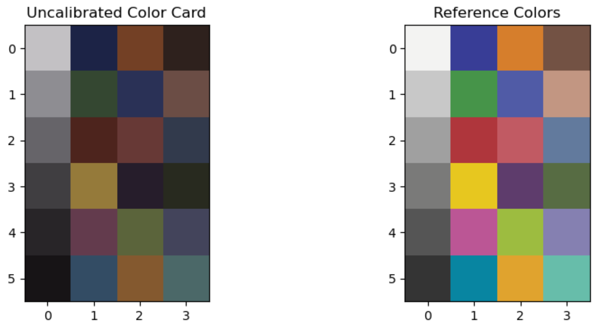
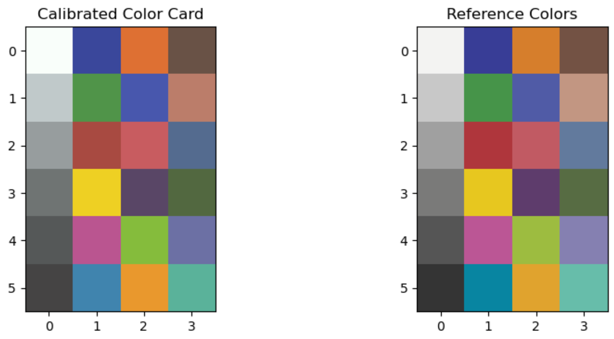

## Calculate Delta E between observed and expected color cards

Calculates Delta E between a Macbeth ColorChecker or Astrobotany.com Calibration sticker style color card and the expected color values.

**plantcv.transform.deltaE**(*rgb_img, color_chip_size=None, roi=None, obs="calibrated", \*\*kwargs*)

**returns** Delta E matrix

- **Parameters**
    - rgb_img          - Input RGB image data containing a color card.
    - color_chip_size - Type of color card to be detected, ("classic", "passport", "nano", "mini", "cameratrax", or "astro", by default `None`) or a tuple of the `(width, height)` dimensions of the color card chips in millimeters. If set then size scalings parameters `pcv.params.unit`, `pcv.params.px_width`, and `pcv.params.px_height`
            are automatically set, and utilized throughout linear and area type measurements stored to `Outputs`. 
    - roi              - Optional rectangular ROI as returned by [`pcv.roi.rectangle`](roi_rectangle.md) within which to look for the color card. (default = None)
	- obs              - label for metadata and debug images, typically "calibrated" or "uncalibrated" depending on whether the `rgb_img` has been color corrected.
    - **kwargs         - Other keyword arguments passed to `cv2.adaptiveThreshold` and `cv2.circle`.
        - adaptive_method - Adaptive threhold method. 0 (mean) or 1 (Gaussian) (default = 1).
        - block_size      - Size of a pixel neighborhood that is used to calculate a threshold value (default = 51). We suggest using 127 if using `adaptive_method=0`.
        - radius         - Radius of circle to make the color card labeled mask (default = 20).
        - min_size         - Minimum chip size for filtering objects after edge detection (default = 1000)
        - aspect_ratio   - Optional aspect ratio (width / height) below which objects will get removed. Orientation agnostic since automatically set to the reciprocal if <1 (default = 1.27)
        - solidity - Optional solidity (object area / convex hull area) filter (default = 0.8)

- **Returns**
    - deltaE            - Delta E values per each color chip as a matrix.

- **Context**
    - Delta E is a perception-based metric for the difference between colors. 0 indicates no perceptual difference and higher values indicate more difference. Generally a delta E value less than 1 is imperceptibly different and values greater than 3.5 are clearly distinct. Whether a particular color chip's delta E value matters for your experimental goals depends on your hypothesis and analysis plan. The particular method used to calculate delta E is controlled by `pcv.params.deltaE` which expects a string function name and defaults to `deltaE_ciede2000` from `skimage.color`.


!!! note
    Delta E is calculated when a color card is detected with `plantcv.transform.detect_color_card` by default
	and a debug image is generated showing the differences in the color card against the expected colors.
	This function will use `plantcv.transform.detect_color_card` to find the color card, potentially in an image that has already
	been color-corrected so that the delta E values can be compared pre vs post calibration.
	Delta E is also calculated by color correction functions in `plantcv.transform` if `deltaE` metrics exist in the outputs,
	which is the default. Running `plantcv.transform.auto_correct_color` will add uncalibrated and corrected deltaE metrics by default.

```python
from plantcv import plantcv as pcv
rgb_img, path, filename = pcv.readimage("target_img.png")

pcv.params.debug = "plot"
# Delta E debug visualization shown below
cc_matrix = pcv.transform.detect_color_card(rgb_img=rgb_img)

# Next we may color correct the image
tgt_matrix = pcv.transform.std_color_matrix(pos=3)
corrected_img = pcv.transform.affine_color_correction(rgb_img=rgb_img,
                                                      source_matrix=cc_matrix,
                                                      target_matrix=tgt_matrix)

# Delta E on the corrected image
e_matrix = pcv.transform.deltaE(corrected_img)
# outputs metadata will have min, mean, max, std dev of deltaE
print(pcv.outputs.metadata["deltaE_uncalibrated"])  # the uncalibrated metadata is added by detect_color_card
print(pcv.outputs.metadata["deltaE_calibrated"]) # the calibrated metadata is added by deltaE
```

Calling `plantcv.transform.detect_color_card` on the uncorrected image:



Using `plantcv.transform.deltaE` on the corrected image to check the new Delta E values:


