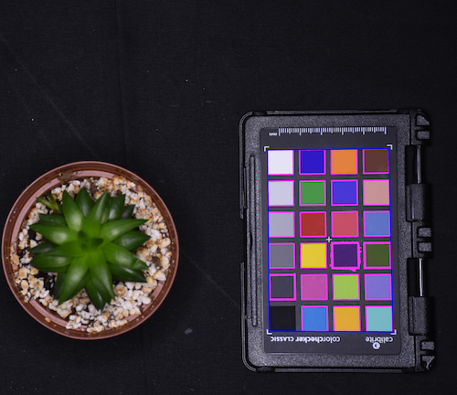

## Automatically Detect a Color Card

Automatically detects a Macbeth ColorChecker style color card and creates a labeled mask. 

**plantcv.transform.detect_color_card**(*rgb_img, label=None, color_chip_size=None, roi=None, \*\*kwargs*)

**returns** color_matrix

- **Parameters**
    - rgb_img          - Input RGB image data containing a color card.
    - label            - Optional label parameter, modifies the variable name of observations recorded. (default = `pcv.params.sample_label`)
    - color_chip_size - Type of color card to be detected, ("classic", "passport", "nano", or "cameratrax", by default `None`) or a tuple of the `(width, height)` dimensions of the color card chips in millimeters. If set then size scalings parameters `pcv.params.unit`, `pcv.params.px_width`, and `pcv.params.px_height`
            are automatically set, and utilized throughout linear and area type measurements stored to `Outputs`. 
    - roi              - Optional rectangular ROI as returned by [`pcv.roi.rectangle`](roi_rectangle.md) within which to look for the color card. (default = None)
    - **kwargs         - Other keyword arguments passed to `cv2.adaptiveThreshold` and `cv2.circle`.
        - adaptive_method - Adaptive threhold method. 0 (mean) or 1 (Gaussian) (default = 1).
        - block_size      - Size of a pixel neighborhood that is used to calculate a threshold value (default = 51). We suggest using 127 if using `adaptive_method=0`.
        - radius         - Radius of circle to make the color card labeled mask (default = 20).
        - min_size         - Minimum chip size for filtering objects after edge detection (default = 1000)
        - aspect_ratio   - Optional aspect ratio (width / height) below which objects will get removed. Orientation agnostic since automatically set to the reciprocal if <1 (default = 1.27)
        - solidity - Optional solidity (object area / convex hull area) filter (default = 0.8)

- **Returns**
    - color_matrix     - Detected color values as a matrix, the same format as output from [`pcv.transform.get_color_matrix`](get_color_matrix.md)).
    
- **Context**
    - If the goal is to color correct the image colorspace to the standard color card values, consider using [`pcv.transform.auto_correct_color`](transform_auto_correct_color.md) since this new function is a one-step wrapper of plantcv.transform.detect_color_card, [plantcv.transform.std_color_matrix](std_color_matrix.md),
    and [plantcv.transform.affine_color_correction](transform_affine_color_correction.md).
    - This mask output will be consistent in chip order regardless of orientation, where the white chip is detected and labeled first with index=0.
    - This algorithm uses an adaptive edge detection, and filters objects based on their size, apparent aspect ratio, and solidity.
    - QR codes are often falsely detected by this algorithm, but can be ignored during detection if the optional `roi` parameter is used.
- **Example use:**
    - [Color Correction Tutorial](https://plantcv.org/tutorials/color-correction) since this function is called during [`pcv.transform.auto_correct_color`](transform_auto_correct_color.md). 

!!! note
    Color chip size can only be used reasonably as a scaling factor (converting pixels to a known real world scale like cms)
    only when the color card is on a consistent plane relative to the subject AND the color card is parallel to the camera. It's a good idea to test your image capture protocol and color card detection before collecting a dataset.
    There are a few important assumptions that must be met in order to automatically detect color cards:
    
    - There is only one color card in the image.
    - Color card should be 4x6 [Macbeth ColorChecker](https://en.wikipedia.org/wiki/ColorChecker) like one of the supported color cards described below. 

```python

from plantcv import plantcv as pcv
rgb_img, path, filename = pcv.readimage("target_img.png")
# Using a supported color card size will automatically set size scaling parameters
cc_mask = pcv.transform.detect_color_card(rgb_img=rgb_img, color_chip_size="passport")
# Or if using another Macbeth ColorChecker you can explicitly set the color chip size (in millimeters)
cc_mask = pcv.transform.detect_color_card(rgb_img=rgb_img, color_chip_size=(12, 12))

avg_chip_size = pcv.outputs.metadata['median_color_chip_size']['value'][0]
avg_chip_w = pcv.outputs.metadata['median_color_chip_width']['value'][0]
avg_chip_h = pcv.outputs.metadata['median_color_chip_height']['value'][0]

# When using detect_color_card, you will always set pos=3
tgt_matrix = pcv.transform.std_color_matrix(pos=3)
headers, card_matrix = pcv.transform.get_color_matrix(rgb_img=rgb_img, mask=cc_mask)
corrected_img = pcv.transform.affine_color_correction(rgb_img=rgb_img,
                                                      source_matrix=card_matrix,
                                                      target_matrix=tgt_matrix)

```

**Image automatically detected and masked**
If `pcv.params.verbose = True` then a debug image will get created showing where the detected color card is located in the input image. 


Not all chips need to be detected in the cropped color card, but help with quality control of labeled mask alignment.


### Suppored Color Cards

**[Calibrite ColorChecker Passport](https://calibrite.com/us/product/colorchecker-passport-photo-2/)** 


Chip dimensions: 12mm x 12mm

**[Calibrite ColorChecker Classic](https://calibrite.com/us/product/colorchecker-classic/)** 


Chip dimensions: 40mm x 40mm

**[CameraTrax 24ColorCard-2x3](https://www.cameratrax.com/cardorder.php)** 


Chip dimensions: 11mm x 11mm

**[ColorChecker Classic Nano](https://calibrite.com/us/product/colorchecker-classic-nano/)** 


Chip dimensions: 3mm x 4mm

**Source Code:** [Here](https://github.com/danforthcenter/plantcv/blob/main/plantcv/plantcv/transform/detect_color_card.py)
