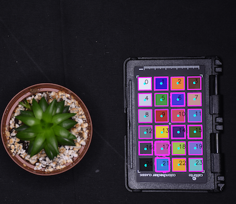

## Automatically Detect a Color Card

Automatically detects a color card and creates a labeled mask. 

**plantcv.transform.detect_color_card**(*rgb_img, \*\*kwargs*)

**returns** labeled_mask

- **Parameters**
    - rgb_img          - Input RGB image data containing a color card.
    - **kwargs         - Other keyword arguments passed to `cv2.adaptiveThreshold` and `cv2.circle`.
        - adaptive_method - Adaptive threhold method. 0 (mean) or 1 (Gaussian) (default = 1).
        - block_size      - Size of a pixel neighborhood that is used to calculate a threshold value (default = 51). We suggest using 127 if using `adaptive_method=0`.
        - radius         - Radius of circle to make the color card labeled mask (default = 20).
        - min_size         - Minimum chip size for filtering objects after edge detection (default = 1000)
- **Returns**
    - labeled_mask     - Labeled color card mask (useful downstream of this step in [`pcv.transform.get_color_matrix`](get_color_matrix.md) and [`pcv.transform.correct_color`](transform_correct_color.md) and [`pcv.transform.affine_color_correction`](transform_affine_color_correction.md)).
    
- **Context**
    - This mask output will be consistent in chip order regardless of orientation, where the white chip is detected and labeled first with index=0. In the case of `affine_color_correction` one will make a target color matrix.  
- **Example use:**
    - [Color Correction Tutorial](tutorials/transform_color_correction_tutorial.md)

!!! note
    Color chip size can only be used reasonably as a scaling factor (converting pixels to a known real world scale like cms)
    only when the color card is on a consistent plane relative to the subject AND the color card is parallel to the camera. 
    There are a few important assumptions that must be met in order to automatically detect color cards:
    
    - There is only one color card in the image.
    - Color card should be 4x6 (like an X-Rite ColorChecker Passport Photo). 

```python

from plantcv import plantcv as pcv
rgb_img, path, filename = pcv.readimage("target_img.png")
cc_mask = pcv.transform.detect_color_card(rgb_img=rgb_img)

avg_chip_size = pcv.outputs.metadata['median_color_chip_size']['value'][0]
avg_chip_w = pcv.outputs.metadata['median_color_chip_width']['value'][0]
avg_chip_h = pcv.outputs.metadata['median_color_chip_height']['value'][0]

# When using detect_color_card, you will always set pos=3
tgt_matrix = pcv.transform.std_color_matrix(pos=3)
headers, card_matrix = pcv.transform.get_color_matrix(rgb_img=rgb_img, mask=cc_mask)
corrected_img = pcv.transform.affine_color_correction(rgb_img=rgb_img,
                                                      source_matrix=card_matrix,
                                                      target_matrix=tgt_matrix)

```

**Image automatically detected and masked**



**Source Code:** [Here](https://github.com/danforthcenter/plantcv/blob/main/plantcv/plantcv/transform/detect_color_card.py)
