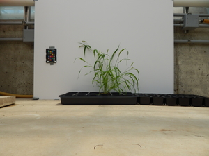
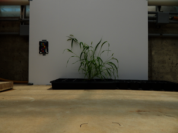

## Gamma Correction

Applies a [gamma correction](https://en.wikipedia.org/wiki/Gamma_correction) on the input image using the
[scikit-image adjust_gamma](https://scikit-image.org/docs/dev/api/skimage.exposure.html?highlight=adjust_gamma#skimage.exposure.adjust_gamma)
method. A pixelwise transformation is applied using the equation: `out = ((in / scale) ** gamma) * scale * gain`.

**plantcv.transform.gamma_correct**(*img, gamma=1, gain=1*)

**returns** corrected_img

- **Parameters**
    - img - RGB or grayscale image on which to perform the correction.
    - gamma - non-negative real number. Default value is 1.
    - gain - the constant multiplier. Default value is 1.

**Original Image**



```python
from plantcv import plantcv as pcv

corrected_img = pcv.transform.gamma_correct(img=img, gamma=1, gain=1)

```

**Corrected Image**



**Source Code**: [Here](https://github.com/danforthcenter/plantcv/blob/master/plantcv/plantcv/transform/gamma_correct.py)
