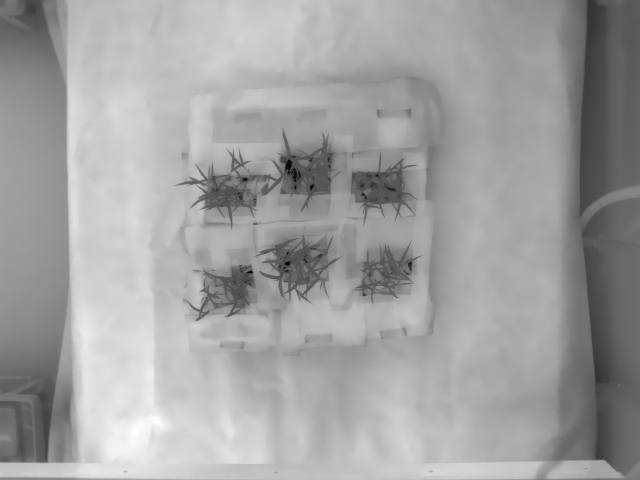
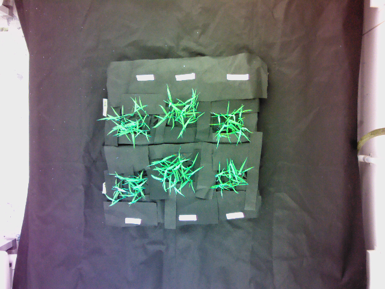
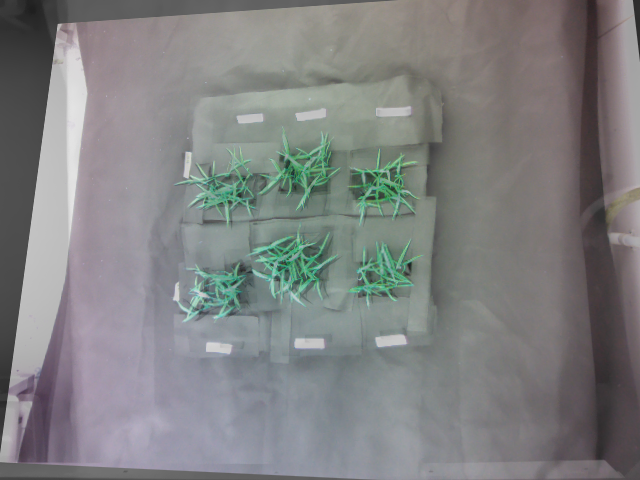

## Image Registration

`ImageRegistrator` is a class that transforms a target image based on corresponding, user-selected landmark points on the reference and 
target images. 

*class* **plantcv.annotate.ImageRegistrator(ref_img, target_img, figsize=(12, 6))**

To initialize an instance of `ImageRegistrator` class, two required parameters are `ref_img` and `target_img`, represent 
for target image and reference image, respectively.

Another optional parameter is the desired figure size `figsize`, by default `figsize=(12,6)`.

### Attributes
**ref_img** (`ndarray`, datatype: uint8, required): input reference image.
**target_img** (`ndarray`, datatype: uint8, required): input target image.
**points** (`list`): list of coordinates of selected pixels on reference image and target image.
**model** (`numpy.ndarray`): tranformation matrix of size (3,3) that register the target image to the reference image. 
**img_registered** (`numpy.ndarray`, datatype: uint8, required): registered target image.

### Class methods
**display_coords()**

Display user selected coordinates for both reference image and target image

**regist()** 

Register the target image to the reference image based on user selected landmark points.

**save_model(model_file="model")**

Save the transformation matrix used for image registration.

```python

from plantcv import plantcv as pcv
# Initialize an image registrator
img_registrator = pcv.annotate.ImageRegistrator(ref_img, target_img, figsize=(12, 6))

## 
# collecting land mark points
##

# Display user selected coordinates on both reference image and target image
img_registrator.display_coords()

# Register the target image to the reference image based on the model calculated from selected points
img_registrator.regist()

# Save
img_registrator.save_model(model_file="my_model")

```

Reference image (a thermal image):



Target image (a RGB image):



Overlay these two images:


Overlay two images after image registration:




Check out this video for how this interactive tool works!
<iframe src="https://player.vimeo.com/video/522809945" width="640" height="360" frameborder="0" allow="autoplay; fullscreen; picture-in-picture" allowfullscreen></iframe>


**Source Code:** [Here](https://github.com/danforthcenter/plantcv/blob/master/plantcv/plantcv/annotate/img_registration.py)
