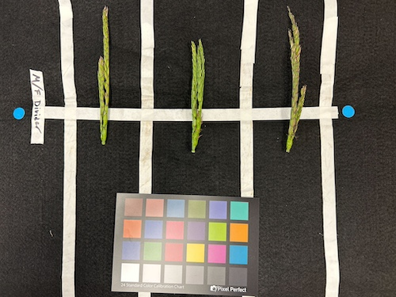
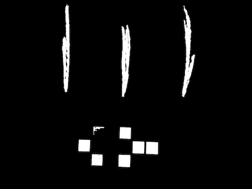
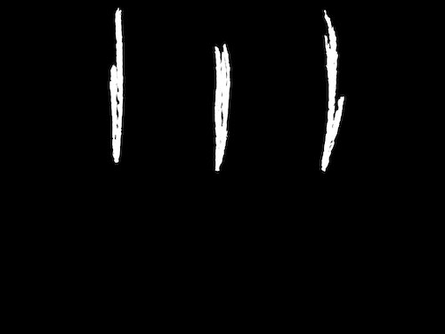

## Mask out Color Card

Automatically detects a color card and creates a bounding box mask. 

**plantcv.transform.mask_color_card**(*rgb_img, \*\*kwargs*)

**returns** color_card_mask

- **Parameters**
    - rgb_img          - Input RGB image data containing a color card.
    - **kwargs         - Other keyword arguments passed to `cv2.adaptiveThreshold` and `cv2.circle`.
        - adaptive_method - Adaptive threhold method. 0 (mean) or 1 (Gaussian) (default = 1).
        - block_size      - Size of a pixel neighborhood that is used to calculate a threshold value (default = 51). We suggest using 127 if using `adaptive_method=0`.
        - radius         - Radius of circle to make the color card labeled mask (default = 20).
        - min_size         - Minimum chip size for filtering objects after edge detection (default = 1000)
- **Returns**
    - color_card_mask     - Bounding box mask of all detected color card chips 
- **Context:**
    - This function can be used with [`pcv.image_subtract`](image_subtract.md) to clean up noise in a plant mask that was introduced by the color card. This is helpful in cases where the color card placement is not consistent enough for region filters to clean the color card chips from all images in a dataset.
- **Example use:**
    - below 

**RGB Image**



**Seed head mask**



```python

from plantcv import plantcv as pcv

# Detect and mask the color card in the image
cc_mask = pcv.transform.mask_color_card(rgb_img=img)

# Remove color card chips from the plant mask with image subtract
cleaned_mask = pcv.image_subtract(gray_img1=plant_mask, gray_img2=cc_mask)

```

**Cleaned mask**



**Source Code:** [Here](https://github.com/danforthcenter/plantcv/blob/main/plantcv/plantcv/transform/detect_color_card.py)
