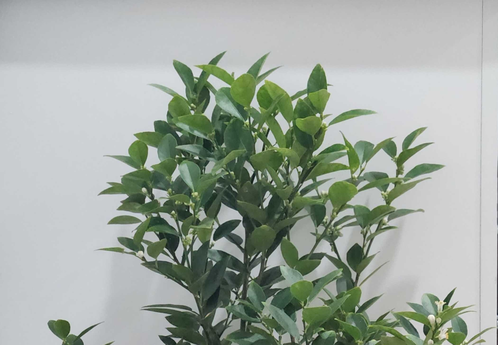
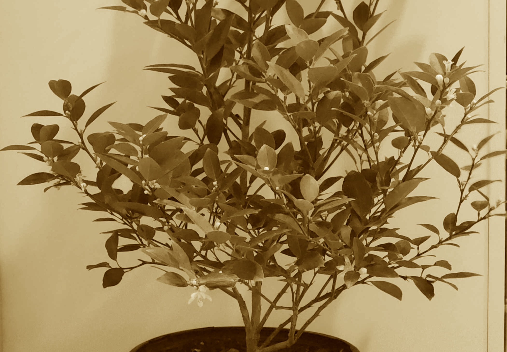
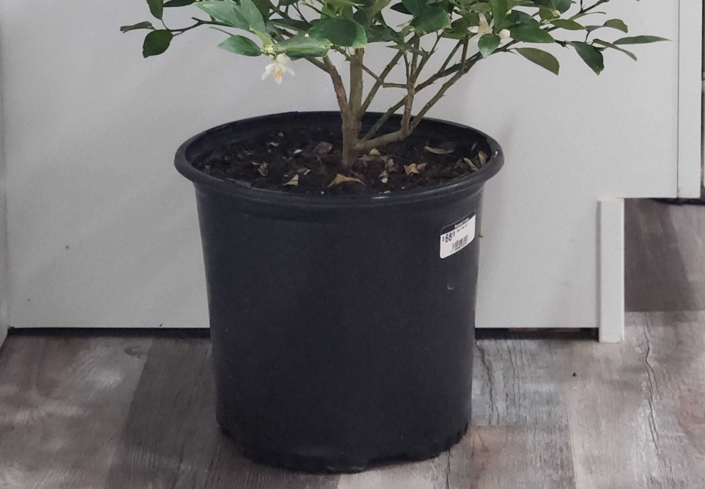
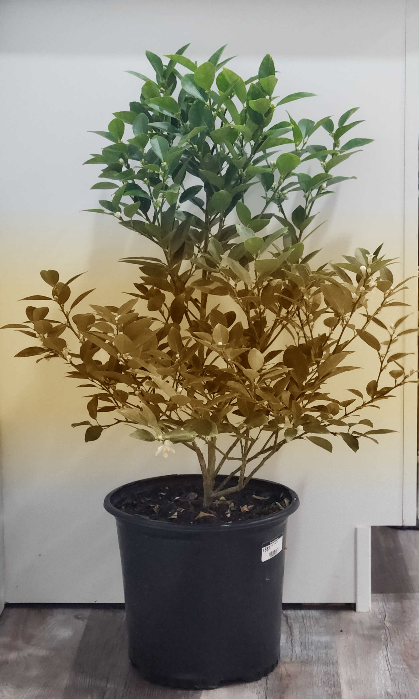

## Merge images

This function takes a set of images with a known overlap and concatenates them in series to create a final single image.
Image paths are provided in a list (e.g. [read_dataset](io_read_dataset.md)) and must be named in the order they should be
merged (ie. prefix_1.png, prefix_2.png, etc.). There are 4 methods for handling the regions that overlap.   

**plantcv.transform.merge_images**(*paths_to_imgs, overlap_percentage, direction = "vertical", method = "stacked"*)

**returns** combined_image

- **Parameters:**
    - paths_to_imgs - a list of image paths
    - overlap_percentage - amount of overlap between successive images (see example below for how to calculate this value)
    - direction - vertical (default), or horizontal, determines in which direction successive images should be added
    - method - Available options are stacked, random, average, and gradual and dictate
        how the overlap region should be handled 
        - 'stacked' : (default), image i+1 stacks on top of image i
        - 'random' : randomly choose either image i or i+1 to go on top
        - 'average' : pixels are averaged between image i values and image i+1 values
        - 'gradual' : pixels are averaged with a weight that corresponds to 
                      proximity to image i or image i+1

- **Context:**
    - Used to concatenate images in a series or scan, such as from minirhizotrons
    - Output image can be the start of any workflow

- **Example use:**


**Vertical image with gradual method example**

**Input images**






```python

from plantcv import plantcv as pcv

# Set global debug behavior to None (default), "print" (to file), or "plot" (Jupyter Notebooks or X11)
pcv.params.debug = "plot"

# Merge images vertially with a 30% overlap by averaging the overlap pixels
images = pcv.io.read_dataset(source_path="./input_images/")
merged_img = pcv.transform.merge_images(paths_to_imgs=images, overlap_percentage=30, direction="vertical", method="gradual")

```

To calculate the overlap percentage, use the following formula:

```python
# Calculate the overlap percentage
# overlap = amount of overlap in measured units (e.g. inches)
# dpu = dots per unit of the image (e.g. 100), units must match overlap units
# width or height = width or height of the image in pixels depending on orientation
#
# percent = ((overlap * dpu) / width or height) * 100
overlap = ((0.5 * 100) / img.shape[0]) * 100

```

**Merged image**



**Source Code:** [Here](https://github.com/danforthcenter/plantcv/blob/main/plantcv/plantcv/transform/merge_images.py)