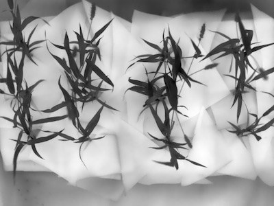

## Rescale

Rescales grayscale images to user input minimum and maximum values.

**plantcv.transform.rescale**(*gray_img, min_value=0, max_value=255*)

**returns** image after rescaling

- **Parameters:**
    - gray_img - Grayscale image to rescale
    - min_value - New minimum value for range of interest. Default = 0
    - max_value - New maximum value for range of interest. Default = 255
   
- **Context:**
    - Rescales pixel values in grayscale images.
- **Example use:**
    - [Use In Thermal Tutorial](tutorials/thermal_tutorial.md)
    
**Input image**


```python

from plantcv import plantcv as pcv

# Set global debug behavior to None (default), "print" (to file), 
# or "plot" (Jupyter Notebooks or X11)
pcv.params.debug = "print"

# Resize image
scaled_img = pcv.transform.rescale(gray_img=thermal_data, min_value=0, max_value=255)

```

**Image after resizing**



**Source Code:** [Here](https://github.com/danforthcenter/plantcv/blob/master/plantcv/plantcv/transform/rescale.py)
